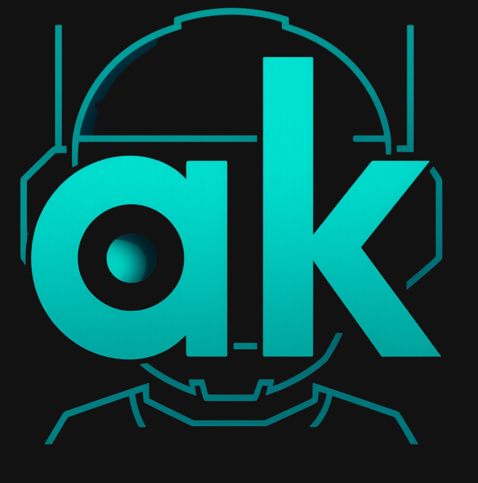

# 🤖 anima-kit | Learning AI, building demos, sharing results



## 🔖 About This Project 

> TL;DR
Learn how to build your own AI agents  and interact with them via easy to use web UIs.

This documentation site contains various tutorials and resources for learning how to build AI agents with [LangChain][langchain] and [LangGraph][langgraph] as well as [Gradio][gradio] web UIs to facilitate interactions. It also covers how to build local servers in [Docker][docker] to power agents and their tools, including an [Ollama][ollama] server for LMs, a [SearXNG][searxng] server for a metasearch engine tool, and a [Milvus][milvus] server for a vectorstore. 

For more details about how to build agents and other easily digestible modules, [check it out here][animakit].

## 🏁 Getting Started 

There are various directions you can take in navigating these tutorials, as each one can be its own standalone lesson.

- [Learn how to build local servers][servers] to power both the tools for your agents and their decision making and response generating processes.
  
  - An [Ollama server][ollama-tutorial] to host the LMs needed for your agents to make decisions and generate information 
  - A [SearXNG server][searxng-tutorial] to host a metasearch engine that can be used as a tool for your agents to search the web
  - A [Milvus server][milvus-tutorial] to host a vectorstore that can be used as a tool for your agents to retrieve information from your personal docs
  - A [multi-server][multi-server] stack that combines the servers you need all in one place

- [Learn how to build chatbots and specialized agents][agents] as well as easy to use web UIs that make interactions a lot more intuitive. 

  - A simple [chatbot][chatbot] without any memory or tools
  - An [agent that can remember][agent-memory] past conversation history
  - A [document agent][doc-agent] that can retrieve information from Markdown files
  - A [code agent][code-agent] that can retrieve information from both Markdown and Python files and is specialized for coding tasks. 


- [Learn advanced RAG techniques][rag] to improve the information retrieval of your agents.

- [Learn about various aspects of AI][odds-ends] including deep learning, natural language processing, MCPs, and generative models.

Take the code and use it, dive into the code and try to understand it, or just learn about AI; [these tutorials][tutorials] were made for you (and me 😊)!

## 🏯 Project Structure

```
├── docs/               # All main documentation files
├── includes/           # Abbreviation definitions for acronyms, etc.
├── overrides/          # Overrides of default pages
├── third-party/        # Third-party licenses and code for attribution
├── mkdocs.yml          # Main documentation configurations
└── requirements.txt    # Required Python libraries
```

## ⚙️ Tech 

This site was made using [Material for MKDocs][material]. The tutorials use various third-party software and libraries including:

- [Caddy][caddy]: Reverse proxy for SearXNG server
- [Docker][docker]: Building and running local servers
- [Gradio][gradio]: Building web UIs
- [LangChain][langchain]: Lots of various uses pertaining to creating tools, chatbots, and agents
- [LangGraph][langgraph]: Lots of various uses pertaining to creating agents
- [Milvus][milvus]: Local vectorstore setup and run in Docker
- [Ollama][ollama]: Local LM server setup and run in Docker
- [Ollama Python library][ollama-python]: Interacting with the Ollama server via a local Python environment
- [PyMilvus][pymilvus]: Interacting with the Milvus server via a local Python environment
- [Requests][requests]: Interacting with the SearXNG server via a local Python environment
- [SearXNG][searxng]: Metasearch engine source code
- [searxng-docker][searxng-docker]: Local metasearch engine setup and run in Docker
- [Valkey][valkey] (acting through the [Redis][redis] API): Data storage for SearXNG server

## 🔗 Contributing 

This documentation site is a work in progress. If you'd like to suggest or add improvements, clarify your confusion, help others understand, or share your own relevant projects, feel free to contribute through [discussions][discussions]. Check out the [contributing guidelines][contributing] to get started.

## 📑 License

This site is [licensed under MIT][license]. However, some of the third-party libraries are licensed differently, [check out the notice][notice] for more details.


<!-- LINKS -->
[agent-memory]: http://anima-kit.github.io/tutorials/agents/agent-memory/
[agents]: http://anima-kit.github.io/tutorials/agents/
[animakit]: https://anima-kit.github.io/
[caddy]: https://caddyserver.com/
[chatbot]: http://anima-kit.github.io/tutorials/agents/chatbot/
[code-agent]: http://anima-kit.github.io/tutorials/agents/code-agent
[contributing]: CONTRIBUTING.md
[discussions]: https://github.com/anima-kit/anima-kit.github.io/discussions
[doc-agent]: http://anima-kit.github.io/tutorials/agents/doc-agent/
[docker]: https://www.docker.com/
[gradio]: https://www.gradio.app/
[langchain]: https://www.langchain.com/
[langgraph]: https://www.langchain.com/langgraph/
[license]: LICENSE
[material]: https://squidfunk.github.io/mkdocs-material/
[milvus]: https://milvus.io/
[milvus-tutorial]: http://anima-kit.github.io/tutorials/servers/milvus/ 
[multi-server]: http://anima-kit.github.io/tutorials/servers/multi-server/
[notice]: NOTICE.md
[odds-ends]: http://anima-kit.github.io/tutorials/misc/
[ollama]: https://ollama.com/
[ollama-python]: https://github.com/ollama/ollama-python
[ollama-tutorial]: https://anima-kit.github.io/tutorials/servers/ollama/
[pymilvus]: https://github.com/milvus-io/pymilvus
[python]: https://www.python.org/
[rag]: http://anima-kit.github.io/tutorials/rag/
[requests]: https://requests.readthedocs.io/en/latest/
[searxng]: https://github.com/searxng/searxng
[searxng-docker]: https://github.com/searxng/searxng-docker
[searxng-tutorial]: http://anima-kit.github.io/tutorials/servers/searxng/
[servers]: https://anima-kit.github.io/tutorials/servers
[tutorials]: https://anima-kit.github.io/tutorials
[valkey]: https://valkey.io/