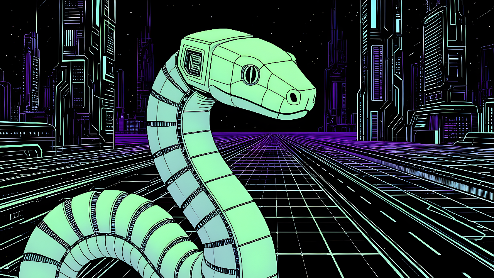

<!-- TODO:
    - add more info about projects
    - redesign project button structure
-->

<h1 style="font-weight:600; text-align: center;">Agents</h1>

!!! welcome "Hiya!" 
    Check out my agents projects below. :material-arrow-down-bold-outline:{ .md-icon }

 

-   :material-file-code-outline:{.md-icon}  PyCoder 

    ---

    [{ .img-def align=left style="width: 60%; margin-top: 0px;"}](https://github.com/anima-kit/pycoder "PyCoder")
    
    Interact with an agent to  manage Python codebases  on your  local  machine. 
    Create different user profiles and codebases by uploading  Python or Markdown  files, then  chat with an agent  about your code. 

-   :material-calendar-clock:{.md-icon}  Stay Tuned... 

    ---
    
    [{ .img-def align=left style="width: 60%; margin-top: 0px;"}](https://github.com/anima-kit "AnimaKit Github")

    Stay tuned for  more agent builds!

---

 