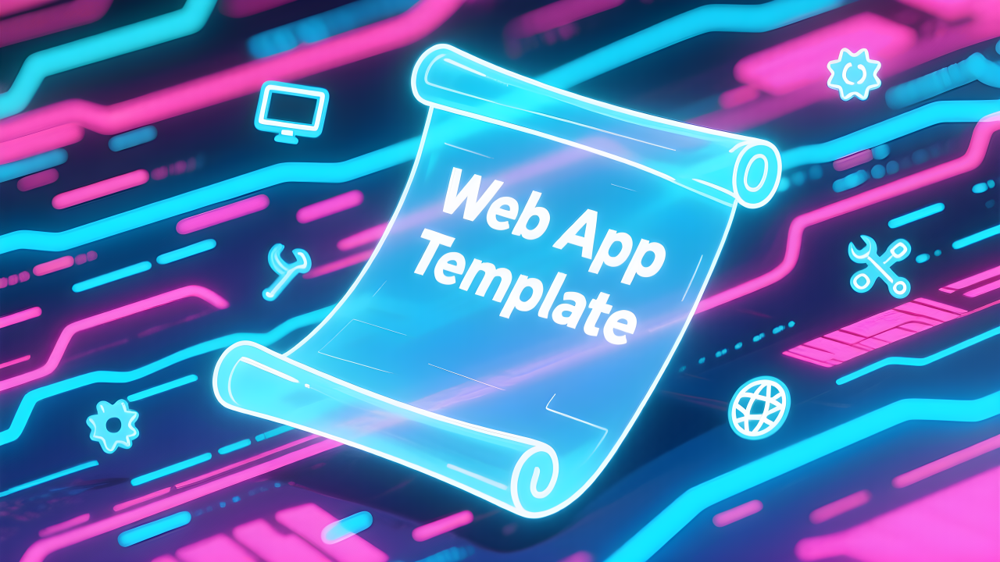
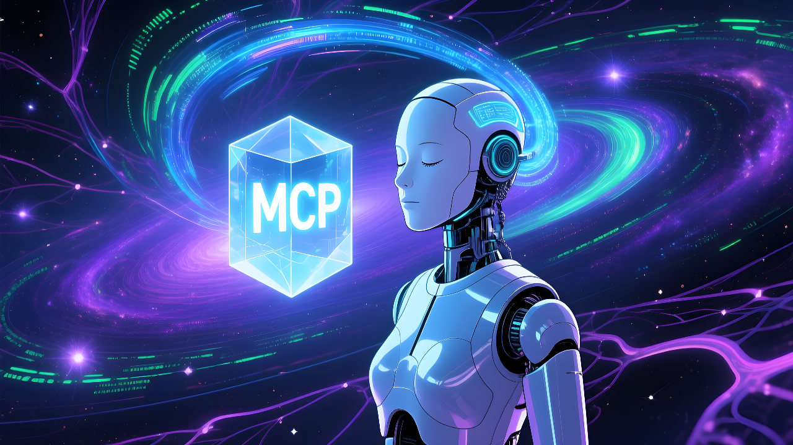
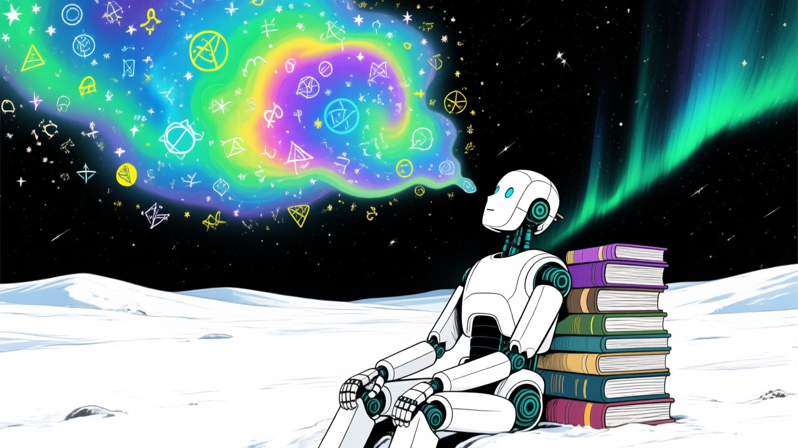
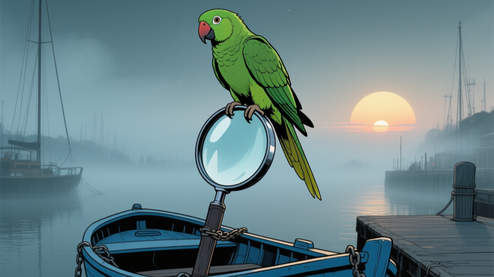

<h1 style="font-weight:600; text-align: center;">Projects</h1>

!!! welcome "Hiya!"
    Welcome to my portfolio site! Check out my projects below. :material-arrow-down-bold-outline:{ .md-icon }

 

-   :material-note-multiple:{.md-icon}  Tutorials 

    ---

    [{ .img-def align=left style="width: 60%; margin-top: 0px;"}](../tutorials/index.md "Tutorials")

    Learn all about AI through in-depth analyses and step-by-step guides.

-   :material-web:{.md-icon}  Web App Guide 

    ---

    [{ .img-def align=left style="width: 60%; margin-top: 0px;"}](https://github.com/anima-kit/web-app-guide "Web App Guide")

    Learn how to create a web app scaffold that can be used to integrate graph logic and agent capabilities with an interactive web UI.

-   :simple-modelcontextprotocol:{.md-icon}  MCP basics 

    ---

    [{ .img-def align=left style="width: 60%; margin-top: 0px;"}](https://github.com/anima-kit/mcp-basics "MCP Basics")

    Learn the fundamentals of MCP through creating and testing various local servers.

-   :simple-langflow:{.md-icon}  Langflows 

    ---

    [{ .img-def align=left style="width: 60%; margin-top: 0px;"}](https://github.com/anima-kit/langflows "Langflows")

    Learn how to create AI systems in an easy to use low/no-code platform.

-   :material-notebook-edit-outline:{.md-icon}  AI Notebooks 

    ---

    [{ .img-def align=left style="width: 60%; margin-top: 0px;"}](https://github.com/anima-kit/ai-notebooks "AI Notebooks")

    Learn the fundamentals of coding AI through interactive notebooks.

-   :material-file-code-outline:{.md-icon}  PyCoder 

    ---

    [{ .img-def align=left style="width: 60%; margin-top: 0px;"}](https://github.com/anima-kit/pycoder "PyCoder")
    
    Interact with an agent to  manage Python codebases  on your  local  machine. 
    Create different user profiles and codebases by uploading  Python or Markdown  files, then  chat with an agent  about your code. 

-   :simple-ollama:{.md-icon} :simple-docker:{.md-icon}  Ollama Docker 

    ---

    [{ .img-def align=left style="width: 60%; margin-top: 0px;"}](https://github.com/anima-kit/ollama-docker "Ollama Docker")
    
    Create a local Ollama server to chat with LLMs.

-   :simple-milvus:{.md-icon} :simple-docker:{.md-icon}  Milvus Docker 

    ---

    [{ .img-def align=left style="width: 60%; margin-top: 0px;"}](https://github.com/anima-kit/milvus-docker "Milvus Docker")
    
    Create a local  Milvus  server to store and query your personal data.

-   :simple-searxng:{.md-icon} :simple-docker:{.md-icon}  SearXNG Docker 

    ---

    [{ .img-def align=left style="width: 60%; margin-top: 0px;"}](https://github.com/anima-kit/searxng-docker "SearXNG Docker")
    
    Create a local  SearXNG  server to perform metasearches.

-   :material-calendar-clock:{.md-icon}  Stay Tuned... 

    ---
    
    [{ .img-def align=left style="width: 60%; margin-top: 0px;"}](https://github.com/anima-kit "AnimaKit Github")

    Stay tuned for  more projects!

---

 

<!-- LINKS -->
[agents]: agents/index.md
[medical]: medical/index.md
[servers]: servers/index.md
[tutorials]: ../tutorials/index.md