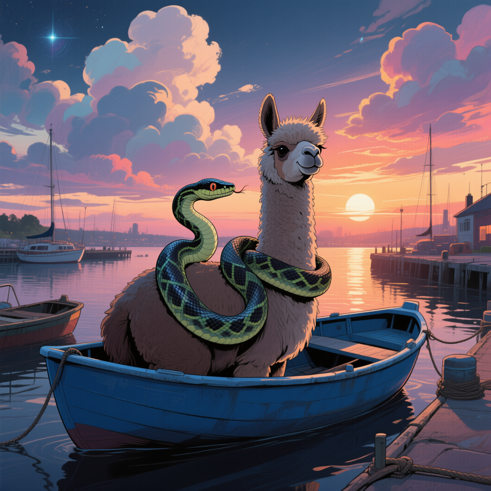
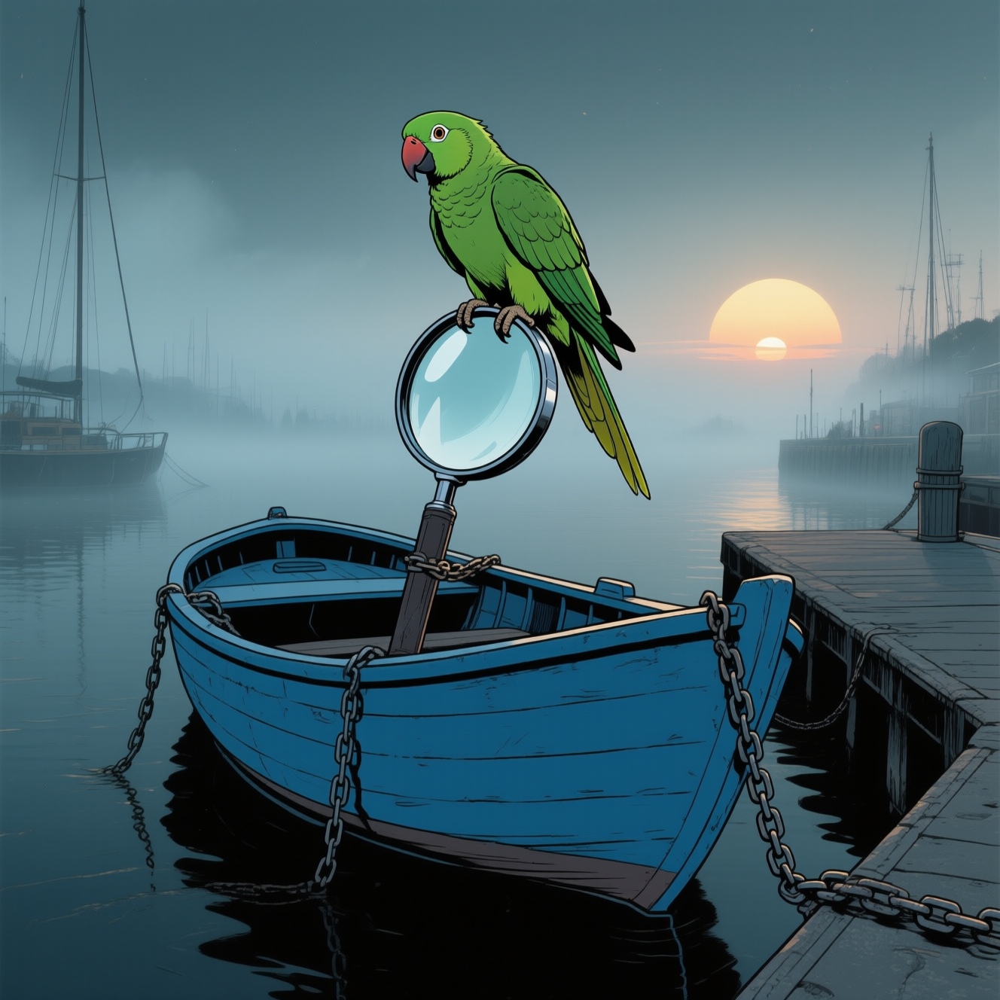

<h1 style="font-weight:600; text-align: center;">Projects</h1>

!!! welcome "Hiya!"
    Welcome to my portfolio site! Check out my projects below. :material-arrow-down-bold-outline:{ .md-icon }

 

-   :material-file-code-outline:{.md-icon}  PyCoder 

    ---

    [{ .img-def align=left style="width: 60%; margin-top: 0px;"}](https://github.com/anima-kit/pycoder "PyCoder")
    
    Interact with an agent to  manage Python codebases  on your  local  machine. 
    Create different user profiles and codebases by uploading  Python or Markdown  files, then  chat with an agent  about your code. 

-   :material-bookshelf:{.md-icon}  AI Notebooks 

    ---

    [{ .img-def align=left style="width: 60%; margin-top: 0px;"}](https://github.com/anima-kit/ai-notebooks "AI Notebooks")

    Learn the fundamentals of coding AI through interactive notebooks.

-   :simple-ollama:{.md-icon} :simple-docker:{.md-icon}  Ollama Docker 

    ---

    [{ .img-def align=left style="width: 60%; margin-top: 0px;"}](https://github.com/anima-kit/ollama-docker "Ollama Docker")
    
    Create a local Ollama server to chat with LLMs.

-   :simple-milvus:{.md-icon} :simple-docker:{.md-icon}  Milvus Docker 

    ---

    [{ .img-def align=left style="width: 60%; margin-top: 0px;"}](https://github.com/anima-kit/milvus-docker "Milvus Docker")
    
    Create a local  Milvus  server to store and query your personal data.

-   :simple-searxng:{.md-icon} :simple-docker:{.md-icon}  SearXNG Docker 

    ---

    [{ .img-def align=left style="width: 60%; margin-top: 0px;"}](https://github.com/anima-kit/searxng-docker "SearXNG Docker")
    
    Create a local  SearXNG  server to perform metasearches.

-   :material-calendar-clock:{.md-icon}  Stay Tuned... 

    ---
    
    [{ .img-def align=left style="width: 60%; margin-top: 0px;"}](https://github.com/anima-kit "AnimaKit Github")

    Stay tuned for  more projects!

---

 

<!-- LINKS -->
[agents]: agents/index.md
[medical]: medical/index.md
[servers]: servers/index.md
[tutorials]: ../tutorials/index.md