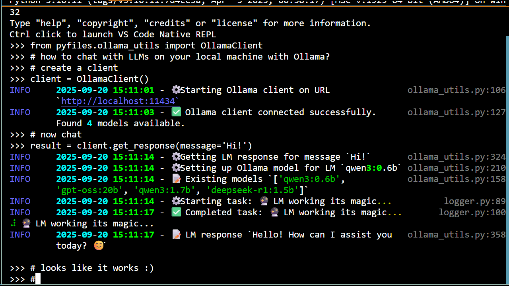
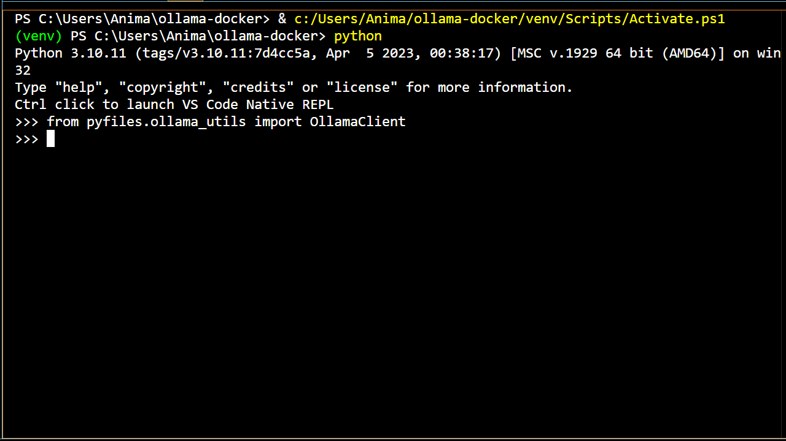

<div class="icon-def-1" style="text-align: center; border: 0.1rem dotted; width: 5%; float: right; padding: 0px; margin: 0px; font-size: 0.9rem; border-radius: 10px;">
  <a onclick="toggleAnimations()" title="Toggle Animations" style="cursor: pointer;">
    <p style="padding: 0px; margin: 0px;"><i class="mdi mdi-sine-wave"></i></p>
  </a>
</div>

# :simple-ollama:{.icon-def-0} Ollama with Docker and Python

<hr class="icon-def-1 tertiary-icon", style="width: 90%;"> 

{ .img-def }

{.demo-img .png style="display:block;margin:auto;"}

{.demo-img .gif style="display:none;margin:auto;"}

!!! tl-dr "TL;DR"
    Learn how to chat with LMs on your local machine :material-laptop:{.icon-def-0}. Then, you can use this setup as a base to [power][agents] locally run AI agents :material-robot-outline:{.icon-def-0}.

<hr class="icon-def-1 tertiary-icon", style="width: 90%;"> 

<a id="about"></a>

## :material-map-marker-star-outline:{.icon-def-0} About This Project

<div class="grid cards" markdown style="text-align: center; font-size: 2rem; width: 10rem; margin: 0 auto;">

-   
    :simple-ollama:{.icon-def-1 style="color: var(--md-accent-fg-color)"} :simple-docker:{.icon-def-1 style="color: var(--md-accent-fg-color)"} :simple-python:{.icon-def-1 style="color: var(--md-accent-fg-color)"}

</div>

In this tutorial, we're going to setup an :simple-ollama:{.icon-def-0} [Ollama][ollama]{.blank} server in :simple-docker:{.icon-def-0} [Docker][docker]{.blank} for chatting with LMs on our local machines using the :simple-python:{.icon-def-0} [Ollama Python library][ollama-python]{.blank}.

The code we learn and use here will serve as a foundation for building AI agents, showcasing how to connect to an LM and invoke responses :material-chat-processing-outline:{.icon-def-0}. This is how we'll power the decision making and response generating processes of our agents :material-robot-excited-outline:{.icon-def-0}. For a general overview of what we're going to do with these agents, checkout [the next series of tutorials][agents].

[As previously mentioned][servers-why], the way we're going to build agents is by first building local servers for all the gadgets that our agents will need :material-hammer-wrench:{.icon-def-0}. Then, we can learn how to pass these gadgets over to our agents with :simple-langchain:{.icon-def-0} [LangChain][langchain]{.blank} and :simple-langgraph:{.icon-def-0} [LangGraph][langgraph]{.blank}. 

To kick off the tutorials, we'll start with the most fundamental server that we'll need to pass to our agents, without which our agents are basically powered off :material-battery-off-outline:{.icon-def-0}: the LM server :material-head-cog-outline:{.icon-def-0}.

As for the software to host the LM, I like using :simple-ollama:{.icon-def-0} Ollama. It's insanely easy to setup and get started chatting right out of the box (as we'll see next) and it plays nicely with all the other libraries that we'll be using :material-dog:{.icon-def-0}. 

---

Some alternatives that I've found for chatting with LMs are [LM Studio][lm-studio]{.blank}, [Open WebUI][open-webui]{.blank}, and :simple-huggingface:{.icon-def-0} [Huggingface Transformers][transformers]{.blank}. There was a time when one could chat with really large LLMs like [Qwen3 235B][qwen3-235b]{.blank} for free using Huggingface's [HuggingChat][huggingchat]{.blank}. Thanks for all your help my ephemeral friend :simple-huggingface:{.icon-def-0} :material-heart-outline:{.icon-def-0}.

---

Now, let's get building :material-account-hard-hat-outline:{.icon-def-0}!

<hr class="icon-def-1 primary-icon", style="width: 90%;"> 

## :material-flag-checkered:{.icon-def-0} Getting Started

First, we're going to setup and build the repo to make sure that it works :material-wrench:{.icon-def-0}. Then, we can play around with the code and learn more about it :material-test-tube:{.icon-def-0}. 

Check out [all the source code here][ollama-github] :material-arrow-left-bold-outline:{.icon-def-0}.

??? vis-inst "Toggle for visual instructions"

    :material-progress-wrench:{.icon-def-0} This is currently under construction.

To setup and build the repo follow these steps:

1.  Make sure [Docker][docker]{.blank} is installed and running.

1.  Clone the repo, head there, then create a Python environment:

      ```bash
      git clone https://github.com/anima-kit/ollama-docker.git
      cd ollama-docker
      python -m venv venv
      ``` 

    <a id="gs-activate"></a>

1.  Activate the Python environment:

     ```bash
     venv/Scripts/activate
     ```

    <a id="gs-reqs"></a>

1.  Install the necessary Python libraries:
     ```bash
     pip install -r requirements.txt
     ```

    <a id="gs-start"></a>

1.  Choose to run the LM on GPU or CPU, then build and run the Docker container:

    === "GPU"

        ``` bash
        docker compose -f docker-compose-gpu.yml up -d
        ```

    === "CPU"

        ``` bash
        docker compose -f docker-compose-cpu.yml up -d
        ```

    > Getting an LM response can be run on your GPU or CPU. Using the GPU will generally be faster :material-flash:{.icon-def-0}, but not all GPUs will be compatible. Also, you may not be able to run certain models regardless of whether you use GPU or CPU.

    > After successfully completing this step, the Ollama server should be running on [http://localhost:11434][ollama-url]{.blank}. For me, when everything is setup correctly and I click the URL link, I get a page that says `Ollama is running`.

    <a id="gs-test"></a>
      
1.  Run the test script to ensure the default LM ([Qwen3 0.6B][qwen3-0.6b]{.blank}) can be invoked:

    ```bash
    python -m scripts.ollama_test
    ```

    > From the Docker setup, all Ollama data (including models) will be located in the local folder :material-folder-outline:{.icon-def-0} `./ollama_data/`. All logs from the test script are output in the console and stored in the :material-note-edit-outline:{.icon-def-0} `./ollama-docker.log` file.

    <a id="gs-stop"></a>

1.  When you're done, stop the Docker containers and cleanup with:

    === "GPU"

        ``` bash
        docker compose -f docker-compose-gpu.yml down
        ```

    === "CPU"

        ``` bash
        docker compose -f docker-compose-cpu.yml down
        ```

<hr class="icon-def-1 primary-icon", style="width: 90%;"> 

<a id="examples"></a>

## :material-note-edit-outline:{.icon-def-0} Example Use Cases

Now that the repo is built and working, let's play around with the code a bit :material-test-tube:{.icon-def-0}. 

Right now, we're only setting up an :simple-ollama:{.icon-def-0} Ollama server to chat with an LM. That means we're only going to be using one method, namely something that gets an LM response for a given user message. To get our own chat going, all we need to do is initialize the class that holds this method, then we can send messages and get responses as we please :material-forum-outline:{.icon-def-0}. 

---

The main class to interact with an LM is the `OllamaClient` class of the `ollama_utils.py` file which is built on the [Ollama Python library][ollama-python]{.blank}.  Once this class is initialized, the `get_response` method can be used to get an LM response for a given user message. 

To facilitate interactions with the LM, the `get_response` method can be executed in the command line :material-console:{.icon-def-0} or in Python scripts :material-script-text-outline:{.icon-def-0}. However, in later tutorials we'll implement :simple-gradio:{.icon-def-0} [Gradio][gradio]{.blank} web UIs so that we can easily chat with our agents in an intuitive way. For now, we can see how to interact with LMs through these less intutive ways :material-code-block-tags:{.icon-def-0}.

To start off, let's interact with an LM through the command line :material-arrow-down-bold-outline:{.icon-def-0}. 

<hr class="icon-def-1 primary-icon", style="width: 60%;"> 

<a id="cl"></a>

### :material-console:{.icon-def-0} Chatting with an LM through the Command Line 

??? vis-inst "Toggle for visual instructions"

    :material-progress-wrench:{.icon-def-0} This is currently under construction.

To chat with an LM, follow these steps:

1.  Do [step 3][step-activate] then [step 5][step-start] of the :material-flag-checkered:{.icon-def-0}`Getting Started` section to activate the Python environment and run the Ollama server in Docker.

1.  Call the Python environment to the command line:

    ```bash
    python
    ```

1.  Now that you're in the Python environment, import the OllamaClient class:

    ```bash
    from pyfiles.ollama_utils import OllamaClient
    ```

1.  Initialize the OllamaClient class:

    ```bash
    client = OllamaClient()
    ```

    <a id="cl-message"></a>

1.  Define a message:

    ```bash
    message = 'What is the average temperature of the universe?'
    ```

    <a id="cl-response"></a>

1.  Then get a response:

    ```bash
    client.get_response(message=message)
    ```

1.  Repeat [step 5][step-message] and [step 6][step-response] any number of times to send different messages and get responses.

1.  Do [step 7][step-stop] of the :material-flag-checkered:{.icon-def-0}`Getting Started` section to stop the containers when you're done.

Just like with the test script, all logs will be printed in the console and stored in :material-note-edit-outline:{.icon-def-0} `./ollama-docker.log`. The `get_response` method can also be executed with the default message `Why is the sky blue?` by running the method with no variables: `client.get_response()`.

---

Now that we know how to get responses for different messages :material-checkbox-marked-outline:{.icon-def-0}, let's try different LMs. By default, we're getting responses from [Qwen3 0.6B][qwen3-0.6b]{.blank}. But, the `get_response` method can also be executed with a specified LM by utilizing the `lm_name` argument. 

In the next example below, I show how to do this by creating and running a custom script to get responses for a given LM :material-arrow-down-bold-outline:{.icon-def-0}.

<hr class="icon-def-1 primary-icon", style="width: 60%;"> 

<a id="rs"></a>

### :material-script-text-outline:{.icon-def-0} Chatting with an LM through Running Scripts

??? vis-inst "Toggle for visual instructions"

    :material-progress-wrench:{.icon-def-0} This is currently under construction.

To chat with an LM, follow these steps:

1.  Do [step 3][step-activate] then [step 5][step-start] of the :material-flag-checkered:{.icon-def-0}`Getting Started` section to activate the Python environment and run the Ollama server in Docker.

    <a id="rs-create"></a>

1.  Create a script in the `./scripts` folder named `my_lm_chat_ex.py` with the following:

    ```python
    # Import OllamaClient class
    from pyfiles.ollama_utils import OllamaClient

    # Initialize client
    client = OllamaClient()

    # Define LM to use and message to send
    # Change these variables to use a different LM or send a different message
    lm_name = 'deepseek-r1:1.5b'
    message = 'What is the average temperature of the universe?'

    # Get response
    client.get_response(lm_name=lm_name, message=message)
    ```

    <a id="rs-run"></a>

1.  Run the script:

    ```bash
    python -m scripts.my_lm_chat_ex
    ```

1.  Do [step 7][step-stop] of the :material-flag-checkered:{.icon-def-0}`Getting Started` section to stop the containers when you're done.

Again, all logs will be printed in the console and stored in :material-note-edit-outline:{.icon-def-0} `./ollama-docker.log`. The name of the Python script doesn't matter as long as you use the same name in [step 2][step-create] and [step 3][step-run].

<hr class="icon-def-1 primary-icon", style="width: 30%;"> 

Now, you have the tools to edit the script (or create an entirely new script) to send whichever messages to whichever LMs you wish :material-checkbox-marked-outline:{.icon-def-0}. For more structured chats, you can loop through invoking different LMs for different messages :material-refresh:{.icon-def-0} with something like the following:

<a id="running-scripts-ex"></a>

```python
# Define LMs to use
lm_names = ['deepseek-r1:1.5b', 'qwen3:1.7b']

# Define messages to send
messages = [
    'Discuss prominent factors in the evolution of humans on Earth.',
    'What is the mathematical symbol PI?',
    'What will the weather be like today in My-Location?'
]

# Get response for each message in messages from each LM in lm_names
for lm_name in lm_names:
    for message in messages:
        client.get_response(lm_name=lm_name, message=message)
```

Notice that the LMs won't be able to give a good answer for the last question :material-robot-confused-outline:{.icon-def-0} because they were built on static stores of knowledge :material-matrix:{.icon-def-0}. However, in a [future tutorial][code-agent] we'll see how to give an agent a web search tool :material-magnify:{.icon-def-0} so that it's easy to answer questions like the last one.

---

Once set up, you can use this foundation to chat with different LMs :material-forum-outline:{.icon-def-0}. I've gotten a lot of mileage out of the [Qwen3][qwen3]{.blank} and [DeepSeek-R1][deepseek]{.blank} models :material-message-text-fast-outline:{.icon-def-0} and they're the defaults that I use in my tutorials. I always like to start with the tiniest Qwen3 model ([Qwen3 0.6B][qwen3-0.6b]{.blank}) for testing purposes because it's lightweight and fast :material-flash:{.icon-def-0}. However, there are a lot of different models out there for different purposes :material-shape-plus:{.icon-def-0}. 

Check out the :simple-ollama:{.icon-def-0} [Ollama library][ollama-library]{.blank} for a list of available models. You can also search the :simple-huggingface:{.icon-def-0} [Huggingface library][models-text-gen]{.blank} and the model you like (or a similar one) might be available in the Ollama library.

Now that we understand how to use the code, let's open it up to check out the gears :material-cog-outline:{.icon-def-0} :material-arrow-down-bold-outline:{.icon-def-0}.

<hr class="icon-def-1 primary-icon", style="width: 90%;"> 

<a id="proj-struct"></a>

## :material-view-quilt-outline:{.icon-def-0} Project Structure

Before we take a deep dive into the source code :material-diving-scuba:{.icon-def-0}, let's look at the repo structure to see what code we'll want to learn :material-magnify:{.icon-def-0}.

```
├── docker-compose-cpu.yml  # Docker settings for CPU build of Ollama container
├── docker-compose-gpu.yml  # Docker settings for GPU build of Ollama container
├── pyfiles/                # Python source code
│   └── ollama_utils.py     # Python methods to use Ollama server
│   └── logger.py           # Python logger for tracking progress
├── requirements.txt        # Required Python libraries for main app
├── requirements-dev.txt    # Required Python libraries for development
├── scripts/                # Example scripts to use Python methods
│   └── latency_test.py     # Timing tests for methods
│   └── ollama_test.py      # Python test of methods
├── tests/                  # Testing suite
│   └── test_integration.py # Integration tests for use with Ollama API
└── └── test_unit.py        # Unit tests for Python methods
```

---

<h4 style="text-align: left;">tests/</h4>

> This folder contains [unit][test-unit]{.blank} and [integration tests][test-integration]{.blank} to make sure the logic of the source code works as expected without calling the Ollama API :material-drama-masks:{ .icon-def-0 }, as well as when the API is available :material-server:{.icon-def-0}. I won't go over these files as they're not important for our results, though I did leave a lot of comments for anyone that's interested :material-comment-question-outline:{.icon-def-0} :material-comment-check-outline:{.icon-def-0}. Learning how to create testing suites has not only helped me better understand how my code works but also how to start my code off on the right track so that I don't have as many surprise bugs popping up along the way :material-shield-bug-outline:{.icon-def-0}. You can check out the [best practices bonus info][code-best-practices] to see how to run the tests. 

---

<h4 style="text-align: left;">logger.py</h4>

> The `logger.py` file is used to get logs from the code that we run (i.e. all the status updates that are output in the console and saved in the :material-notebook-edit-outline:{.icon-def-0} `./ollama-docker.log` file). This file doesn't matter for our results either. It's just an extra bow to put on top so that our interactions are informative :material-chart-timeline:{.icon-def-0} and nice to look at :material-palette:{.icon-def-0}. Though, if you're interested the [Logging][logging]{.blank} and [Rich][rich]{.blank} Python libraries are worth looking into.

---

<h4 style="text-align: left;">requirements*.txt</h4>

> The `requirements.txt` file tells Python what libraries we need to install in our :simple-python:{.icon-def-0} Python environment to use the code. This is the file we used in [step 4][step-requirements] of the :material-flag-checkered:{.icon-def-0}`Getting Started` section to install all the libraries that we needed :material-checkbox-marked-outline:{.icon-def-0}. The `requirements-dev.txt` file is for extra libraries to be installed for development (e.g. running the testing suite) :material-file-code-outline:{.icon-def-0}.

---

<h4 style="text-align: left;">ollama_utils.py</h4>

> Now, the :simple-ollama:{.icon-def-0} `ollama_utils.py` file has the class we need to instantiate and the method we need to get responses :material-chat-processing-outline:{.icon-def-0}. We're going to be spending most of our deep dive on this file :material-map-marker-star-outline:{.icon-def-0}.

---

<a id="ollama-test"></a>

<h4 style="text-align: left;">ollama_test.py</h4>

> The `ollama_test.py` file basically does what we did when [running the script][running-scripts] in the :material-note-edit-outline:{.icon-def-0}`Example Use Cases` section, namely use the code in the `ollama_utils.py` file to get a response :material-checkbox-marked-outline:{ .icon-def-0 }. This is the script that we ran in [step 6][step-test] of the :material-flag-checkered:{.icon-def-0}`Getting Started` section to test that our Python methods were working.

---

<h4 style="text-align: left;">latency_test.py</h4>

> The `latency_test.py` file is used to check how quickly our methods are working :material-timer-check-outline:{.icon-def-0}. This file can be run the same way the `ollama_test.py` script was run in [step 6][step-test] of the :material-flag-checkered:{.icon-def-0}`Getting Started` section and the example script was run in [step 3][step-run] of the :material-note-edit-outline:{.icon-def-0}`Example Use Cases` section (i.e. `python -m scripts.latency_test`).

<h4 style="text-align: left;">docker-compose*.yml</h4>

> Finally, this leaves the :simple-docker:{.icon-def-0} Docker compose files: `docker-compose-gpu.yml` and `docker-compose-cpu.yml`. These are the files that tell Docker how to build the :simple-ollama:{.icon-def-0} Ollama container, one for building with GPU support and one for building with CPU support. We're also going to want to understand how these work because they'll be crucial to all of our agent builds :material-map-marker-star-outline:{.icon-def-0}. 

---

Ok, that's all the files :material-checkbox-marked-outline:{.icon-def-0}. Let's go diving :material-diving-scuba:{.icon-def-0}!

<hr class="icon-def-1", style="border-top: 0.2rem dotted; border-bottom: transparent; width: 90%; margin: 0 auto;"> 

## :material-file-code-outline:{.icon-def-0} Code Deep Dive

Here, we're going to look at the relevant files in more detail :material-magnify:{.icon-def-0}. We're going to start with looking at the full files to see which parts of the code we'll want to learn, then we can further probe each of the important pieces to see how they work :material-map-marker-question-outline:{.icon-def-0}.

<hr class="icon-def-1 primary-icon", style="width: 60%;"> 

<a id="ollama-utils"></a>

### :simple-ollama:{.icon-def-0} File 1 | `ollama_utils.py`

??? vis-inst "Toggle file visibility"

    <a id="ollama-utils-skeleton"></a>

    === "Skeleton"

        ```python title="ollama_utils.py skeleton" linenums="1" hl_lines="96-120"
        --8<--
        docs/tutorials/servers/assets/ollama/ollama-utils-skeleton.py
        --8<--
        ``` 

    === "Full"
        
        ```python title="ollama_utils.py full" linenums="1" hl_lines="276-357"
        --8<--
        docs/tutorials/servers/assets/ollama/ollama-utils-full.py
        --8<--
        ```

Above, I show the `ollama_utils.py` file in all its full glory as well as in a skeleton version :material-bone:{.icon-def-0}. This version is all the code needed to work :material-power:{.icon-def-0} and almost none of the code for some crucial best practices like logging, error handling, type checking, and documenting.

<a id="code-best-practices"></a>

??? bonus-code "What about these best practices?"
 
    Logging :material-notebook-edit-outline:{.icon-def-0}, error handling :material-alert-circle-outline:{.icon-def-0}, type checking :material-shape-plus:{.icon-def-0}, documenting :material-bookshelf:{.icon-def-0}, and using testing suites :material-test-tube:{.icon-def-0} are practices that I didn't fully appreciate while I was learning how to code through finding tutorials online and chatting with LMs, because these sources usually just demonstrate how to get the code working :material-power:{.icon-def-0}. But after I learned how to implement them into my code :material-head-heart-outline:{.icon-def-0}, it made sense why all the :simple-github:{.icon-def-0} repos I had been digging through had these practices in spades :material-cards-spade-outline:{.icon-def-0}. They're great for catching early problems, keeping your code working as expected, and for easily keeping yourself (and others) in the loop about how the code is working :material-sync:{.icon-def-0}. I highly suggest trying to implement some or all of these practices into your working code throughout the tutorials :material-monitor-shimmer:{.icon-def-0}. 

    I use [mypy][mypy]{.blank} for type checking and [pytest][pytest]{.blank}, [pytest-order][pytest-order]{.blank}, and [unittest][unittest]{.blank} for creating and running the testing suite. If you want to use type checking and the testing suite be sure to install the necessary Python libraries: 

    1.  Activate the python environment ([step 3][step-activate] of the :material-flag-checkered:{.icon-def-0}`Getting Started` section)
    1.  Install the development libraries: `pip install -r requirements-dev.txt`   
    
    If you want to do type checking for the `ollama_utils.py` file, run the type checker with: 

    ```bash
    mypy ollama_utils.py --verbose
    ```

    The `--verbose` flag is optional and just gives more information while running. If you want to use the testing suite, run the tests with: 
    
    ```bash
    pytest tests/ -v
    ```
    
    The `-v` flag is, again, optional and just gives more information while running.

Notice that all but one of the methods in the class have `_` at the beginning of the name. All of the methods with `_` are *internal* methods :material-tag-hidden:{.icon-def-0}, meaning they were created to help the other methods in the class, but they're not suggested to be used outside of the class. 

There is one, and only one, method that was created to be used outside of the class: the `get_response` method. This is what we used when [working in the command line][command-line] and [running scripts][running-scripts] in the :material-note-edit-outline:{.icon-def-0} `Example Use Cases` section. Let's check this method out :material-arrow-down-bold-outline:{.icon-def-0}.

<hr class="icon-def-1 primary-icon", style="width: 30%;"> 

---

#### :material-map-marker-question-outline:{.icon-def-0} Method 1.1 | `get_response`

: See [lines 96-120][ollama-utils-skeleton] of `ollama_utils.py`

We've already seen that the `get_response` method can take in an LM name and a message then output a response :material-message-text-outline:{.icon-def-0}. Now, we can open up the method to see how this is all done :material-book-open-variant-outline:{.icon-def-0}.

<a id="get-response"></a>

```python title="get_response method of OllamaClient" linenums="1" hl_lines="14 23-26 29 30"
--8<--
docs/tutorials/servers/assets/ollama/ollama-utils-stripped.py:7:12,75:98
--8<--
```

As a brief overview, we're first initializing an LM with the `_init_lm` method on [line 14][get-response], then we're formatting the user message to properly work with our LM on [lines 18-21][get-response] :material-forum-outline:{.icon-def-0}. After that, we utilize the [Ollama Python library][ollama-python]{.blank} by using the `chat` method of our [Ollama Client][ollama-client]{.blank} to get a response on [lines 23-26][get-response]. Finally, we cleanup the response with the `_remove_think_tags` method on [line 29][get-response] and return the cleaned result on [line 30][get-response] :material-creation-outline:{.icon-def-0}. 

??? bonus-code "Wasn't there another argument in `client.chat`?"

    Yep :material-robot-happy-outline:{ .icon-def-0 }. In the skeleton and full version, the `client.chat` method has an extra `options` argument. I added this here to allow a :material-thermometer:{.icon-def-0} `temperature` parameter to be passed to the model, but I omitted it during the deep dive because this parameter is only used in the testing suite :material-test-tube:{.icon-def-0}. 
    
    The `temperature` parameter controls the *randomness* :material-dice-3-outline:{.icon-def-0} of the model with lower temperatures giving more *deterministic* :material-vector-line:{.icon-def-0} results. The `options` argument should be a dictionary with any of the available parameters which can be [found here][ollama-options]{.blank}.  

Let's look at each of these aspects in turn :material-arrow-down-bold-outline:{.icon-def-0}.

<hr class="icon-def-1 primary-icon", style="width: 30%;"> 

---

#### :material-map-marker-question-outline:{.icon-def-0} Method 1.2 | `_init_lm`

: See [line 14][get-response] of `get_response` and [lines 61-70][ollama-utils-skeleton] of `ollama_utils.py`

This method makes sure the specified LM is available to the Ollama client :material-checkbox-marked-outline:{.icon-def-0}.

<a id="init-lm"></a>
    
```python title="_init_lm method of OllamaClient" linenums="1" hl_lines="10 14"
--8<--
docs/tutorials/servers/assets/ollama/ollama-utils-stripped.py:7:9,41:51
--8<--
```

We first list the models available to the Ollama client using the `_list_pulled_models` method on [line 10][init-lm] :material-format-list-bulleted-type:{.icon-def-0}. Then if the model isn't available, we pull it from the Ollama library using the `_pull_lm` method on [line 14][init-lm] :material-source-pull:{.icon-def-0}. This method is a simple wrapper of the `pull` method of our [Ollama Client][ollama-client]{.blank}:

```python title="_pull_lm method of OllamaClient" linenums="1" hl_lines="11"
--8<--
docs/tutorials/servers/assets/ollama/ollama-utils-stripped.py:3:4,7:9,33:39
--8<--
```

??? bonus-code "How does `_list_pulled_models` work?"

    The `_list_pulled_models` method ([line 10][init-lm] of `_init_lm` and [lines 39-48][ollama-utils-skeleton] of `ollama_utils.py`) is given by:

    <a id="list-pulled-models"></a>

    ```python title="_list_pulled_models method of OllamaClient" linenums="1"
    --8<--
    docs/tutorials/servers/assets/ollama/ollama-utils-stripped.py:3:4,21:31
    --8<--
    ``` 

    This method uses the `list` method of our [Ollama Client][ollama-client]{.blank} to list all the available models on [line 8][list-pulled-models] :material-format-list-bulleted-type:{.icon-def-0}. From this, we get a list of abstract objects from which we can get the model names by pointing to the proper attributes :material-cursor-pointer:{.icon-def-0}. The code on [lines 10-12][list-pulled-models] does just this when it loops through all of the available abstract objects to get a list of the available model names :material-refresh:{.icon-def-0}.

Now that we know the LM will be available :material-checkbox-marked-outline:{.icon-def-0}, we can invoke our Ollama client to get a response. Let's check this method out :material-arrow-down-bold-outline:{.icon-def-0}.

<hr class="icon-def-1 primary-icon", style="width: 30%;"> 

---

<a id="client.chat"></a>

#### :material-map-marker-question-outline:{.icon-def-0} Method 1.3 | `client.chat`

: See [lines 23-26][get-response] of `get_response` and [line 26][ollama-utils-skeleton] of `ollama_utils.py`

The class attribute, `client`, is defined in the `__init__` method of the class:

<a id="init"></a>

```python title="__init__ method of OllamaClient" linenums="1" hl_lines="10"
--8<--
docs/tutorials/servers/assets/ollama/ollama-utils-skeleton.py:13:15,20:26
--8<--
```

We utilize the [Ollama Python library][ollama-python]{target="_blank"} by instantianting an [Ollama Client][ollama-client]{.blank} instance on [line 10][init] with the `_init_client` method: 

<a id="init-client"></a>

```python title="_init_client method of OllamaClient" linenums="1" hl_lines="8"
--8<--
docs/tutorials/servers/assets/ollama/ollama-utils-stripped.py:5:6,13:19
--8<--
```

Remember that we setup an :simple-ollama:{.icon-def-0} Ollama server in :simple-docker:{.icon-def-0} Docker. This is the server URL that we point to when creating the client (see [lines 2 and 9][init] of the `__init__` method and [line 8][init-client] of the `_init_client` method). 

The `client` attribute of the `OllamaClient` class ([line 10][init] of the `__init__` method) is then just an instance of the [Ollama Client][ollama-client]{.blank} object from the [Ollama Python library][ollama-python]{target="_blank"}. By telling the client to utilize our :simple-ollama:{.icon-def-0} Ollama server, we can then use its `chat` method to get responses from LMs :material-forum-outline:{.icon-def-0}.

Now that we can get a response from our Ollama client :material-checkbox-marked-outline:{.icon-def-0}, let's see how to clean it up :material-arrow-down-bold-outline:{.icon-def-0}.

<hr class="icon-def-1 primary-icon", style="width: 30%;"> 

---

#### :material-map-marker-question-outline:{.icon-def-0} Method 1.4 | `_remove_think_tags`

: See [line 29][get-response] of `get_response` and [lines 74-92][ollama-utils-skeleton] of `ollama_utils.py`

The sole purpose of this method is to remove the `<think></think>` tags and all content within that some LMs output (including our default models [Qwen3][qwen3]{.blank} and [DeepSeek-R1][deepseek]{.blank}). These models have a :material-thought-bubble:{.icon-def-0} *thinking* :material-thought-bubble:{.icon-def-0} phase before they give a final response to a user message. All the content of this phase is wrapped in `<think></think>` tags to denote the purpose. 

For now, we're going to remove these tags and all the content within :material-tag-remove-outline:{.icon-def-0}. However, in later tutorials we'll see how to output the *thinking* content separately from the *response* content in a pretty slick way using a :simple-gradio:{.icon-def-0} [Gradio][gradio]{target="_blank"} web UI :material-monitor-shimmer:{.icon-def-0}.

<a id="remove-think-tags"></a>

```python title="_remove_think_tags method of ollama_utils.py" linenums="1" hl_lines="0"
--8<--
docs/tutorials/servers/assets/ollama/ollama-utils-stripped.py:1:2,53:73
--8<--
```

When I first tried cleaning the output from these models, I started with something like [lines 9 and 19][remove-think-tags]. Let's look at this little part more closely:

<a id="remove-think-tags-piece"></a>

```python title="remove tags for complete <think></think> match" linenums="1" hl_lines="0"
import re

# Find <think>...</think> within the text
think_tag_pattern = re.compile(r'<think>.*?</think>\s*', re.DOTALL)

# Change the <think>...</think> to an empty string
cleaned_text = think_tag_pattern.sub('', text).strip()
```

Here, we're using Python's [regular expression operations][re]{.blank} to find all instances of `<think>...</think>` in a given text ([line 4][remove-think-tags-piece]), where `...` can be any string content. It then replaces all those instances with an empty string ([line 7][remove-think-tags-piece]) while the `strip` method just gets rid of all leading and trailing [whitespace characters][whitespace]{.blank} that remain. 

This works great if the LM *always* outputs the thinking phase fully enclosed in the proper tags :material-checkbox-marked-outline:{.icon-def-0}. But, what if something messes up along the way and the LM accidentally drops one of the tags :material-tag-remove-outline:{.icon-def-0} or adds an extra one :material-tag-multiple-outline:{.icon-def-0}? This is *rare* but I've seen it, especially if the user message includes one of the `<think>` or `</think>` tags. So, we need to take into account situations in which the full `think_tag_pattern` isn't found :material-help-rhombus-outline:{.icon-def-0}. This will also take care of responses without any thinking phases at all :material-checkbox-marked-outline:{.icon-def-0}.

We've already seen that responses with a fully enclosed thinking phase are taken care of with [lines 9 and 19][remove-think-tags], however we also want to make sure no tags remain by replacing any instances of `<think>` or `</think>` with empty strings on [line 21][remove-think-tags] :material-checkbox-marked-outline:{.icon-def-0}. 

To take care of the rest, on [line 11][remove-think-tags] we check if the `think_tag_pattern` isn't found (i.e. one of the tags were dropped or added accidentally or the message has no thinking tags at all). On [line 14][remove-think-tags], we then follow the same procedure to clean the text as we did on [line 21][remove-think-tags] :material-creation-outline:{.icon-def-0}. 

This will sometimes result in some or all of the LM *thinking* phase being output with the final response, but I'd rather have too much than too little context :material-checkbox-marked-outline:{ .icon-def-0 }. Alternatively, I bet there's an approach somewhere out there that ensures only the final response is output :material-help-rhombus-outline:{.icon-def-0}.

---

And that's it :material-checkbox-marked-outline:{.icon-def-0}! Those are all the methods that we need to dig through in order to understand how we're getting responses from LMs using the [Ollama Python library][ollama-python]{target="_blank"}. 

Now, how exactly do we create the Ollama server that we'll be pointing to in order to get responses :material-arrow-down-bold-outline:{.icon-def-0}?

<hr class="icon-def-1 primary-icon", style="width: 60%;"> 

<a id="docker-compose"></a>

### :simple-docker:{.icon-def-0} File 2 | `docker-compose.yml`

??? vis-inst "Toggle file visibility"

    <a id="docker-compose-file"></a>

    === "GPU"

        ```yaml title="docker-compose-gpu.yml" linenums="1" hl_lines="22-23"
        --8<--
        docs/tutorials/servers/assets/ollama/docker-compose-gpu.yml
        --8<--
        ```

    === "CPU"   
        
        ```yaml title="docker-compose-cpu.yml" linenums="1"
        --8<--
        docs/tutorials/servers/assets/ollama/docker-compose-cpu.yml
        --8<--
        ```

The :simple-docker:{.icon-def-0} Docker compose file is a special file that tells [Docker][docker]{target="_blank"} how to create the containers that you want. In our case we want one container, an :simple-ollama:{.icon-def-0} Ollama server, and there are two different ways to create it, for :material-expansion-card-variant:{.icon-def-0} GPU or :material-cpu-64-bit:{.icon-def-0} CPU support [^docker-files]. 

Now, let's take a closer look at the files :material-arrow-down-bold-outline:{.icon-def-0}.

<a id="GPU-piece"></a>

=== "GPU"

    ```yaml title="docker-compose-gpu.yml piece" linenums="1" hl_lines="10-11"
    --8<--
    docs/tutorials/servers/assets/ollama/docker-compose-gpu.yml:13:24,26:28
    --8<--
    ```

=== "CPU"

    ```yaml title="docker-compose-cpu.yml piece" linenums="1"
    --8<--
    docs/tutorials/servers/assets/ollama/docker-compose-cpu.yml:13:20,22:24
    --8<--
    ```

These are typical :simple-docker:{.icon-def-0} Docker compose files starting with a definition of all the services (containers :material-cube-outline:{.icon-def-0}) that we want to build. In our case, we only want an :simple-ollama:{.icon-def-0} Ollama server, so we add that to the service definitions :material-checkbox-marked-outline:{.icon-def-0}. 

We want to use the latest Docker image [found here][ollama-docker-image]{target="_blank"}, and we want to interact with the server by using our [localhost][localhost]{target="_blank"} network to send requests to port `11434` :material-send-check-outline:{.icon-def-0} (the designated port where the :simple-ollama:{.icon-def-0} Ollama API can be reached). This is [where we point][client-chat] when we initialize the `OllamaClient` class of the `ollama_utils.py` file and the URL that we pass to the [Ollama Client][ollama-client]{.blank} using the `Client` object :material-checkbox-marked-outline:{.icon-def-0}.

Finally, in this demo we're going to store all of the Ollama data (like the models that we pull) in a local folder called :material-folder-outline:{.icon-def-0} `./ollama_data/`. However, in later tutorials we'll use :simple-docker:{.icon-def-0} Docker volumes for all our data [^docker-volumes].

By switching between [the two code snippets][gpu-piece], you can see that the :material-expansion-card-variant:{.icon-def-0} GPU setup is exactly the same as the :material-cpu-64-bit:{.icon-def-0} CPU setup, only with two extra lines that tell Ollama to use all of our available GPUs :material-message-text-fast-outline:{.icon-def-0}.

---

That's it :material-checkbox-marked-outline:{.icon-def-0}! We've gone through all the code in this repo that's needed to understand how to setup an :simple-ollama:{.icon-def-0} Ollama server in :simple-docker:{.icon-def-0} Docker and use it to chat with LMs in a local :simple-python:{.icon-def-0} Python environment :material-creation-outline:{.icon-def-0}.

<hr class="icon-def-1 primary-icon", style="width: 90%;"> 

## :material-bookshelf:{.icon-def-0} Next Steps & Learning Resources

Now that you've finished this tutorial, the next tutorials in the [servers series][servers] will be a breeze :material-weather-windy:{.icon-def-0} because the code to build all the servers is really similar. The :simple-milvus:{.icon-def-0} [Milvus][milvus-tutorial] and :simple-searxng:{.icon-def-0} [SearXNG][searxng-tutorial] servers have different nuances that can be worked through, but the main process of building the servers and interacting with them through Python will structurally be the same :material-checkbox-marked-outline:{.icon-def-0}.

Continue learning how to build the rest of the servers by following along with another tutorial in the :material-server:{.icon-def-0} [servers series][servers], or learn how to pass this :simple-ollama:{.icon-def-0} Ollama server to a [LangChain][langchain]{target="_blank"} chatbot and interact with it through a :simple-gradio:{.icon-def-0} [Gradio][gradio]{target="_blank"} web UI in the :material-chat-processing-outline:{.icon-def-0} [chatbot][chatbot] tutorial. You can also check out more advanced agent builds in the rest of the :material-robot-excited-outline:{.icon-def-0} [agents tutorials][agents]. 

Just like all the other tutorials, :simple-github:{.icon-def-0} [all the source code is available][animakit] so you can plug and play any of tutorial code right away :material-controller-classic:{.icon-def-0}.

<hr class="icon-def-1 primary-icon", style="width: 60%;"> 

## :material-link-variant:{.icon-def-0} Contributing 

This tutorial is a work in progress. If you'd like to suggest or add improvements :material-notebook-edit-outline:{.icon-def-0}, fix bugs or typos :material-shield-bug-outline:{.icon-def-0}, ask questions to clarify :material-chat-question-outline:{.icon-def-0}, or discuss your understanding :material-wizard-hat:{.icon-def-0}, feel free to contribute through participating in the site :material-forum-outline:{.icon-def-0} [discussions][discussions]! Check out the :material-link-variant:{.icon-def-0} [contributing guidelines][contributing] to get started.

<hr class="icon-def-1", style="border-top: 0.2rem dotted; border-bottom: transparent; width: 30%; margin: 0 auto;"> 


<!-- FOOTNOTES -->
[^docker-files]: Usually, we would only have one :simple-docker:{.icon-def-0} Docker compose file that can handle different user preferences by using something like environment variables (we'll see how to do this when we get into the :simple-searxng:{.icon-def-0} [SearXNG server][searxng-tutorial] and :material-chat-processing-outline:{.icon-def-0} [chatbot][chatbot] tutorials). However, in our case :material-expansion-card-variant:{.icon-def-0} GPU support is built by adding two lines (see [lines 10-11][gpu-piece] of the GPU snippet) while :material-cpu-64-bit:{.icon-def-0} CPU support is built by omitting these two lines. I couldn't figure out a good way to dynamically add or omit these lines when building :material-head-question-outline:{.icon-def-0}, so I just resorted to using two different files.

[^docker-volumes]: You can see how to setup using a Docker volume for this project in the [full Docker compose files][docker-compose-full].


<!-- LINKS -->
[agents]: ../agents/index.md
[animakit]: https://github.com/anima-kit
[chatbot]: ../agents/chatbot.md
[client-chat]: ollama.md#client.chat
[code-agent]: ../agents/code-agent.md
[code-best-practices]: ollama.md#code-best-practices
[command-line]: ollama.md#cl
[contributing]: https://github.com/anima-kit/anima-kit.github.io/blob/main/CONTRIBUTING.md
[deepseek]: https://ollama.com/library/deepseek-r1
[discussions]: https://github.com/anima-kit/anima-kit.github.io/discussions
[docker]: https://www.docker.com/
[docker-compose-full]: ollama.md#docker-compose-file
[get-response]: ollama.md#get-response
[gradio]: https://www.gradio.app/
[gpu-piece]: ollama.md#GPU-piece
[huggingchat]: https://huggingface.co/spaces/huggingchat/chat-ui/discussions/747/
[init]: ollama.md#init
[init-client]: ollama.md#init-client
[init-lm]: ollama.md#init-lm
[langchain]: https://www.langchain.com/
[langgraph]: https://www.langchain.com/langgraph/
[list-pulled-models]: ollama.md#list-pulled-models
[lm-studio]: https://lmstudio.ai/
[localhost]: https://en.wikipedia.org/wiki/Localhost
[logging]: https://docs.python.org/3/library/logging.html
[milvus-tutorial]: milvus.md
[models-text-gen]: https://huggingface.co/models?pipeline_tag=text-generation&sort=trending
[mypy]: https://mypy-lang.org/
[ollama]: https://ollama.com/
[ollama-client]: https://github.com/ollama/ollama-python/blob/main/ollama/_client.py
[ollama-docker-image]: https://hub.docker.com/r/ollama/ollama
[ollama-github]: https://github.com/anima-kit/ollama-docker
[ollama-library]: https://ollama.com/library
[ollama-options]: https://github.com/ollama/ollama/blob/main/docs/modelfile.md#valid-parameters-and-values
[ollama-python]: https://github.com/ollama/ollama-python/
[ollama-url]: http://localhost:11434/
[ollama-utils-skeleton]: ollama.md#ollama-utils-skeleton
[open-webui]: https://openwebui.com/
[pytest]: https://docs.pytest.org/en/stable/#
[pytest-order]: https://pypi.org/project/pytest-order/
[qwen3]: https://ollama.com/library/qwen3
[qwen3-0.6b]: https://ollama.com/library/qwen3:0.6b
[qwen3-235b]: https://huggingface.co/Qwen/Qwen3-235B-A22B/
[re]: https://docs.python.org/3/library/re.html
[remove-think-tags]: ollama.md#remove-think-tags
[remove-think-tags-piece]: ollama.md#remove-think-tags-piece
[rich]: https://github.com/Textualize/rich
[running-scripts]: ollama.md#rs
[searxng-tutorial]: searxng.md
[servers]: index.md
[servers-why]: index.md#servers-why
[step-activate]: ollama.md#gs-activate
[step-create]: ollama.md#rs-create
[step-message]: ollama.md#cl-message
[step-requirements]: ollama.md#gs-reqs
[step-response]: ollama.md#cl-response
[step-run]: ollama.md#rs-run
[step-start]: ollama.md#gs-start
[step-stop]: ollama.md#gs-stop
[step-test]: ollama.md#gs-test
[requests]: https://requests.readthedocs.io/en/latest/
[test-integration]: https://en.wikipedia.org/wiki/Integration_testing
[test-unit]: https://en.wikipedia.org/wiki/Unit_testing
[transformers]: https://huggingface.co/docs/transformers/index/ 
[unittest]: https://docs.python.org/3/library/unittest.html
[whitespace]: https://en.wikipedia.org/wiki/Whitespace_character