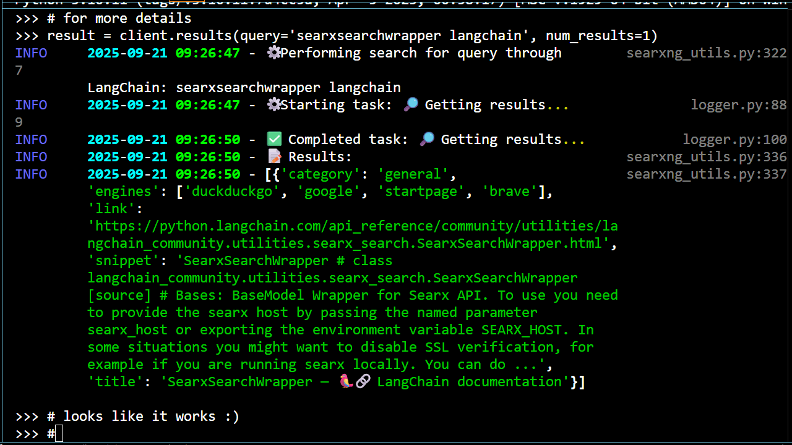
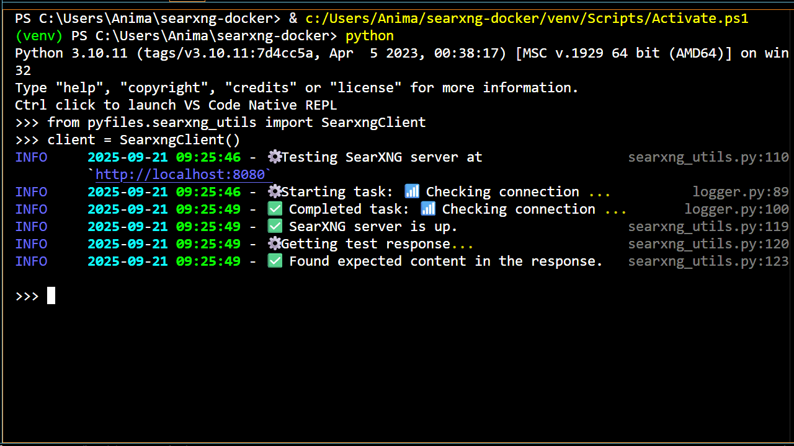

<div class="icon-def-1" style="text-align: center; border: 0.1rem dotted; width: 5%; float: right; padding: 0px; margin: 0px; font-size: 0.9rem; border-radius: 10px;">
  <a onclick="toggleAnimations()" title="Toggle Animations" style="cursor: pointer;">
    <p style="padding: 0px; margin: 0px;"><i class="mdi mdi-sine-wave"></i></p>
  </a>
</div>

# :simple-searxng:{.icon-def-0} SearXNG with Docker and LangChain

<hr class="icon-def-1 tertiary-icon", style="width: 90%;"> 

{ .img-def }

!!! tl-dr "TL;DR"
    Learn how to build and use a [metasearch engine][metasearch-engine]{.blank} on your local machine :material-laptop:{.icon-def-0}. Then, you can use this setup as a tool to give to [locally run AI agents][agents] :material-robot-outline:{.icon-def-0}.

<hr class="icon-def-1 tertiary-icon", style="width: 90%;"> 

## :material-map-marker-star-outline:{.icon-def-0} About This Project {#about}

<div class="grid cards" markdown style="text-align: center; font-size: 2rem; width: 10rem; margin: 0 auto;">

-   
    :simple-searxng:{.icon-def-1 style="color: var(--md-accent-fg-color)"} :simple-docker:{.icon-def-1 style="color: var(--md-accent-fg-color)"} :simple-langchain:{.icon-def-1 style="color: var(--md-accent-fg-color)"}

</div>

In this tutorial, we're going to setup a local :simple-searxng:{.icon-def-0} [SearXNG][searxng]{.blank} server in :simple-docker:{.icon-def-0} [Docker][docker]{.blank} for using the [metasearch engine][metasearch-engine]{.blank} on our local machines :material-laptop:{.icon-def-0}. Once setup, the engine can be used in a web browser by navigating to [http://localhost:8080][searxng-url]{.blank}. We're also going to see how to use our server to get web search results with the :simple-langchain:{.icon-def-0} [LangChain library][langchain]{.blank}. 

The code we learn and use here will serve as the foundation for an indispensable tool to give to our agents :material-hammer-wrench:{.icon-def-0}, allowing them to obtain unfamiliar or up to date information :material-calendar-month-outline:{.icon-def-0}. For a general overview of what we're going to do with these agents, checkout the :material-robot-excited-outline:{.icon-def-0} [next series of tutorials][agents].

---

[As previously mentioned][servers-why], the way we're going to build agents is by first building local servers for all the gadgets that our agents will need :material-hammer-wrench:{.icon-def-0}. Then, we can learn how to pass these gadgets over to our agents with :simple-langchain:{.icon-def-0} [LangChain][langchain]{.blank} and :simple-langgraph:{.icon-def-0} [LangGraph][langgraph]{.blank}. 

The :simple-ollama:{.icon-def-0} [first tutorial of the series][ollama-tutorial] covered how to setup a local [Ollama][ollama]{.blank} server in [Docker][docker]{.blank} to chat with LMs :material-chat-processing-outline:{.icon-def-0}. This tutorial is structurally the same. We'll learn how to setup and use the provided :simple-python:{.icon-def-0} [Python][python]{.blank} code, built on the [Requests][requests]{.blank} and :simple-langchain:{.icon-def-0} [LangChain][langchain]{.blank} libraries, to interact with the server :material-search-web:{.icon-def-0}. Then, we'll dive into the code to see how it all works :material-diving-scuba:{.icon-def-0}. 

---

When I first realized that :simple-searxng:{.icon-def-0} [SearXNG][searxng]{.blank} existed and that a local server could be bridged to an agent with :simple-langchain:{.icon-def-0} [LangChain][langchain]{.blank} and :simple-langgraph:{.icon-def-0} [LangGraph][langgraph]{.blank}, my body immediately started trying to figure out how to make it work before I realized what I was doing :material-bullseye-arrow:{.icon-def-0}. 

SearXNG doesn't collect my data :material-account-off:{.icon-def-0}, I can run it on my local machine :material-laptop:{.icon-def-0}, and it can be setup and used right away without knowing any of the details of how it works :material-auto-fix:{.icon-def-0}. Also, [all the code is right there][searxng-github]{.blank} in full view so I can [try to understand all the details][searxng-docker]{.blank}, if I want :material-wizard-hat:{.icon-def-0}. After setting up, I can even use it through a web browser, so I can see that it works right away without any extra code :material-flash:{.icon-def-0}. 

The SearXNG server will also utilize a :simple-caddy:{.icon-def-0} [Caddy][caddy]{.blank} server for a reverse proxy and a [Valkey][valkey]{.blank} server (acting through the :simple-redis:{.icon-def-0} [Redis][redis]{.blank} API) for storage. I won't go into the details of this part of the setup, though I tried to add extensive [documentation to the code][searxng-github-ak] as a result of me trying to understand what it was doing a bit better :material-puzzle-check-outline:{.icon-def-0}.

---

If you don't want to host a local server on your machine :material-server:{.icon-def-0} and you just want to give your agent a web search tool real quick with no fuss :material-flash:{.icon-def-0}, a good alternative is the :simple-duckduckgo:{.icon-def-0} [DuckDuckGo][duck-duck-go]{.blank} search tool that's [built into Langchain][duck-duck-go-langchain]{.blank}. If you don't care about having a free, but limited monthly quota or paying for search usage, the [Tavily][tavily]{.blank} search [tool for LangChain][tavily-langchain]{.blank} was promising as well :material-checkbox-marked-outline:{.icon-def-0}. 

For a refresher on how to use Docker to build an LM server that can power the decision making and response generating aspects of our agents, check out the :simple-ollama:{.icon-def-0} [Ollama server tutorial][ollama-tutorial]. For an idea of what types of agents we'll build with our servers, check out the :material-robot-excited-outline:{.icon-def-0} [agents tutorials][agents].

---

Finally, before you start building you can also check out the [original repo][searxng-docker]{.blank} on which our Docker setup is based :simple-searxng:{.icon-def-0} :simple-docker:{.icon-def-0}.

Now, let's get building :material-account-hard-hat-outline:{.icon-def-0}!

<hr class="icon-def-1 primary-icon", style="width: 90%;"> 

## :material-flag-checkered:{.icon-def-0} Getting Started

{.demo-img .png style="display:block;margin:auto;"}

{.demo-img .gif style="display:none;margin:auto;"}

First, we're going to setup and build the repo to make sure that it works :material-wrench:{.icon-def-0}. Then, we can play around with the code and learn more about it :material-test-tube:{.icon-def-0}. 

Check out [all the source code here][searxng-github-ak] :material-arrow-left-bold-outline:{.icon-def-0}.

??? vis-inst "Toggle for visual instructions"

    :material-progress-wrench:{.icon-def-0} This is currently under construction.

To setup and build the repo follow these steps:

1.  Make sure [Docker][docker]{.blank} is installed and running.
1.  Clone the repo, head there, then create a Python environment:

    ```bash
    git clone https://github.com/anima-kit/searxng-docker.git
    cd searxng-docker
    python -m venv venv
    ``` 

    <a id="gs-activate"></a>

1.  Activate the Python environment:

    ```bash
    venv/Scripts/activate
    ```

    <a id="gs-reqs"></a>

1.  Install the necessary Python libraries and create the `.env` file:

    ```bash
    pip install -r requirements.txt
    cp .env.example .env
    ```

1.  Generate a new secret key (see the README instructions of the [searxng-docker][searxng-docker]{.blank} repo for similar methods):

    === "Windows"

        ```bash
        $key = python -c "import secrets; print(secrets.token_bytes(32).hex())"
        $content = Get-Content .env
        $content = $content -replace 'SEARXNG_SECRET=.*', "SEARXNG_SECRET=$key"
        Set-Content .env $content
        ```

    === "Linux/macOS"

        ```bash
        SECRET_KEY=$(python3 -c "import secrets; print(secrets.token_bytes(32).hex())")
        sed -i.bak "s/SEARXNG_SECRET=.*/SEARXNG_SECRET=$SECRET_KEY/" .env
        ```

    > This generates a secret key to replace the `SEARXNG_SECRET` in the `.env` file. If you don't change the secret key, it'll be set to its default: `ultrasecretkey`. 

    > If you run the server with the secret key set to its default, you should get an error like so: `ERROR:searx.webapp: server.secret_key is not changed. Please use something else instead of ultrasecretkey.`

    <a id="gs-start"></a>

1.  Build and start all the Docker containers:

    ```bash
    docker compose up -d
    ```

    > All server data will be located in :material-database-outline:{.icon-def-0} Docker volumes (caddy-data, caddy-config, searxng-data, and valkey-data).

1.  Head to [http://localhost:8080/][searxng-url]{.blank} to start searching with a web browser.

    <a id="gs-test"></a>

1.  Run the test script to ensure the SearXNG server can be reached through the [Requests][requests]{.blank} and [LangChain][langchain]{.blank} libraries:

    ```bash
    python -m scripts.searxng_test
    ```

    > All logs from the test script are output in the console and stored in the :material-note-edit-outline:{.icon-def-0} `./searxng-docker.log` file.

    <a id="gs-stop"></a>

1.  When you're done, stop the Docker containers and cleanup with:
    ```bash
    docker compose down
    ```

<hr class="icon-def-1 primary-icon", style="width: 90%;">  

## :material-note-edit-outline:{.icon-def-0} Example Use Cases

Now that the repo is built and working, let's play around with the code a bit :material-test-tube:{.icon-def-0}. 

After setting up your :simple-searxng:{.icon-def-0} SearXNG server, you can now search the web through a [web browser][searxng-url]{.blank} or through the provided :simple-python:{.icon-def-0} Python methods.

---

When we first built our :simple-ollama:{.icon-def-0} Ollama server to power our agents, we demonstrated that the server could be reached and properly invoked by using the [provided code][ollama-examples] built on the [Ollama Python library][ollama-python]{.blank}. To chat with an LM, we first instantiated an instance of our `OllamaClient` class and used the `get_response` method to get LM responses for different LMs and messages :material-chat-processing-outline:{.icon-def-0}. We did this by executing commands in the command line :material-console:{.icon-def-0} and by running scripts :material-script-text-outline:{.icon-def-0}.

---

This time, we'll also instantiate a main class, but we'll have different methods to choose from depending on the type of results we want :material-newspaper-variant-multiple-outline:{.icon-def-0}. The class we'll use is the `SearxngClient` class of the `searxng_utils.py` file which is built on the [Requests][requests]{.blank} and :simple-langchain:{.icon-def-0} [LangChain][langchain]{.blank} libraries. Once this class is initialized, there are two potential methods to get search results, each from LangChain's [SearxSearchWrapper][searx-search-wrapper]{.blank}: `run`, and `results` [^requests-search].

The `run` method gives a single result which is a summary of all the aggregated results :material-newspaper-variant-outline:{.icon-def-0} while the `results` method gives a list of results with more details :material-newspaper-variant-multiple-outline:{.icon-def-0}. We still don't have a [nice web UI][agents] setup that facilitates easier interactions with our servers so let's keep using the command line :material-console:{.icon-def-0} and Python scripts :material-script-text-outline:{.icon-def-0}.

To start off, let's do a web search through the command line :material-arrow-down-bold-outline:{.icon-def-0}. 

<hr class="icon-def-1 primary-icon", style="width: 60%;"> 

### :material-console:{.icon-def-0} Searxng the Web through the Command Line {#cl}

??? vis-inst "Toggle for visual instructions"

    :material-progress-wrench:{.icon-def-0} This is currently under construction.

To do a web search, follow these steps:

1.  Do [step 3][step-activate] then [step 6][step-start] of the :material-flag-checkered:{.icon-def-0} `Getting Started` section to activate the Python environment and run all the Docker containers to start the SearXNG server.

1.  Call the Python environment to the command line:

    ```bash
    python
    ```

1.  Now that you're in the Python environment, import the SearxngClient class:

    ```bash
    from pyfiles.searxng_utils import SearxngClient
    ```

1.  Initialize the SearxngClient class:
    
    ```bash
    client = SearxngClient()
    ```

    <a id="cl-message"></a>

1.  Define your query:

    ```bash
    query = 'weather My-Location'
    ```

    <a id="cl-response"></a>

1.  Get results:

    ```bash
    client.run(query=query)
    ```

1.  Repeat [step 5][step-message] and [step 6][step-response] any number of times for different queries.

1.  Do [step 9][step-stop] of the :material-flag-checkered:{.icon-def-0}`Getting Started` section to stop the containers when you're done.

Just like with the test script, all logs will be printed in the console and stored in :material-note-edit-outline:{.icon-def-0} `./searxng-docker.log`. The `run` method can also be executed with the default query `Python programming` by running the method with no variables: `client.run()`.

---

Now that we know how to use the `run` method to get a summary of results :material-checkbox-marked-outline:{.icon-def-0}, let's use the `results` method to get more details :material-newspaper-variant-multiple-outline:{.icon-def-0}. 

In the next example, I show how to do this by creating and running a custom script to get a list of results for a query :material-arrow-down-bold-outline:{.icon-def-0}.

<hr class="icon-def-1 primary-icon", style="width: 60%;"> 

### :material-script-text-outline:{.icon-def-0} Searxng the Web through Running Scripts {#rs}

??? vis-inst "Toggle for visual instructions"

    :material-progress-wrench:{.icon-def-0} This is currently under construction.

To do a web search, follow these steps:

1.  Do [step 3][step-activate] then [step 6][step-start] of the :material-flag-checkered:{.icon-def-0} `Getting Started` section to activate the Python environment and run the SearXNG server in Docker.

    <a id="rs-create"></a>

1.  Create a script in the `./scripts` folder named `my_web_searx_ex.py` with the following:

    ```python
    # Import SearXNGClient class
    from pyfiles.searxng_utils import SearxngClient

    # Initialize client
    client = SearxngClient()

    # Define number of results and search query
    # Change these variables to get a different number of search results 
    # or to get results for a different search query
    num_results = 3
    query = 'SearxSearchWrapper LangChain'

    # Get response
    client.results(num_results=num_results, query=query)
    ```

    <a id="rs-run"></a>

1.  Run the script

    ```bash
    python -m scripts.my_web_searx_ex
    ```

1.  Do [step 9][step-stop] of the :material-flag-checkered:{.icon-def-0}`Getting Started` section to stop the containers when you're done.

Again, all logs will be printed in the console and stored in :material-note-edit-outline:{.icon-def-0} `./searxng-docker.log`. The name of the Python script doesn't matter as long as you use the same name in [step 2][step-create] and [step 3][step-run]. 

<hr class="icon-def-1 primary-icon", style="width: 30%;"> 

Now, you have the tools to edit the script (or create an entirely new script) to get any query results you like :material-checkbox-marked-outline:{.icon-def-0}. For more structured queries, you can loop through getting a different number of results for different queries :material-refresh:{.icon-def-0} with something like the following:

```python
# Define list of number of results
num_results_list = [3,2,1]

# Define queries to search for
queries = [
    'prominent factors evolution humans',
    'mathematical symbol PI',
    'weather My-Location'
]

# Get response for each (num_results, query) pair
for num_results, query in zip(num_results_list, queries):
    client.results(num_results=num_results, query=query)
```

If you followed along in the last tutorial where we built an :simple-ollama:{.icon-def-0} Ollama server to chat with an LM, you may remember that the [LM couldn't give a good answer][ollama-running-scripts-ex] for the last query :material-robot-confused-outline:{.icon-def-0}, because its static knowledge only goes up to some fixed point in the past. We can now use the metasearch engine tool :material-search-web:{.icon-def-0} to get appropriate answers for queries that need up to date information :material-calendar-month-outline:{.icon-def-0}. 

To make sure our agents can utilize this up to date information, all we need to do to is combine the :simple-ollama:{.icon-def-0} Ollama and :simple-searxng:{.icon-def-0} SearXNG servers and port everything to an our agents with :simple-langchain:{.icon-def-0} LangChain and :simple-langgraph:{.icon-def-0} LangGraph. This is exactly what we'll do in [future tutorials][agents] when we build our agents and give them tools :material-robot-excited-outline:{.icon-def-0} :material-hammer-wrench:{.icon-def-0}.

Now that we understand how to use the code, let's open it up to check out the gears :material-cog-outline:{.icon-def-0} :material-arrow-down-bold-outline:{.icon-def-0}.

<hr class="icon-def-1 primary-icon", style="width: 90%;"> 

## :material-view-quilt-outline:{.icon-def-0} Project Structure {#proj-struct}

Before we take a deep dive into the source code :material-diving-scuba:{.icon-def-0}, let's look at the repo structure to see what code we'll want to learn :material-magnify:{.icon-def-0}.

```
├── Caddyfile               # Caddy reverse proxy configuration
├── docker-compose.yml      # Docker configurations
├── pyfiles/                # Python source code
│   └── logger.py           # Python logger for tracking progress
│   └── searxng_utils.py    # Python methods to use SearXNG server
├── requirements.txt        # Required Python libraries for main app
├── requirements-dev.txt    # Required Python libraries for development
├── searxng/                # SearXNG configuration directory
│   └── limiter.toml        # Bot protection and rate limiting settings
│   └── settings.yml        # Further custom SearXNG settings
├── scripts/                # Example scripts to use Python methods
│   └── latency_test.py     # Timing tests for methods
│   └── searxng_test.py     # Python test of methods
├── tests/                  # Testing suite
├── third-party/            # searxng-docker licensing
└── .env.example            # Custom SearXNG environment variables
```

<h4 style="text-align: left;">third-party/</h4>

> This directory contains the necessary licensing information for the [original repo][searxng-docker]{.blank} on which our Docker setup is based. Since the original repo is licensed as [AGPL3][searxng-docker-license], [my repo][searxng-github-ak] is also [licensed the same][searxng-github-ak-license].

<h4 style="text-align: left;">docker-compose.yml</h4>

> Recall that we used a `docker-compose` file [in the first tutorial][ollama-docker-compose] to tell Docker how we wanted the Ollama server to be built :material-floor-plan:{.icon-def-0}. We'll also use a `docker-compose` file here to define how we want to build our SearXNG, Caddy, and Valkey/Redis servers. We'll spend a little bit of time on this one to further our understanding of how to use Docker :material-map-marker-star-outline:{.icon-def-0}. 

<h4 style="text-align: left;">.env.example</h4>

> This is the template for creating the `.env` file that we used in [step 4][step-requirements]  of the :material-flag-checkered:{.icon-def-0} `Getting Started` section for setting the `SEARXNG_SECRET`. This file can also be used if you want to change how the SearXNG server is hosted (rather than through the [localhost][localhost]{.blank} network) :material-laptop:{.icon-def-0}.

<h4 style="text-align: left;">Caddyfile</h4>

> The Caddyfile is a special file to tell Docker how to build the :simple-caddy:{.icon-def-0} [Caddy server][caddy]{.blank}. I won't go into this file in detail, but I did try to include [detailed comments][searxng-github-ak-caddyfile] in my attempts to understand how it works :material-puzzle-check-outline:{.icon-def-0}. This file is the exact same as the [original file][searxng-docker-caddyfile]{.blank} that it's based on, just with more comments and proper attribution :material-notebook-edit-outline:{.icon-def-0}.

<h4 style="text-align: left;">searxng/</h4>

> The `searxng/` directory contains special files to take care of extra settings for our SearXNG server :material-cog-outline:{.icon-def-0}. I also won't go into these files in detail, but I did try to add [detailed comments][searxng-github-ak-searxng] to help my understanding :material-puzzle-check-outline:{.icon-def-0}.

> The `limiter.toml` file, for rate limiting and bot protection, is exactly the same as in the [searxng-docker repo][searxng-docker-limiter]{.blank}, just with some extra comments and proper attribution :material-notebook-edit-outline:{.icon-def-0}. 

> The `settings.yml` file is also very similar to the [original file][searxng-docker-settings]{.blank}, except I removed the `secret_key` variable and moved this setup to the `.env.example` file instead :material-key-outline:{.icon-def-0}. I also added an extra `json` format to the search results :material-code-json:{.icon-def-0} in order to use the SearXNG server with LangChain's [SearxSearchWrapper][searx-search-wrapper]{.blank}.

<h4 style="text-align: left;">searxng_utils.py</h4>

> Finally, the `searxng_utils.py` defines the class and methods needed in order to get web search results from our SearXNG server :material-search-web:{.icon-def-0}. We're going to spend much of our deep dive on this one :material-map-marker-star-outline:{.icon-def-0}.

<a id="bonus-all-files"></a>

??? bonus-code "How do all the files work?"

    If you followed :simple-ollama:{.icon-def-0} [the previous tutorial][ollama-project-structure], you should be familar with the `logger.py`, `requirements*.txt`, `latency_test.py`, and `searxng_test.py` files as well as the `tests/` folder.
    
    Here, we also use the `logger.py` file to produce informative :material-chart-timeline:{.icon-def-0} and visually appealing :material-palette:{.icon-def-0} interactions, and the `requirements.txt` file to install all the necessary :simple-python:{.icon-def-0} Python libraries (see [step 4][step-requirements] of the :material-flag-checkered:{.icon-def-0} `Getting Started` section). Similarly, the `requirements-dev.txt` file can be used to install the necessary libraries for development :material-file-code-outline:{.icon-def-0}.

    We use the `latency_test.py` file to check how quickly our methods are working :material-timer-check-outline:{.icon-def-0}, and just like in the [Ollama server tutorial][ollama-test], the `searxng_test.py` file basically does what we did when [running the script][running-scripts]{data-preview} in the :material-note-edit-outline:{.icon-def-0} `Example Use Cases` section. This is the script that we ran in [step 6][step-test] of the :material-flag-checkered:{.icon-def-0}`Getting Started` section to test that our Python methods were working.

    The `tests/` folder also contains unit and integration tests for ensuring the code works properly :material-test-tube:{.icon-def-0}. To see how to use the testing suite, check out the [best practices note][ollama-code-best-practices] in the :simple-ollama:{.icon-def-0} Ollama server tutorial.

---

Ok, that's all the files :material-checkbox-marked-outline:{.icon-def-0}. Let's go diving :material-diving-scuba:{.icon-def-0}!

<hr class="icon-def-1 primary-icon", style="width: 90%;"> 

## :material-file-code-outline:{.icon-def-0} Code Deep Dive

Here, we're going to look at the relevant files in more detail :material-magnify:{.icon-def-0}. We're going to start with looking at the full files to see which parts of the code we'll want to learn, then we can further probe each of the important pieces to see how they work :material-map-marker-question-outline:{.icon-def-0}.

<hr class="icon-def-1 primary-icon", style="width: 60%;"> 

### :simple-searxng:{.icon-def-0} File 1 | `searxng_utils.py` {#searxng-utils}

??? vis-inst "Toggle file visibility"

    === "Skeleton"

        ```python title="searxng_utils.py skeleton" linenums="1" hl_lines="77-85 89-99"
        --8<--
        docs/tutorials/applications/agents/servers/assets/searxng/searxng-utils-skeleton.py
        --8<--
        ``` 

    === "Full"
        
        ```python title="searxng_utils.py full" linenums="1" hl_lines="215-276 280-344"
        --8<--
        docs/tutorials/applications/agents/servers/assets/searxng/searxng-utils-full.py
        --8<--
        ```

Above, I show the `searxng_utils.py` file in all its full glory as well as in a skeleton version :material-bone:{.icon-def-0} which is all the code needed to work :material-power:{.icon-def-0} and almost none of the code for some crucial [best practices][ollama-code-best-practices].

Similarly to the `ollama_utils.py` file in the [Ollama server tutorial][ollama-utils], we have both internal methods :material-tag-hidden:{.icon-def-0} and external methods. The methods of the class that we're going to use are the `run` and `results` methods (exactly what we used when [working in the command line][command-line]{data-preview} and [running scripts][running-scripts]{data-preview} in the :material-note-edit-outline:{.icon-def-0} `Example Use Cases` section). The two methods are almost exactly identical, but the `results` method takes in an extra argument. 

Let's check these methods out :material-arrow-down-bold-outline:{.icon-def-0}.

<hr class="icon-def-1 primary-icon", style="width: 30%;"> 

---

#### :material-map-marker-question-outline:{.icon-def-0} Methods 1.1 | `run` and `results` {#run-results}

: See [lines 77-85][searxng-utils]{data-preview} and [lines 89-99][searxng-utils]{data-preview} of `searxng_utils.py`

We've already seen that the `run` and `results` methods can take in a query, then output some search results. The `run` method ouputs a summary of all the aggregated results :material-newspaper-variant-outline:{.icon-def-0} while the `results` method outputs a list of detailed results based on the `num_results` argument :material-newspaper-variant-multiple-outline:{.icon-def-0}. Now, we can open up the methods to see how this is all done :material-book-open-variant-outline:{.icon-def-0}.

=== "run"

    ```python title="run method of searxng_utils.py" linenums="1" hl_lines="11-13" 
    --8<--
    docs/tutorials/applications/agents/servers/assets/searxng/searxng-utils-stripped.py:12:14,60:70
    --8<--
    ```

=== "results"

    ```python title="results method of searxng_utils.py" linenums="1" hl_lines="15-18" 
    --8<--
    docs/tutorials/applications/agents/servers/assets/searxng/searxng-utils-stripped.py:12:14,15:17,72:84
    --8<--
    ```

Here, we see that we're using the `run` and `results` method of our `client` attribute to get results (see [lines 11-13][run-results]{data-preview} of the `run` method and [lines 15-18][run-results]{data-preview} of the `results` method). All we need to do now is understand how the `client` attribute works (see [line 29][searxng-utils]{data-preview} of the `searxng_utils.py` file) :material-checkbox-marked-outline:{.icon-def-0}. 

Let's look at how we define the `client` attribute of the class more closely :material-arrow-down-bold-outline:{.icon-def-0}.

<hr class="icon-def-1 primary-icon", style="width: 30%;"> 

---

#### :material-map-marker-question-outline:{.icon-def-0} Method 1.2 | `__init__` {#code-init}

: See [lines 20-29][searxng-utils]{data-preview} of `searxng_utils.py`

This method instantiates the LangChain [SearxSearchWrapper][searx-search-wrapper]{.blank} which has the `run` and `results` methods that [we saw above][run-results]{data-preview} already built in. All we need to do is properly point to the SearXNG server that we created with Docker. 

```python title="__init__ method of searxng_utils.py" linenums="1" hl_lines="16" 
--8<--
docs/tutorials/applications/agents/servers/assets/searxng/searxng-utils-skeleton.py:6:7,9:11,19:29
--8<--
```

So, we can just invoke the `client.run` and `client.results` methods to create our own `run` ([lines 77-85][searxng-utils]{data-preview}) and `results` ([lines 89-99][searxng-utils]{data-preview}) methods :material-flash:{.icon-def-0}. It really is just this easy when [other people do all the work for you][searx-search-wrapper]{.blank}. We can just wrap up their code to be used in our custom setting :material-candy:{.icon-def-0}. 

??? bonus-code "Wasn't there another argument in the `__init__` method?"

    Yep :material-robot-happy-outline:{ .icon-def-0 }. In the [full version][searxng-utils]{data-preview} of `searxng_utils.py`, the `__init__` method has an extra `client` argument. I added this here to allow the user to define their own [SearxSearchWrapper][searx-search-wrapper]{.blank} with any arguments that they'd like :material-palette-outline:{.icon-def-0}. 
    
    It's also helpful to define the class this way when testing the code without access to the SearXNG server :material-server-off:{.icon-def-0}. In this case, we want to [mock][mock-testing]{.blank} the server and we can easily pass this mock through the `client` attribute :material-flash:{.icon-def-0}.

Now, it's generally good practice to make sure the SearXNG server can be reached :material-check-network-outline:{.icon-def-0} as soon as we instantiate our class, otherwise the user might get a surprise error when trying to get search results :material-head-question-outline:{.icon-def-0}. This is exactly what we're doing when we use the `_test_searxng` method on [line 13][code-init]{data-preview}.

Let's look at how we test the SearXNG server more closely :material-arrow-down-bold-outline:{.icon-def-0}.

<hr class="icon-def-1 primary-icon", style="width: 30%;"> 

---

#### :material-map-marker-question-outline:{.icon-def-0} Method 1.3 | `_test_searxng` {#code-test-searxng}

: See [lines 33-56][searxng-utils]{data-preview} of `searxng_utils.py`

This method ensures the SearXNG server can be properly reached and exits the program with an error if it can't :material-alert-octagon-outline:{.icon-def-0}.

```python title="_test_searxng method of searxng_utils.py" linenums="1" hl_lines="15 18 25 28" 
--8<--
docs/tutorials/applications/agents/servers/assets/searxng/searxng-utils-stripped.py:4:5,7:7,18:42
--8<--
```

Here, we loop through five consecutive tries of getting a successful response from the server :material-chat-question-outline:{.icon-def-0} using the [Requests][requests]{.blank} library ([lines 12-15][code-test-searxng]{data-preview}). If the status code is a success (i.e. 200), we exit the method successfully :material-checkbox-marked-outline:{.icon-def-0} and move on to defining our `client` attribute ([line 16][code-init]{data-preview} of the `__init__` method). If the status code isn't a success, we wait for a bit ([lines 24-25][code-test-searxng]{data-preview}), then try again until the fifth try. If we still don't get a success, we exit the program with an error ([line 28][code-test-searxng]{data-preview}) :material-alert-octagon-outline:{.icon-def-0}. This way, the user will know up front that there's going to be problems getting search results :material-head-alert-outline:{.icon-def-0}.

This retry mechanism works for *server errors* in which the server is available for requests, but it somehow isn't able to perform the request properly (like the website doesn't exist or it's taking too long to reply) :material-help-network-outline:{.icon-def-0}. However, if we have more serious issues like we can't even connect to the server :material-server-off:{.icon-def-0}, we want to let the user know this immediately without going through the whole retry logic ([lines 20-21][code-test-searxng]{data-preview}) :material-flash:{.icon-def-0}.

<a id="requests-search"></a>

??? bonus-code "How does the `requests_search` method work?"

    The `requests_search` method ([lines 60-73][searxng-utils]{data-preview} of `searxng_utils.py`) uses the [Requests][requests]{.blank} library to get the entire HTML output of the search request :material-code-block-tags:{.icon-def-0}. Results are also obtained this way in LangChain's [SearxSearchWrapper][searx-search-wrapper-source]{.blank} (see the `_searx_api_query` method and how it's used in the `run` and `results` methods), but with a lot of extra formatting, error handling, and cleaning to promote more useful results :material-creation-outline:{.icon-def-0}. Might as well stand on the shoulders of giants :material-image-filter-hdr-outline:{.icon-def-0} and utilize the work that's been gifted to us :material-gift-open-outline:{.icon-def-0}. However, I wanted to add this method for learning purposes :material-wizard-hat:{.icon-def-0}.

    <a id="code-requests-search"></a>

    ```python title="requests_search method of searxng_utils.py" linenums="1" hl_lines="0"
    --8<--
    docs/tutorials/applications/agents/servers/assets/searxng/searxng-utils-stripped.py:5:5,7:7,12:14,44:58
    --8<--
    ```

    Here, we're formatting the query to work properly with the [Requests][requests]{.blank} library on [line 12][code-requests-search], then we're using the GET method to get our results from the SearXNG server URL defined in our Docker setup ([lines 15-19][code-requests-search]). Finally, we return the `text` attribute of the result ([line 20][code-requests-search]) :material-newspaper:{.icon-def-0}. 

    As an aside, when playing around with the Requests library I learned that you can feed this `params` dictionary basically any Python object as the `query` :material-shape-plus:{.icon-def-0} and Requests will use Python's [urllib][urllib]{.blank} to parse it into a [URL encoded string][url-encode]{.blank}. By adding a `query` validation in the `requests_search` method, the user now knows exactly what they can pass to the method (see [lines 181-185][searxng-utils]{data-preview} of the full version of the `searxng_utils.py` file) :material-checkbox-marked-outline:{.icon-def-0}.
 
---

And that's it :material-checkbox-marked-outline:{.icon-def-0}! Those are all the methods that we need to dig through in order to understand how to get web search results from our SearXNG server using the [Requets][requests]{.blank} and [LangChain][langchain]{.blank} libraries.  

Now, how about creating the SearXNG server that we'll be pointing to in order to get results :material-arrow-down-bold-outline:{.icon-def-0}?

<hr class="icon-def-1 primary-icon", style="width: 60%;"> 

### :simple-docker:{.icon-def-0} File 2 | `docker-compose.yml` {#docker-compose}

??? vis-inst "Toggle file visibility"

    ```yaml title="docker-compose.yml (original file: https://github.com/searxng/searxng-docker/blob/master/docker-compose.yaml)" linenums="1" hl_lines="0"
    --8<--
    docs/tutorials/applications/agents/servers/assets/searxng/docker-compose.yml
    --8<--
    ```

[Recall from the first tutorial][ollama-docker-compose] that we used :simple-docker:{.icon-def-0} Docker compose files to tell [Docker][docker]{.blank} how to create our :simple-ollama:{.icon-def-0} [Ollama][ollama]{.blank} server. This time we want three containers: a :simple-searxng:{.icon-def-0} SearXNG server, a :simple-caddy:{.icon-def-0} Caddy server, and a Valkey server ported through the :simple-redis:{.icon-def-0} Redis API. 

Similarly to how we defined the Ollama container under the `services` section in the [Ollama server tutorial][ollama-docker-compose], we'll define all the services that we need under this section :material-cube-outline:{.icon-def-0}. We'll also define the Docker volumes to store all of our data :material-database-outline:{.icon-def-0} and the Docker network so that our containers can communicate with each other :material-server-network:{.icon-def-0}. We're also going to add in healthchecks for all our containers to periodically make sure that they can be properly reached :material-thermometer-check:{.icon-def-0}.

In the snippet below, I show how to define the SearXNG service as well as the volumes and networks :material-arrow-down-bold-outline:{.icon-def-0}.

<hr class="icon-def-1 primary-icon", style="width: 30%;"> 

---

> You can access the original file that the following snippet is based on [here][searxng-docker-docker-compose]{.blank} and [here][animakit-searxng-docker-compose]. You can also access the modified file [here][searxng-github-ak-docker-compose].

<a id="docker-compose-piece"></a>

```yaml title="docker-compose.yml piece (original file: https://github.com/searxng/searxng-docker/blob/master/docker-compose.yaml)" linenums="1" hl_lines="0"
--8<--
docs/tutorials/applications/agents/servers/assets/searxng/docker-compose-stripped.yml
--8<--
```

The SearXNG container ([lines 9-34][docker-compose-piece]) is defined similarly to how we defined our :simple-ollama:{.icon-def-0} [Ollama container][ollama-docker-compose] with the image, name, volume, and port that we want to use. In this case, we want to interact with the server by using our [localhost][localhost]{.blank} network to send requests to port `8080` (the designated port that's chosen by default in the [searxng-docker repo][searxng-docker]{.blank}) [^port-8080]. This is [where we point][code-init]{data-preview} when we initialize the `SearxngClient` class of the `searxng_utils.py` file :material-access-point-check:{.icon-def-0} and the URL that we pass to LangChain's [SearxSearchWrapper][searx-search-wrapper]{.blank} :material-search-web:{.icon-def-0}.

---

Now, there are some new techniques here that we didn't use when building the [Ollama server][ollama-docker-compose] :material-flask-plus-outline:{.icon-def-0}. First, when we set up our Ollama server we didn't need it to interact with any other servers in our Docker network :material-server-network-outline:{.icon-def-0}. However, here we need our SearXNG and Redis containers to talk to each other, so we define a proper network for container communication :material-chat-alert-outline:{.icon-def-0}. 

We also *definitely* need our Caddy and SearXNG services to communicate with each other :material-chat-processing-outline:{.icon-def-0}, but they do so in a different way :material-shape-plus:{.icon-def-0}. Since we set the `network_mode` to `host` for our Caddy service (see [line 38][docker-compose]{data-preview} of the full Docker compose file), it's directly ported to our [localhost][localhost]{.blank} network and so the service can communicate with SearXNG directly through the URL we set: [http://localhost:8080][searxng-url]{.blank} :material-checkbox-marked-outline:{.icon-def-0}.

Besides the network, we also want to define Docker volumes to handle all of our configuration and data storage. In the code snippet, we can see how the Docker network ([lines 37-38][docker-compose-piece]) :material-server-network:{.icon-def-0} and volumes ([lines 41-45][docker-compose-piece]) :material-database-outline:{.icon-def-0} are defined with ease, while the SearXNG service is defined to use the proper volume and network ([lines 15 and 20][docker-compose-piece]). The other volume definition on [line 19][docker-compose-piece] tells Docker where to find all of our SearXNG settings in the `./searxng` folder :material-palette-outline:{.icon-def-0}. 

---

Next, notice that we added some environment variables to the SearXNG server definition ([lines 21-25][docker-compose-piece]). These are using the variables defined in the `.env` file to define the base URL and secret key :material-cog-outline:{.icon-def-0}. If these aren't defined, the base URL for the server will be `localhost` to use the [localhost][localhost]{.blank} network and the secret key will be `ultrasecretkey` (which will cause an error and a failed server build because the secret key can't be set to this default value) :material-key-outline:{.icon-def-0}.

Finally, we've added a healtcheck for the SearXNG server ([lines 26-34][docker-compose-piece]) :material-thermometer-check:{.icon-def-0}. This periodically checks that the SearXNG server can be reached at the [designated healthcheck endpoint][healthz-why]{.blank} using a [wget][wget]{.blank} request. However, we just want to check that the server endpoint exists and so we add the `--spider` argument to make a [HEAD request][head-request]{.blank}. 

We designate a time at which to start this healtcheck (30s after the server starts) :material-timer-play-outline:{.icon-def-0} and the time interval at which we should repeat this healthcheck (every 10s) :material-timer-alert-outline:{.icon-def-0}. We also designate how long to wait for a response before considering the test as failed (the timeout time here is set to 5s) :material-timer-remove-outline:{.icon-def-0} and how many times to repeat the test after failing before the container is deemed unhealthy (retry 3 times) :material-timer-refresh-outline:{.icon-def-0}. 

In our case, when the server is deemed unhealthy :material-thermometer-alert:{.icon-def-0}, it will restart because of the `restart` argument that we added on [line 13][docker-compose-piece] which tells Docker to try to restart the server unless it's manually stopped by the user :material-restart-alert:{.icon-def-0}.  

---

That's it :material-checkbox-marked-outline:{.icon-def-0}! We've gone through all the code in this repo that's needed to understand how to setup a :simple-searxng:{.icon-def-0} SearXNG server in :simple-docker:{.icon-def-0} Docker and use it to search the web with the Requests and :simple-langchain:{.icon-def-0} LangChain libraries :material-creation-outline:{.icon-def-0}.

<hr class="icon-def-1 primary-icon", style="width: 90%;"> 

## :material-bookshelf:{.icon-def-0} Next Steps & Learning Resources

There are two more tutorials in the [servers series][servers]: one which shows how to build a :simple-milvus:{.icon-def-0} [Milvus server][milvus-tutorial] in order to store and query custom data; and the other to show how to :simple-docker:{.icon-def-0} [combine all the servers][multi-server-tutorial] covered in the series. This last tutorial will show how to build the complete server stack that we'll use for our specialized :material-robot-excited-outline:{.icon-def-0} [agent builds][agents]. 

Continue learning how to build the rest of the servers by following along with another tutorial in the :material-server:{.icon-def-0} [servers series][servers] or learn how pass this SearXNG server to an agent and interact with it through a [Gradio][gradio]{.blank} web UI in the :material-file-code-outline:{.icon-def-0} [code agent][code-agent] tutorial. You can also checkout other agent builds in the rest of the :material-robot-excited-outline:{.icon-def-0} [agents tutorials][agents].

Just like all the other tutorials, :simple-github:{.icon-def-0} [all the source code is available][animakit] so you can plug and play any of tutorial code right away :material-controller-classic:{.icon-def-0}.

<hr class="icon-def-1 primary-icon", style="width: 60%;"> 

## :material-link-variant:{.icon-def-0} Contributing 

This tutorial is a work in progress. If you'd like to suggest or add improvements :material-notebook-edit-outline:{.icon-def-0}, fix bugs or typos :material-shield-bug-outline:{.icon-def-0}, ask questions to clarify :material-chat-question-outline:{.icon-def-0}, or discuss your understanding :material-wizard-hat:{.icon-def-0}, feel free to contribute through participating in the site :material-forum-outline:{.icon-def-0} [discussions][discussions]! Check out the :material-link-variant:{.icon-def-0} [contributing guidelines][contributing] to get started.

<hr class="icon-def-1 primary-icon", style="width: 30%;"> 


<!-- FOOTNOTES -->
[^requests-search]: There's also one other method, but it basically does what the LangChain methods do without all the nice cleaning up to facilitate ease of use. This method, the `requests_search` method, will output the *entire* HTML content of the resulting site, which is great for learning purposes :material-wizard-hat:{.icon-def-0}, but the [LangChain methods][searx-search-wrapper-source]{.blank} have done all the cleaning up for us :material-creation-outline:{.icon-def-0}. You can check out the `requests_search` [bonus code][requests-search] to see how this method works.

[^port-8080]: From what I can tell, `8080` is largely abritrary but does have some significance behind it. I think the story goes something like this: Port `80` is the standard port for HTTP, but any port value less than 1024 will typically be designated for root users and I don't want my server to have those kinds of privileges. I could tack a couple of zeros on there and use port 8000, but I see this is widely used for some other, official services. Maybe just tack an 80 on there instead? Sure, looks good. Port `8080` it is :material-checkbox-marked-outline:{.icon-def-0}. 


<!-- LINKS -->
[agents]: ../agents/index.md
[animakit]: https://github.com/anima-kit
[animakit-searxng-docker-compose]: https://github.com/anima-kit/anima-kit.github.io/blob/main/third-party/searxng-docker-code/docker-compose.yaml
[caddy]: https://caddyserver.com/
[chatbot]: ../agents/chatbot.md
[code-agent]: ../agents/code-agent.md
[code-best-practices]: ollama.md#code-best-practices
[docker-compose]: searxng.md#docker-compose
[code-init]: searxng.md#code-init
[code-requests-search]: searxng.md#code-requests-search
[run-results]: searxng.md#run-results
[code-test-searxng]: searxng.md#code-test-searxng
[command-line]: searxng.md#cl
[contributing]: https://github.com/anima-kit/anima-kit.github.io/blob/main/CONTRIBUTING.md
[discussions]: https://github.com/anima-kit/anima-kit.github.io/discussions
[docker]: https://www.docker.com/
[docker-compose-full]: searxng.md#docker-compose-file
[docker-compose-piece]: searxng.md#docker-compose-piece
[duck-duck-go]: https://duckduckgo.com/
[duck-duck-go-langchain]: https://python.langchain.com/docs/integrations/tools/
[environment-variables]: https://en.wikipedia.org/wiki/Environment_variable
[gradio]: https://www.gradio.app/
[head-request]: https://http.dev/head
[healthz-why]: https://stackoverflow.com/questions/43380939/where-does-the-convention-of-using-healthz-for-application-health-checks-come-f
[langchain]: https://www.langchain.com/
[langgraph]: https://www.langchain.com/langgraph/
[localhost]: https://en.wikipedia.org/wiki/Localhost
[logging]: https://docs.python.org/3/library/logging.html
[metasearch-engine]: https://en.wikipedia.org/wiki/Metasearch_engine
[milvus-tutorial]: milvus.md
[mock-testing]: https://en.wikipedia.org/wiki/Mock_object
[multi-server-tutorial]: multi-server.md
[mypy]: https://mypy-lang.org/
[ollama]: https://ollama.com/
[ollama-code-best-practices]: ollama.md#code-best-practices
[ollama-docker-compose]: ollama.md#docker-compose
[ollama-examples]: ollama.md#examples
[ollama-project-structure]: ollama.md#proj-struct
[ollama-python]: https://github.com/ollama/ollama-python/
[ollama-running-scripts-ex]: ollama.md#running-scripts-ex
[ollama-test]: ollama.md#ollama-test
[ollama-tutorial]: ollama.md
[ollama-utils]: ollama.md#ollama-utils
[ollama-utils-skeleton]: ollama.md#ollama-utils-skeleton
[python]: https://www.python.org/
[pytest]: https://docs.pytest.org/en/stable/#
[pytest-order]: https://pypi.org/project/pytest-order/
[re]: https://docs.python.org/3/library/re.html
[redis]: https://redis.io/
[requests]: https://requests.readthedocs.io/en/latest/
[requests-search]: searxng.md#requests-search
[rich]: https://github.com/Textualize/rich
[running-scripts]: searxng.md#rs
[searx-search-wrapper]: https://python.langchain.com/api_reference/community/utilities/langchain_community.utilities.searx_search.SearxSearchWrapper.html
[searx-search-wrapper-source]: https://python.langchain.com/api_reference/_modules/langchain_community/utilities/searx_search.html#SearxSearchWrapper
[searxng]: https://docs.searxng.org/
[searxng-docker]: https://github.com/searxng/searxng-docker/tree/master
[searxng-docker-caddyfile]: https://github.com/searxng/searxng-docker/blob/master/Caddyfile
[searxng-docker-docker-compose]: https://github.com/searxng/searxng-docker/blob/master/docker-compose.yaml
[searxng-docker-license]: https://github.com/anima-kit/anima-kit.github.io/blob/main/third-party/searxng-docker-LICENSE
[searxng-docker-limiter]: https://github.com/searxng/searxng-docker/blob/master/searxng/limiter.toml
[searxng-docker-settings]: https://github.com/searxng/searxng-docker/blob/master/searxng/settings.yml
[searxng-github]: https://github.com/searxng/searxng
[searxng-github-ak]: https://github.com/anima-kit/searxng-docker
[searxng-github-ak-caddyfile]: https://github.com/anima-kit/searxng-docker/blob/main/Caddyfile
[searxng-github-ak-docker-compose]: https://github.com/anima-kit/searxng-docker/blob/main/docker-compose.yml
[searxng-github-ak-generate-key]: https://github.com/anima-kit/searxng-docker/blob/main/generate_key.py
[searxng-github-ak-license]: https://github.com/anima-kit/searxng-docker/blob/main/LICENSE
[searxng-github-ak-searxng]: https://github.com/anima-kit/searxng-docker/tree/main/searxng
[searxng-tutorial]: http://anima-kit.github.io/tutorials/servers/searxng/
[searxng-url]: http://localhost:8080
[searxng-utils]: searxng.md#searxng-utils
[secrets]: https://docs.python.org/3/library/secrets.html
[servers]: index.md
[servers-why]: index.md#servers-why
[step-activate]: searxng.md#gs-activate
[step-create]: searxng.md#rs-create
[step-message]: searxng.md#cl-message
[step-requirements]: searxng.md#gs-reqs
[step-response]: searxng.md#cl-response
[step-run]: searxng.md#rs-run
[step-set-environment]: searxng.md#gs-set-env
[step-start]: searxng.md#gs-start
[step-stop]: searxng.md#gs-stop
[step-test]: searxng.md#gs-test
[tavily]: https://www.tavily.com/
[tavily-langchain]: https://python.langchain.com/docs/integrations/tools/tavily_search/
[unittest]: https://docs.python.org/3/library/unittest.html
[url-encode]: https://en.wikipedia.org/wiki/Percent-encoding
[urllib]: https://docs.python.org/3/library/urllib.parse.html
[valkey]: https://valkey.io/
[wget]: https://www.gnu.org/software/wget/