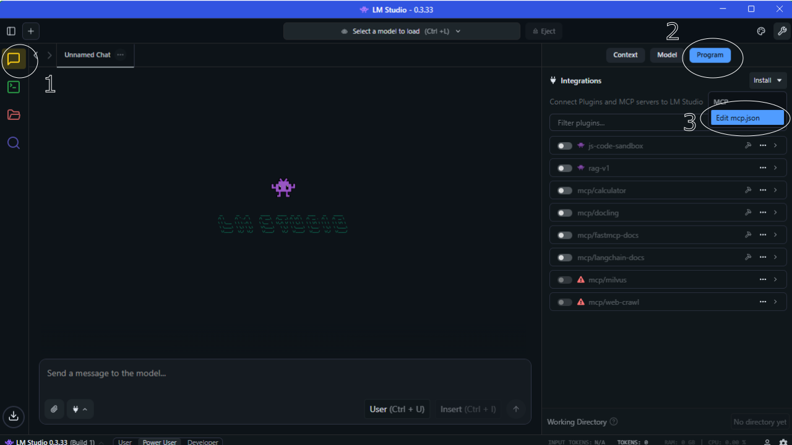
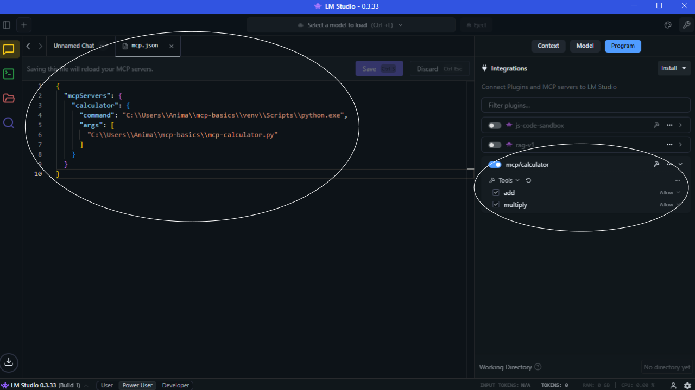
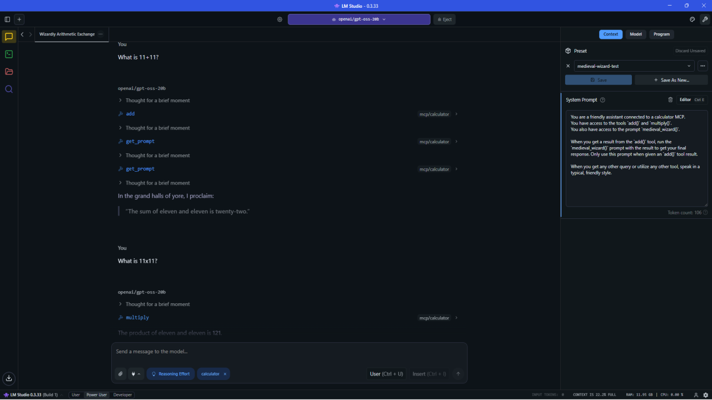

<div class="icon-def-1" style="text-align: center; border: 0.1rem dotted; width: 5%; float: right; padding: 0px; margin: 0px; font-size: 0.9rem; border-radius: 10px;">
  <a onclick="toggleAnimations()" title="Toggle Animations" style="cursor: pointer;">
    <p style="padding: 0px; margin: 0px;"><i class="mdi mdi-sine-wave"></i></p>
  </a>
</div>

# :material-usb-c-port:{ .icon-def-0 } MCP Basics

<hr class="icon-def-1 tertiary-icon", style="width: 90%;"> 

:material-wizard-hat:{.icon-def-0} Learn how to give your agents tools and context with `Model Context Protocol (MCP)`. :material-fire:{.icon-def-0} 

{ .img-def }

MCP acts a layer between AI agents and all that useful external information. It automatically takes care of letting the agent know *what tools and information it has access to* as well as *packaging and transporting appropriate information*. It's a `general protocol` for the complex task of passing `context` between the `agent`, the multitude of tools in the `agent's toolbox`, and the `user`.

All of the major agent frameworks have some way of allowing agents to interact with MCP servers, giving them access to organized, clean data for specific use cases. In this tutorial, we'll learn about the basic concepts of MCP, then see how to create a very simple `calculator` MCP with the [FastMCP][fastmcp] library and test its usage through the [MCP Inspector][mcp-inspector]. We'll also see how to pass this MCP to LLMs hosted through [LM Studio][lm-studio]. 

Since all of this happens on your local machine, you can easily create your own MCP servers and locally test them for free. :material-test-tube:{.icon-def-0} :material-monitor-shimmer:{.icon-def-0}

So, let's get started! 

<hr class="icon-def-1 primary-icon", style="width: 90%;"> 

## :material-shape-plus:{.icon-def-0} Concepts

To use MCP we need to create a `server` that contains all the useful data, tools, and context that we want our LLM to have access to. We need to then use a `host` that can create a `client` to connect the LLM to the server. The host could be some sort of LLM hosting platform like [LM Studio][lm-studio], or coding agent like [OpenCode][opencode], both of which have MCP integration which allows for the creation of clients that facilitate interactions between LLMs and connected servers. 

<div class="center-table" markdown>
| concept | description |
| --- | --- |
| server | Tools, data, etc. to give to LLM |
| host | Houses the LLM and creates a client | 
| client | Mediates between the LLM and the server | 
</div>

To create these servers, we can use pre-packaged libraries that have abstracted away much of the MCP server creation process. For example, when using the [MCP Python SDK][mcp-python] or the [FastMCP][fastmcp] libraries, this creation process is just a few short lines and a run command... :material-flash:{.icon-def-0} But, before we look at any code, let's see how these concepts play out with a simple example.

The user is chatting with an LLM in LM Studio. They have a `search` MCP server with a `web_search` tool. 

1. The user turns on the `search` server in LM Studio. 
1. LM Studio creates a client that will act as a mediator between the server and the LLM. 
1. The user inputs, `Search the web for Y.` 
1. If the LLM is structured for tool use, it will understand to use the `web_search` tool with an appropriate query. 
   > The LLM understands what tools and information it has access to because the client has given it this information. 
1. The client packages and sends the query information to the server. 
1. The server runs the tool and outputs the result.
1. The client then packages and sends result information back to the LLM. 
1. The LLM responds to the user with a web search informed answer.

In this way, various results from different tools and data resources can easily and efficiently be passed back and forth between the LLM and the server - in a standardized way. So, we can create one MCP server and use it with many different agent frameworks or LLM hosting platforms. 

Now that we see a bit more how MCP works, let's build something with it. First, take the simple example of a `calculator`. 

<hr class="icon-def-1 primary-icon", style="width: 60%;">

## :material-calculator-variant-outline:{.icon-def-0} Calculator MCP

To build MCPs, we'll use the [FastMCP][fastmcp] library. If you want to follow along with the code, make sure to install the library:

```bash
uv venv venv
venv/Scripts/activate
uv pip install fastmcp
```

> Alternatively, you can use the [MCP Python SDK][mcp-python] which uses an early version of FastMCP. However, to my knowledge, some of the features we'll utilize later aren't included in the original FastMCP implementation.

Now, let's see how to create our example. First, let's save the following code to a file called `mcp-caculator.py` (you can get the full script [here][ak-mcp-basics]):

```python
## Import FastMCP
from fastmcp import FastMCP

## Create calculator server
server = FastMCP("calculator")
```

Now that the server is created, we can see if it works. 

```bash
fastmcp dev mcp-calculator.py
```

After running the code above, you can navigate to [http://localhost:6274/][mcp-web-ui] to play with the [MCP Inspector][mcp-inspector] - a web UI instance where you can check out some useful properties and test your server. Right now, we don't have any tools or other useful functions added to our calculator, so there isn't much to see yet. Let's create some tool functions and add them to our MCP.

<hr class="icon-def-1 primary-icon", style="width: 30%;"> 

### Tools

To create tools that we can use with our `calculator` MCP, all we need to do is tack the `tool` decorator to each function we want to include. 

```python
## Include tools for server `calculator` by adding `tool` decorator

@server.tool()
def add(a: float, b: float) -> float:
    """
    Add two numbers together.

    Args
    -------
    a: float
        The first number.
    b: float
        The second number.

    Returns
    -------
    float:
        The sum of the two numbers.    
    """
    return float(a + b)

@server.tool()
def multiply(a: float, b: float) -> float:
    """
    Multiply two numbers together.

    Args
    -------
    a: float
        The first number.
    b: float
        The second number.

    Returns
    -------
    float:
        The two numbers multiplied together.    
    """
    return float(a * b)
```

After adding the above code to our `mcp-calculator.py` file and restarting the server, you should see that the Inspector now lists the `add` and `multiply` tools. You can then test them by plugging-in different numbers to get the results. 

> Even though we can test the functions in the MCP Inspector, it isn't actually able to `transport` anything to external hosts yet. We just need to add a couple more lines to `mcp-calculator.py` to tell FastMCP to run the server in `stdio` mode:

```python
## Run the server in stdio mode
if __name__ == "__main__":
    server.run(transport="stdio")
```

Great! That was really easy to create and now we can add any sort of function we like as a `tool` that can then be used by an appropriate client. So, how do we go about connecting this server to a host? 

<hr class="icon-def-1 primary-icon", style="width: 30%;">

### Example Use Case - LM Studio

In LM Studio, this is really easy. All we need to do is find our MCP JSON configuration file and add our new MCP server.

> You can edit the `mcp.json` file by navigating to the `Program` tab on the `Chat` interface. Then, click the `Install` button followed by `Edit mcp.json`. This will open the JSON file in an editor so that you can modify the file. Alternatively, you can open the `mcp.json` file directly - mine was located at `C:\\Users\\Anima\.cache\lm-studio`.

{ .img-def }

Open the file and copy and paste this:

```
{
  "mcpServers": {
    "calculator": {
      "command": "path/to/your/python-environment/python.exe",
      "args": [
        "path/to/your/mcp-calculator.py"
      ]
    }
  }
}
```

Then, change the paths to your appropriate Python executable and the calculator script that we created. After you save your edits, you should see the `calculator` MCP with the `add` and `multiply` tools. You can then toggle the `calculator` MCP on in the LM Studio interface and start using it by interacting with an LLM.

{ .img-def }

Now, we have the basic setup necessary to create our own local MCP servers then use them when chatting with local LLMs!

<hr class="icon-def-1 primary-icon", style="width: 60%;">

## :material-cog-outline:{.icon-def-0} Advanced Configurations

What else can we do with this setup? Well, one neat thing is adding [prompts][fastmcp-prompts] to instruct the LLM in a specific way. 

Let's take a really simple example of telling the LLM to give us the result of any `add` tool in `medieval wizard` style. All we need to do is add a prompt to our MCP server and expose it so that the LLM can utilize it.

```python
## Expose prompts to LLMs 
server.add_middleware(PromptToolMiddleware())

## Create a medieval wizard prompt for the `add` tool
@server.prompt()
def medieval_wizard(result: float) -> str:
    """
    Generates a user message to give the result 
    in the style of a medieval wizard.
    """
    prompt = f"""Roleplay as a wizard in medieval times 
    to give the following result: {result}."""
    return prompt
```

Now, we can give the LLM specific instructions to use the `medieval_wizard` prompt at particular times. Here's the system prompt that I gave to my LLM:

```markdown
You are a friendly assistant connected to a calculator MCP. 
You have access to the tools `add()` and `multiply()`. 
You also have access to the prompt `medieval_wizard()`.
 
When you get a result from the `add()` tool, 
run the `medieval_wizard()` prompt with the result to get your final response. 
Only use this prompt when given an `add()` tool result.

When you get any other query or utilize any other tool, 
speak in a typical, friendly style. 
```

The result is that the LLM will now speak with the user in a friendly manner, unless it gets a result from the `add` tool. Then, it will speak as a `medieval wizard`.

> I think you should be able to instruct the LLM with the `instructions` argument in the `FastMCP` server instantiation. But, I couldn't get it to work this way, so I instead gave a system prompt to my LLM in LM Studio. See the `System Prompt` in the `Context` tab of the image below. 

{ .img-def }

So, now you can give your LLM useful instructions to be used during particular tools calls or when prompted a particular way. 

Another cool feature you can add on top of this is giving the LLM access to various resources such as custom datasets. For more details on how to implement this, check out the docs [here][fastmcp-resources].

---

And that's it! Now you have the basic concepts of building your own MCP servers and interacting with them through local solutions like [LM Studio][lm-studio]. 

Stay tuned for the next tutorial, where we'll create an MCP that's a little more useful than a medieval wizard roleplaying calculator - an [adaptive web crawler][mcp-web-crawl] with [Crawl4AI][crawl4ai].

<hr class="icon-def-1 primary-icon", style="width: 30%;"> 

<!-- LINKS -->
[ak-mcp-basics]: https://github.com/anima-kit/mcp-basics
[crawl4ai]: https://docs.crawl4ai.com/
[fastmcp]: https://gofastmcp.com/getting-started/welcome
[fastmcp-prompts]: https://gofastmcp.com/clients/prompts
[fastmcp-resources]: https://gofastmcp.com/clients/resources
[lm-studio]: https://lmstudio.ai/
[mcp-inspector]: https://modelcontextprotocol.io/docs/tools/inspector
[mcp-python]: https://github.com/modelcontextprotocol/python-sdk
[mcp-web-crawl]: mcp-web-crawl.md
[mcp-web-ui]: http://localhost:6274/
[opencode]: https://opencode.ai/