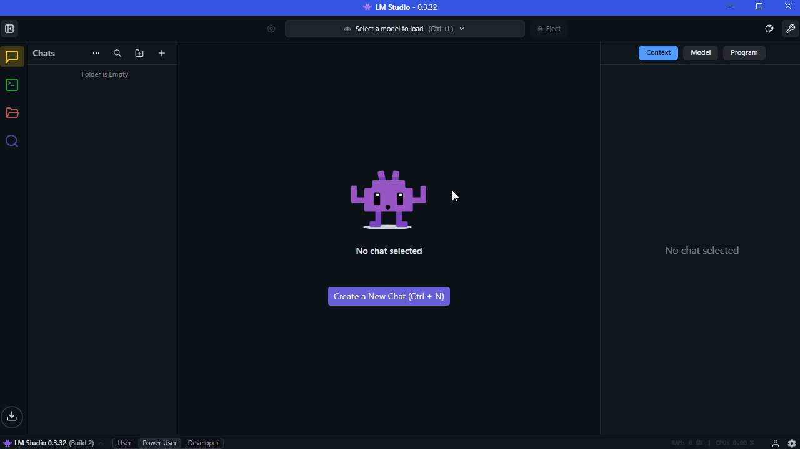
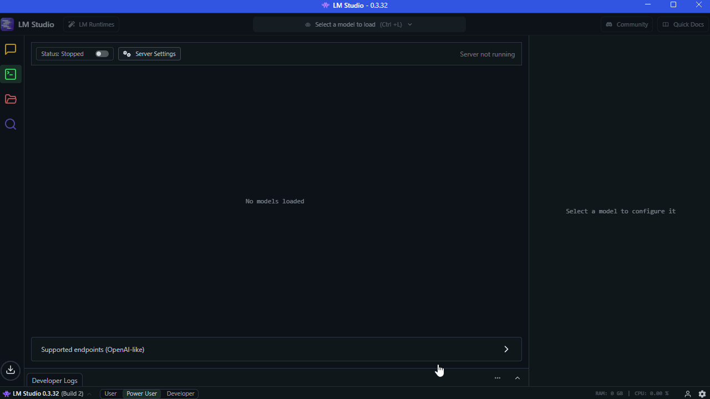
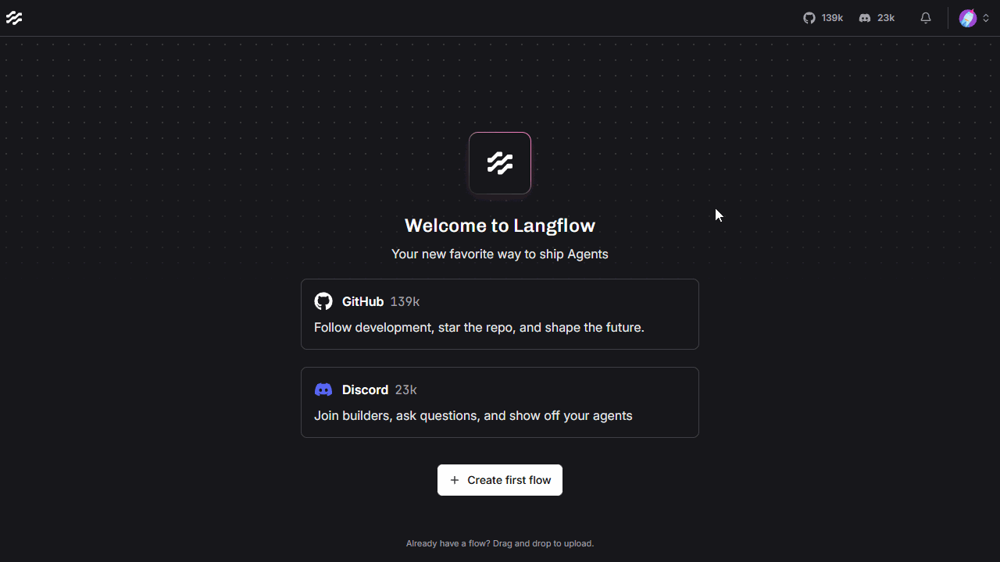
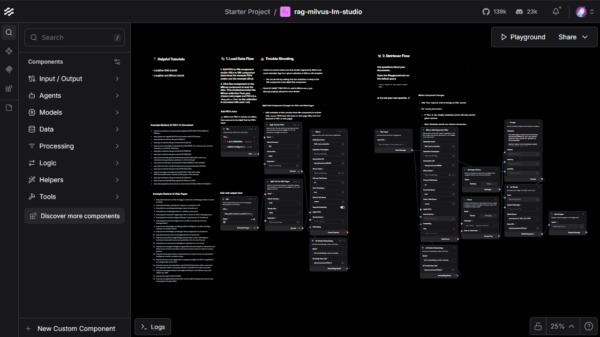
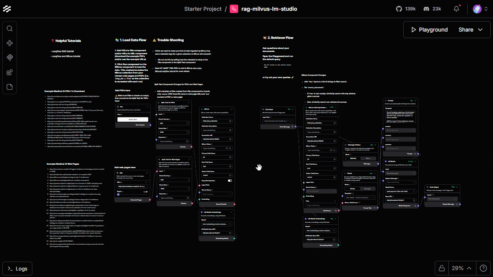

<div class="icon-def-1" style="text-align: center; border: 0.1rem dotted; width: 5%; float: right; padding: 0px; margin: 0px; font-size: 0.9rem; border-radius: 10px;">
  <a onclick="toggleAnimations()" title="Toggle Animations" style="cursor: pointer;">
    <p style="padding: 0px; margin: 0px;"><i class="mdi mdi-sine-wave"></i></p>
  </a>
</div>

# :simple-langflow:{ .icon-def-0 } RAG with Langflow, Milvus, and LM Studio

<hr class="icon-def-1 tertiary-icon", style="width: 90%;"> 

{ .img-def }

!!! tl-dr "TL;DR"

    Learn how to use :simple-langflow:{.icon-def-0} [Langflow][langflow]{.blank}, :simple-milvus:{.icon-def-0} [Milvus][milvus]{.blank}, and [LM Studio][lm-studio]{.blank} to process and chat with your documents :material-chat-question-outline:{.icon-def-0}, all on your local machine. :material-monitor-shimmer:{.icon-def-0}

On the surface, :simple-langflow:{.icon-def-0} [Langflow][langflow]{.blank} is a drag-and-drop platform for building AI systems that's built on top of :simple-langchain:{.icon-def-0} [LangChain][langchain]{.blank}. It can act as a no-code builder where the user can combine different `components` together in a `flow`, then immediately test their configuration in a `playground`. This means really, *really* quick and easy prototyping with built in UI support for seamless testing :material-creation-outline:{.icon-def-0}. It also has a lot of default `components` already in place with dedicated `flow` templates to show how these `components` can be used. 

But even though Langflow can easily be used without creating any code, it can also be treated as a *very-much-code* platform for endless customization :material-palette-outline:{.icon-def-0}. One of my favorite functionalities is the :material-code-tags:{.icon-def-0} `Code` button on top of each `component` which allows the user to view and modify the underlying code on-the-fly. You can see exactly what's going on and customize your build to fit your specific needs :material-hammer-wrench:{.icon-def-0}. We'll see how to do this by editing some of the default `components` for specific use cases. 

We're going to build a simple :material-bookshelf:{.icon-def-0} RAG :material-chat-processing-outline:{.icon-def-0} system with which we can process and store many types of documents (40+ types of files can be uploaded :material-shape-plus:{.icon-def-0}) with various PDFs and web pages discussing current and future medical AI as examples :material-medication-outline:{.icon-def-0}. 

For more tutorials on this particular subject, you can also check out [Langflow's RAG tutorial][langflow-rag-tutorial]{.blank} and [Milvus's Langflow tutorial][milvus-langflow-tutorial]{.blank}. 

---

OK, enough talk - let's get building! :material-account-hard-hat-outline:{.icon-def-0}

<hr class="icon-def-1 primary-icon", style="width: 90%;"> 

## :material-flag-checkered:{.icon-def-0} Getting Started

To showcase Langflow's capabilities, we'll use a `flow` that I created for this very purpose. You can download it, then test that it works in Langflow's `playground` by following these steps:

1.  Install and run [Docker][docker]:

    > We'll use Docker to create a [Milvus][milvus]{.blank} server (with [etcd][etcd]{.blank} and [MinIO][minio]{.blank} servers for support). You can see the [official Docker Compose release][milvus-docker-release]{.blank} that we'll use.

1.  Install and run [LM Studio][lm-studio]{.blank}:

    > We'll use LM Studio to host local embedding models for an extra representation for our documents and LLMs to chat with our documents.

1.  In LM Studio, download an LLM:

    > LM Studio should come packaged with a default embedding which we'll use in this example, so you only need to download an LLM. I used `qwen3-30b`.

    ??? vis-inst "Visuals"

        

1.  In the LM Studio `Developer` tab, start the server:

    > You can load the models that you want to test, but when you store your data and invoke the LLM, the models should be loaded automatically.

    ??? vis-inst "Visuals"

        

1.  Clone my repo and setup the Python environment:
    
    > We'll use one of the `flows` in Langflow and the Docker Compose file for building and running Milvus.
    > Then, we'll create a virtual Python environment in which to work.

    ```
    git clone https://github.com/anima-kit/langflows.git
    cd langflows
    uv venv venv
    venv/Scripts/activate
    ```

1.  Build and run [Milvus][milvus]{.blank}:

    > You can check out [additional instructions][milvus-docker-official]{.blank} here.

    > If you're on Linux or Mac, you may be able to use `milvus-lite` instead. Checkout the installation instructions [here][milvus-lite-install]{.blank}.

    ```
    docker compose -f docker-compose/milvus.yml up -d
    ```

1.  Install [Langflow][langflow]{.blank}: 

    > You can do this [many different ways][langflow-install]{.blank}, but I chose to `uv` install.
    ```
    uv pip install -U langflow
    ```

1.  Run Langflow
    ```
    uv run langflow run
    ```

1.  Navigate to [http://localhost:7860](http://localhost:7860){.blank} in a web browser.

1.  Drag and drop `rag-milvus-lm-studio.json` onto the Langflow interface.

    > This should open the `flow` with all the necessary components. In the `1st` section, you can upload PDFs, parse through PDFs and web pages, and store all the information in Milvus. In the `2nd` section, you can chat with an LLM about the PDFs and web pages that you added.

    ??? vis-inst "Visuals"

        

1.  Add some PDFs and web pages to Milvus:

    ??? vis-inst "Visuals"

        

1.  Start the `Playgroud` to chat.

    ??? vis-inst "Visuals"

        

And that's it! :material-creation-outline:{.icon-def-0} Now, you can add whichever documents or web pages you'd like and chat about them with an LLM, all on your local machine. :material-laptop:{.icon-def-0}

---

Stay tuned for the next section of this tutorial, where we'll discuss how to edit the code behind some of these examples `components`. :material-hammer-wrench:{.icon-def-0}

<hr class="icon-def-1 primary-icon", style="width: 30%;"> 

<!-- LINKS -->
[ak-langflow-milvus-lm-studio]: https://github.com/anima-kit/langflows/blob/main/flows/rag-milvus-lm-studio.json
[ak-milvus-docker]: https://github.com/anima-kit/milvus-docker/blob/main/README.md#-getting-started
[chroma]: https://www.trychroma.com/
[docker]: https://www.docker.com/
[docker-compose]: https://docs.docker.com/compose
[etcd]: https://etcd.io/
[langchain]: https://www.langchain.com/
[langflow]: https://www.langflow.org/
[langflow-install]: https://github.com/langflow-ai/langflow?tab=readme-ov-file#%EF%B8%8F--langflow-desktop
[langflow-rag-tutorial]: https://docs.langflow.org/chat-with-rag
[lm-studio]: https://lmstudio.ai/
[milvus]: https://milvus.io/
[milvus-docker-official]: https://milvus.io/docs/install_standalone-docker.md
[milvus-docker-release]: https://github.com/milvus-io/milvus/releases/tag/v2.6.5
[milvus-langflow-tutorial]: https://docs.langflow.org/chat-with-rag
[milvus-lite-install]: https://milvus.io/docs/milvus_lite.md
[minio]: https://www.min.io/