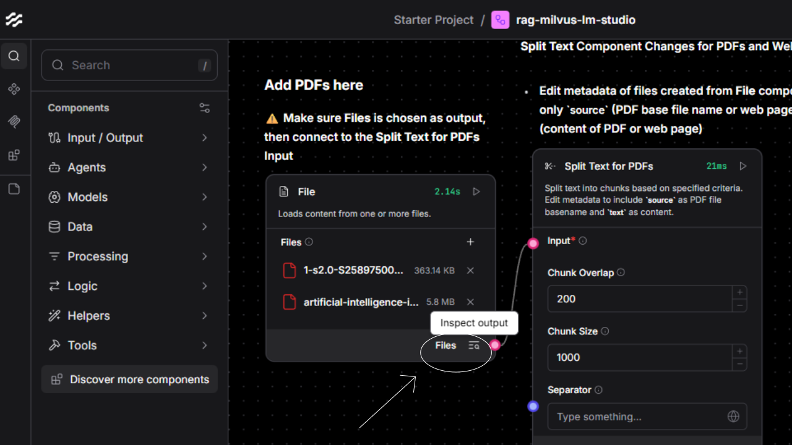
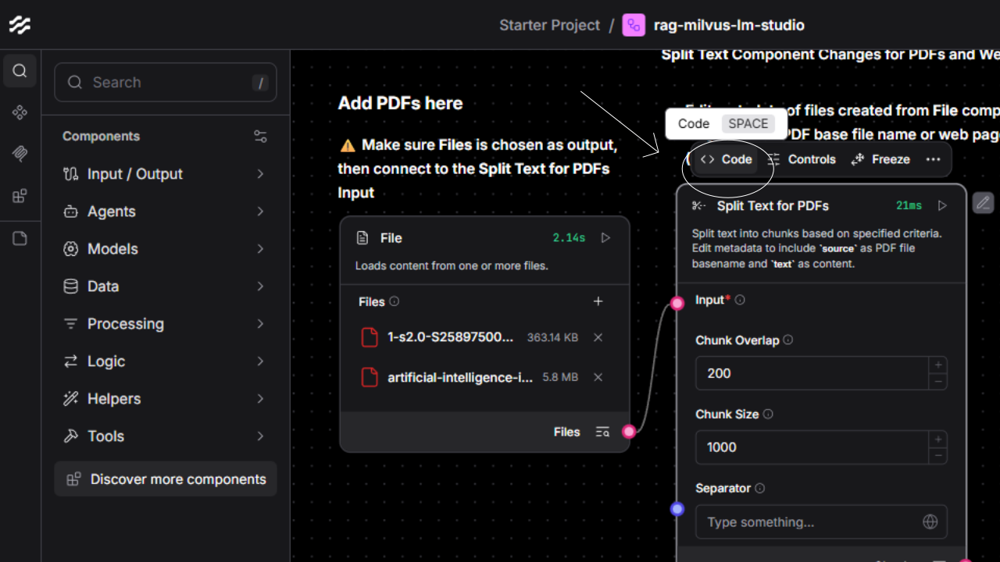
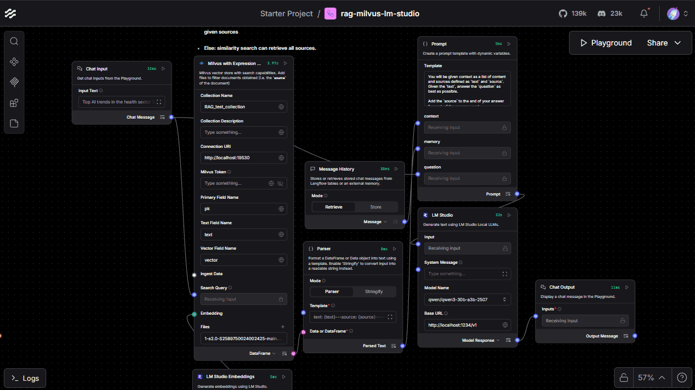

<div class="icon-def-1" style="text-align: center; border: 0.1rem dotted; width: 5%; float: right; padding: 0px; margin: 0px; font-size: 0.9rem; border-radius: 10px;">
  <a onclick="toggleAnimations()" title="Toggle Animations" style="cursor: pointer;">
    <p style="padding: 0px; margin: 0px;"><i class="mdi mdi-sine-wave"></i></p>
  </a>
</div>

# :simple-langflow:{ .icon-def-0 } RAG with Langflow, Milvus, and LM Studio

<hr class="icon-def-1 tertiary-icon", style="width: 90%;"> 

{ .img-def }

!!! tl-dr "TL;DR"

    Learn how to use :simple-langflow:{.icon-def-0} [Langflow][langflow]{.blank}, :simple-milvus:{.icon-def-0} [Milvus][milvus]{.blank}, and [LM Studio][lm-studio]{.blank} to process and chat with your documents :material-chat-question-outline:{.icon-def-0}, all on your local machine. :material-monitor-shimmer:{.icon-def-0}

On the surface, :simple-langflow:{.icon-def-0} [Langflow][langflow]{.blank} is a drag-and-drop platform for building AI systems that's built on top of :simple-langchain:{.icon-def-0} [LangChain][langchain]{.blank}. It can act as a no-code builder where the user can combine different `components` together in a `flow`, then immediately test their configuration in a `playground`. This means really, *really* quick and easy prototyping with built in UI support for seamless testing :material-creation-outline:{.icon-def-0}. It also has a lot of default `components` already in place with dedicated `flow` templates to show how these `components` can be used. 

But even though Langflow can easily be used without creating any code, it can also be treated as a *very-much-code* platform for endless customization :material-palette-outline:{.icon-def-0}. One of my favorite functionalities is the :material-code-tags:{.icon-def-0} `Code` button on top of each `component` which allows the user to view and modify the underlying code on-the-fly. You can see exactly what's going on and customize your build to fit your specific needs :material-hammer-wrench:{.icon-def-0}. We'll see how to do this by editing some of the default `components` for specific use cases. 

We're going to build a simple :material-bookshelf:{.icon-def-0} RAG :material-chat-processing-outline:{.icon-def-0} system with which we can process and store many types of documents (40+ types of files can be uploaded :material-shape-plus:{.icon-def-0}) with various PDFs and web pages discussing current and future medical AI as examples :material-medication-outline:{.icon-def-0}. 

For more tutorials on this particular subject, you can also check out [Langflow's RAG tutorial][langflow-rag-tutorial]{.blank} and [Milvus's Langflow tutorial][milvus-langflow-tutorial]{.blank}. 

---

OK, enough talk - let's get building! :material-account-hard-hat-outline:{.icon-def-0}

<hr class="icon-def-1 primary-icon", style="width: 90%;"> 

## :material-flag-checkered:{.icon-def-0} Getting Started

To showcase Langflow's capabilities, we'll use a `flow` that I created for this very purpose. You can download it, then test that it works in Langflow's `playground` by following these steps:

1.  Install and run [Docker][docker]:

    > We'll use Docker to create a [Milvus][milvus]{.blank} server (with [etcd][etcd]{.blank} and [MinIO][minio]{.blank} servers for support). You can see the [official Docker Compose release][milvus-docker-release]{.blank} that we'll use.

1.  Install and run [LM Studio][lm-studio]{.blank}:

    > We'll use LM Studio to host local embedding models for an extra representation for our documents and LLMs to chat with our documents.

1.  In LM Studio, download an LLM:

    > LM Studio should come packaged with a default embedding which we'll use in this example, so you only need to download an LLM. I used `qwen3-30b`.

    ???+ vis-inst "Visuals"

        

1.  In the LM Studio `Developer` tab, start the server:

    > You can load the models that you want to test, but when you store your data and invoke the LLM, the models should be loaded automatically.

    ???+ vis-inst "Visuals"

        

1.  Clone my repo and setup the Python environment:
    
    > We're cloning this repo to use the included `rag-milvus-lm-studio.json` in Langflow and the `milvus.yml` for building and running Milvus in Docker.

    ```
    git clone https://github.com/anima-kit/langflows.git
    cd langflows
    uv venv venv
    venv/Scripts/activate
    ```

1.  Build and run [Milvus][milvus]{.blank}:

    > You can check out [additional instructions][milvus-docker-official]{.blank} here.

    > If you're on Linux or Mac, you may be able to use `milvus-lite` instead. Checkout the installation instructions [here][milvus-lite-install]{.blank}.

    ```
    docker compose -f docker-compose/milvus.yml up -d
    ```

1.  Install [Langflow][langflow]{.blank}: 

    > You can do this [many different ways][langflow-install]{.blank}, but I chose to `uv` install.
    ```
    uv pip install -U langflow
    ```

1.  Run Langflow:

    > This will start the Langflow server on your local machine.

    ```
    uv run langflow run
    ```

1.  Navigate to [http://localhost:7860](http://localhost:7860){.blank} in a web browser.

1.  Drag and drop `rag-milvus-lm-studio.json` onto the Langflow interface.

    > This should open the `flow` with all the necessary components. In the `1st` section, you can upload PDFs, parse through PDFs and web pages, and store all the information in Milvus. In the `2nd` section, you can chat with an LLM about the PDFs and web pages that you added.

    ???+ vis-inst "Visuals"

        

1.  Add some PDFs and web pages to Milvus:

    > These are the PDFs and web pages about which we'll chat with an LLM. I added lots of medical AI examples for you to test.

    ???+ vis-inst "Visuals"

        

1.  Start the `Playgroud` to chat.

    > Now you can test out chatting with an LLM about your documents.

    ???+ vis-inst "Visuals"

        

And that's it! :material-creation-outline:{.icon-def-0} Now, you can add whichever documents or web pages you'd like and chat about them with an LLM, all on your local machine. :material-laptop:{.icon-def-0}


<hr class="icon-def-1 primary-icon", style="width: 60%;"> 

## :material-note-edit-outline:{.icon-def-0} Examples Use Cases

Now that we understand how to add `flow` templates and test them in Langflow's `playground`, let's see how we can further customize our `flows`. Of course, we can add or remove whichever built in `components` we'd like, but we can also *modify the default components* or *create completely new components*. Here, I'll show how we can modify the default `Split Text` and `Milvus` components. 

First, let's inspect the outputs for the `File` component and the `Split Text for PDFs` component. You can do this by clicking `Inspect Output` at the bottom right hand corner.

???+ vis-inst "Visuals"

    

Notice that they have different metadata, with the `File` component including the `file_path` while the `Split Text for PDFs` component includes the `source` instead. This is because I edited Langflow's default `Split Text` code. 

You can checkout the edited code by clicking the :material-code-tags:{.icon-def-0} `Code` button or by selecting the component, then pressing `Space`.

???+ vis-inst "Visuals"

    

Let's take a closer look at what I edited for the `Split Text for PDFs` component:

```python title="changed code for Split Text component" linenums="1"
def _docs_to_data(self, docs) -> list[Data]:
    for doc in docs:
        ### CHANGED: Lauren Street 2025/11/19
        ### Added metadata editing to include `source` as file path basename and `text` as content
        doc.metadata['source'] = basename(doc.metadata['file_path'])
        del doc.metadata['file_path']

    ### Original code
    return [Data(text=doc.page_content, data=doc.metadata) for doc in docs]
```

Originally, the code didn't include lines 2-6. But, I wanted each of the documents that I added to have a `source` tag as the basename of the file added.  

---

See how easy it is to edit a default component in order to get particular behaviors? :material-creation-outline:{.icon-def-0}

<hr class="icon-def-1 primary-icon", style="width: 30%;">

Now, let's look at one more example. The default `Milvus` component searches documents by using the `similarity_search` method of [Langchain's Milvus module][langchain-milvus]. We can see this by checking out the code:

```python title="building Milvus vectorstore in Langflow" linenums="1"
def build_vector_store(self):
    try:
        from langchain_milvus.vectorstores import Milvus as LangchainMilvus
    except ImportError as e:
        msg = "Could not import Milvus integration package. Please install it with `pip install langchain-milvus`."
        raise ImportError(msg) from e
    self.connection_args.update(uri=self.uri, token=self.password)
    milvus_store = LangchainMilvus(
        embedding_function=self.embedding,
        collection_name=self.collection_name,
        collection_description=self.collection_description,
        connection_args=self.connection_args,
        consistency_level=self.consistency_level,
        index_params=self.index_params,
        search_params=self.search_params,
        drop_old=self.drop_old,
        auto_id=True,
        primary_field=self.primary_field,
        text_field=self.text_field,
        vector_field=self.vector_field,
        timeout=self.timeout,
    )

    # Convert DataFrame to Data if needed using parent's method
    self.ingest_data = self._prepare_ingest_data()

    documents = []
    for _input in self.ingest_data or []:
        if isinstance(_input, Data):
            documents.append(_input.to_lc_document())
        else:
            documents.append(_input)

    if documents:
        milvus_store.add_documents(documents)

    return milvus_store
```

Langchain's Milvus vectorstore has a lot potential customizations. For example, one thing we can do is add a filter to the search so that only certain documents are fetched. This is exactly what I did by editing the default `Milvus` component to create the `Milvus with Expression Filter` component. Let's check the code out:

```python title="editing Milvus component to include source filter" linenums="1"
class MilvusVectorStoreComponent(LCVectorStoreComponent):
    """Milvus vector store with search capabilities."""

    ...

    inputs = [

        ...

        ### CHANGED: Lauren Street 2025/11/19
        ### Add list of strings input for particular sources to retrieve
        StrInput(
            name="files", 
            display_name="Files", 
            value="",
            is_list=True,
        ),
    ]

def search_documents(self) -> list[Data]:
        vector_store = self.build_vector_store()
        if self.search_query and isinstance(self.search_query, str) and self.search_query.strip():
            ### ORIGINAL:
            #docs = vector_store.similarity_search(
            #    query=self.search_query,
            #    k=self.number_of_results,
            #)
            
            ### CHANGED: Lauren Street 2025/11/19
            ### Do similarity search:
            ###     without expression if no sources added
            ###     with expression 'source == source_name_1' OR 'source == source_name_2' ... OR 'source == source_name_n' 
            ###         for n added sources
            if self.files==['']:
                docs = vector_store.similarity_search(
                    query=self.search_query,
                    k=self.number_of_results,
                )
            else:
                expr_in = ' OR '.join(f'source=="{file}"' for file in self.files)
                docs = vector_store.similarity_search(
                    query=self.search_query,
                    k=self.number_of_results,
                    expr=expr_in
                )

            data = docs_to_data(docs)
            self.status = data
            return data
        return []
```

Here, we're adding a filter `expression` to the `similarity_search` method so that if the user includes any `files` as input, the search will be filtered to only fetch those files. 

Let's see if it works:

???+ vis-inst "Visuals"

    

Great! Now, we can filter our searches to include whichever sources we want. We can select a few for focused research or select them all for getting a general understanding. 

And now you might see why the little :material-code-tags:{.icon-def-0} `Code` button on top of each `component` is my favorite Langflow attribute. We can easily drag-and-drop the default `components` to create a system, then customize them to better fit our needs. We can also create `completely new components` if the default components aren't enough to build off of. 

---

And that's it! :material-creation-outline:{.icon-def-0} I hope I showed you how easy it is to create and play with your own AI systems in Langflow. Happy building! :material-robot-excited-outline:{.icon-def-0}

<hr class="icon-def-1 primary-icon", style="width: 30%;"> 

<!-- LINKS -->
[ak-langflow-milvus-lm-studio]: https://github.com/anima-kit/langflows/blob/main/flows/rag-milvus-lm-studio.json
[ak-milvus-docker]: https://github.com/anima-kit/milvus-docker/blob/main/README.md#-getting-started
[chroma]: https://www.trychroma.com/
[docker]: https://www.docker.com/
[docker-compose]: https://docs.docker.com/compose
[etcd]: https://etcd.io/
[langchain]: https://www.langchain.com/
[langchain-milvus]: https://docs.langchain.com/oss/python/integrations/vectorstores/milvus
[langflow]: https://www.langflow.org/
[langflow-install]: https://github.com/langflow-ai/langflow?tab=readme-ov-file#%EF%B8%8F--langflow-desktop
[langflow-rag-tutorial]: https://docs.langflow.org/chat-with-rag
[lm-studio]: https://lmstudio.ai/
[milvus]: https://milvus.io/
[milvus-docker-official]: https://milvus.io/docs/install_standalone-docker.md
[milvus-docker-release]: https://github.com/milvus-io/milvus/releases/tag/v2.6.5
[milvus-langflow-tutorial]: https://docs.langflow.org/chat-with-rag
[milvus-lite-install]: https://milvus.io/docs/milvus_lite.md
[minio]: https://www.min.io/