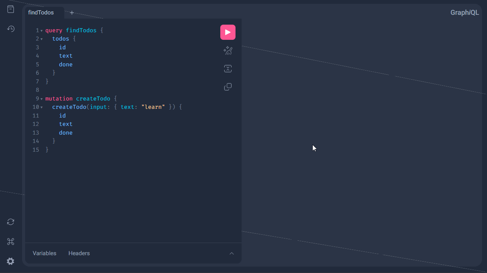
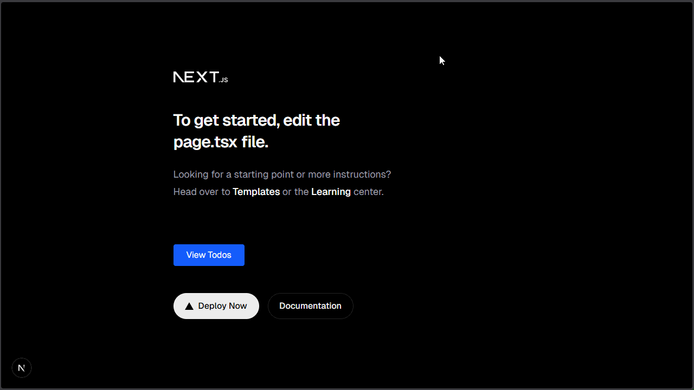

<div class="icon-def-1" style="text-align: center; border: 0.1rem dotted; width: 5%; float: right; padding: 0px; margin: 0px; font-size: 0.9rem; border-radius: 10px;">
  <a onclick="toggleAnimations()" title="Toggle Animations" style="cursor: pointer;">
    <p style="padding: 0px; margin: 0px;"><i class="mdi mdi-sine-wave"></i></p>
  </a>
</div>

# :material-book-open-page-variant-outline:{ .icon-def-0 } Go + Next Basics

<hr class="icon-def-1 tertiary-icon", style="width: 90%;"> 

{ .img-def }

Creating a web app can be daunting, but with the right tools it can be easy and fun to learn! :material-monitor-shimmer:{.icon-def-0} 

Here, we'll see a step-by-step instruction manual for creating a simple web app with [Next][next] on the frontend and [Go][go] + [gqlgen][gqlgen] on the backend. It can be used as a `template` for a quick web app scaffolding with some extra logic to help us understand how to integrate Go and Next.

So, let's get started! 

<hr class="icon-def-1 primary-icon", style="width: 90%;"> 

## :material-flag-checkered:{ .icon-def-0 } Getting Started

All the code shown here (and more) is available in my [Github repo][ak-web-app-guide]. You can interact with this repo in a couple of ways. 

(**Option 1**):  The simplest option is to clone the repo for all the necessary files. You can then use this guide as a template for how to set up your own web apps.

```
git clone https://github.com/anima-kit/web-app-guide.git
```

(**Option 2**).  Another option is to create a simplified version of the full repo yourself by following all the steps outlined below.

For all you that chose Option 2 - first, let's create a space for our project.

```
mkdir web-app-guide
cd web-app-guide
```

Now that we have a place to house our web app, let's focus on setting up the frontend.

<hr class="icon-def-1 primary-icon", style="width: 60%;"> 

### :material-monitor-shimmer:{ .icon-def-0 } Frontend

Using Next makes setting up a project *ridiculously easy*. With one command, we get all the necessary files for creating a basic frontend project.

1.  Make sure `npm` is installed.

    See installation instructions [here][npm-install] (installs Node.js with automatic `npm` install).

1.  Create our Next project: 

    ```
    npx create next-app@latest frontend --yes
    ```

    > This will create a Next app (in `./frontend`) that uses Typescript for the source code, ESLint for linting, Tailwind CSS for easy component customization, the App Router for navigation, and Turbopack as the bundler.

1.  (Optional) Set up [Prettier][prettier] for a nice code formatter:

    1.  Add Prettier to the `devDependencies` of `./frontend/package.json`:

        ```
        "devDependencies": {
            ...,
            "prettier": "latest"
        }
        ```

        > This uses the latest release of Prettier. Alternatively, you can change "latest" to whichever version you want to use.

    1.  Set up a script for formatting in the `./frontend/package.json`.

        ```
        "scripts": {
            ...,
            "format": "prettier --write ."
        }
        ```

        > This will allow you to use `npm run format` inside `./frontend` to format all of your frontend code.

1.  (Optional) Test the scaffolding:

    1.  Navigate to the frontend: 
    
        ```
        cd frontend
        ```

    1.  Make sure all packages are installed: 
        
        ```
        npm install
        ```

    1.  Check that Typescript is configured properly: 
    
        ```
        npx tsc
        ```

        > If you don't see any errors - that's a good sign.
    
    1.  (Optional) If you added Prettier for formatting, check that it works without any errors: 
        
        ```
        npm run format
        ```

    1.  Run the linter to check that no errors arise:

        ```
        npm run lint
        ```

    1.  Check that the app can be built properly:

        ```
        npm run build
        ```

1.  Serve our app locally to start playing around!

    <a id="serve-frontend"></a>

    ```
    npm run dev
    ```

    > This will serve our app at [http://localhost:3000][web-app-frontend] by default.

And that's it, our frontend scaffold is now set up! If everything worked correctly, you can navigate to [http://localhost:3000][web-app-frontend] (after following [step 5][serve-frontend]). :material-creation-outline:{ .icon-def-0 }

<hr class="icon-def-1 primary-icon", style="width: 60%;"> 

### :material-hammer-wrench:{ .icon-def-0 } Backend 

In this guide, we're going to set up a backend using Go + gqlgen.  My backend choice was mostly due to the fact that I wanted to learn Go and GraphQL (using gqlgen), and I found them to be pretty simple to learn and start playing around with (see [A Tour of Go][go-tour] and [GraphQL's Playground][graphql-playground]).

1.  Make sure Go is installed.

    See installation instructions [here][go-install].

1.  Create the backend directory and navigate there:

    ```
    mkdir backend
    cd backend
    ```

1.  Create a Go project:

    ```
    go mod init github.com/<your-github-handle>/<your-project-name>
    ```

    > This will create a Go project that you can use both locally and through your remote Github repo.

    For example, I created the backend for this guide with: `go mod init github.com/anima-kit/web-app-guide`

1.  Install gqlgen:

    ```
    go get -tool github.com/99designs/gqlgen
    ```

1.  Create the gqlgen scaffold:

    <a id="gqlgen-scaffold"></a>

    ```
    go tool gqlgen init
    ```

1.  (Optional) Set up [golangci-lint][golangci-lint] for formatting and linting:

    1.  Check out the [installation instructions][golangci-lint-install]
    1.  Check that the formatter works:

        ```
        golangci-lint fmt
        ```

    1.  Check that the linter works:

        ```
        golangci-lint run
        ```

1.  Run the gqlgen server locally:

    <a id=serve-backend></a>

    ```
    go run ./server.go
    ```

    > This will host the GraphQL Playground on [http://localhost:8080/][web-app-backend] by default.

And that's it, our backend scaffold is now set up! If everything worked correctly, you can navigate to [http://localhost:8080/][web-app-backend] (after following [step 7][serve-backend]). :material-creation-outline:{ .icon-def-0 }

<hr class="icon-def-1 primary-icon", style="width: 60%;"> 

### :simple-docker:{ .icon-def-0 } Deployment 

Here, we'll set up Docker containers to serve both our frontend and backend at the same time with a simple Docker command.

1.  Create the frontend Dockerfile (`./frontend/Dockerfile`)

    ```dockerfile
    # Dockerfile for Next frontend
    FROM node:20-alpine
    WORKDIR /app
    # Copy and install dependencies
    COPY package.json package-lock.json ./
    RUN npm ci
    # Copy all source code
    COPY . .
    # Run dev server
    CMD ["npm", "run", "dev"]
    ```

1.  Create the backend Dockerfile (`./backend/Dockerfile`)

    ```dockerfile
    # Dockerfile for Go backend
    FROM golang:1.25 AS builder
    WORKDIR /app
    # Copy and download dependencies
    COPY go.mod go.sum ./
    RUN go mod download
    # Copy all source code and build binary
    COPY . .
    RUN CGO_ENABLED=0 GOOS=linux go build -o /usr/local/bin/backend .
    # Create minimal image and copy binary
    FROM scratch
    COPY --from=builder /usr/local/bin/backend /
    # Define entry point for Docker compose
    ENTRYPOINT ["/backend"]
    ```

1.  Create the Docker Compose file to serve both the backend and frontend:

    ```yaml
    services:
      backend:
        # Use Dockerfile in backend
        build: ./backend
        # Serve GraphQL at this port
        ports:
          - "8080:8080"
      frontend:
        # Use Dockerfile in frontend
        build: ./frontend
        # Serve Next app at this port
        ports:
          - "3000:3000"
    ```

1.  Create and run the containers to serve both the backend and frontend at once (from the root directory - `./`):

    ```
    docker compose up --build
    ```

    > Just like previously, the backend is served at [http://localhost:8080/][web-app-backend] and the frontend at [http://localhost:3000][web-app-frontend]. 

1.  Stop and delete the containers when you're done:

    ```
    docker compose down
    ```

Now, we can run both servers with one simple command. :material-creation-outline:{ .icon-def-0 }

<hr class="icon-def-1 primary-icon", style="width: 60%;"> 

### :simple-github:{ .icon-def-0 } CI 

Finally, let's create a CI routine so that the main branch of your repo remains clean.

1.  Create the CI file in `./.github/workflows/ci.yml`.

1.  Define when you want the CI to run. Here we'll run it for pushes or pull requests to the `main` branch:

    ```yaml
    name: CI
    on:
      push:
        branches: [main]
      pull_request:
        branches: [main]
    ```

1.  Define a job for installing dependencies and linting the frontend:

    ```yaml
    jobs:
      next_lint:
        name: Next Lint
        runs-on: ubuntu-latest
        strategy:
          matrix:
            node: [20]
        steps:
          - uses: actions/checkout@v4
          - name: Use Node.js ${{ matrix.node }}
            uses: actions/setup-node@v4
            with:
              node-version: ${{ matrix.node }}
              cache: "npm"
              cache-dependency-path: frontend/package-lock.json
          - name: Install dependencies
            run: npm ci
            working-directory: frontend
          - name: Run lint
            run: npm run lint
            working-directory: frontend
    ```

1.  (Optional) Set up more jobs for both frontend and backend:

    For simplicity, we just set up a linting job here, but we can also set up more jobs for formatting, testing, etc.

Now, any code that hits our `main` branch will be cleaned and standardized to our liking. :material-creation-outline:{ .icon-def-0 } 

<hr class="icon-def-1 primary-icon", style="width: 90%;"> 

## :material-transit-connection-variant:{ .icon-def-0 } Connecting the Logic

We've seen how to setup the main scaffolding for our web app, but nothing's connected yet. We just have two separate servers that hold lots of potential to do some pretty neat things. Let's dive in to see what we can do! :material-diving-scuba:{ .icon-def-0 }

### :material-notebook-edit-outline:{ .icon-def-0 } Customizing the Backend

If you check out our backend, you'll see that there were several default files created (this happened when we [created our gqlgen scaffold][gqlgen-scaffold]). Let's go over some of these files (see also the nice [getting started tutorial][gqlgen-getting-started] for gqlgen):

#### Schema

The `schema.graphqls` file is where we'll define our custom schemas to use for the data that we want to manage.

By default we have two types defined: `Todo` and `User`. This seems like a nice starting place for creating a todo app for different users. We have a `Query` type as a list of our `Todos` and a `Mutation` type for creating a new `Todo`.

Let's make this *even easier* by deleting all the `User` logic and focusing purely on `Todos`. In the end, our `schema.graphqls` will look like:

```go
type Todo {
  id: ID!
  text: String!
  done: Boolean!
}

type Query {
  todos: [Todo!]!
}

input NewTodo {
  text: String!
}

type Mutation {
  createTodo(input: NewTodo!): Todo!
}
``` 

Now, that we've defined our custom schema, let's see how to generate the correct Go code to properly create and get a list of `Todos`.

<hr class="icon-def-1 primary-icon", style="width: 30%;"> 

#### Models

The `graph/model/models_gen.go` file is where all of our models live. We'll *never* edit this file manually, rather this file will be generated for us depending on our schema. When this file was first generated, it used the default schema in `schema.graphqls`. Notice that it has still has a `User` type and some `User` logic in the `Todo` type.  Now that we no longer want any `User` logic, let's regenerate using gqlgen to see how our models change. 

```
cd backend
go tool gqlgen generate
```

Now, our `models_gen.go` file only has the `Todo` logic as we defined it in `schema.graphqls`. These models will be used by our state trackers and resolvers that tell Go how to manage our `Todos`.

<hr class="icon-def-1 primary-icon", style="width: 30%;"> 

#### Dependencies

The `resolver.go` file is where we list our dependencies (i.e. what states do we want to track?). By default, gqlgen doesn't assume it knows this, so we'll need to add in our dependencies by hand. In our case, we only have our `Todos`, so let's set up a simple state tracker that won't persist between sessions:

```go
import (
  "github.com/anima-kit/web-app-guide/graph/model"
)

type Resolver struct{
  todos []*model.Todo
}
```

Here, we're telling Go that we only want to track a list of `Todos` as defined in our `models_gen.go` file (make sure to import our models!). Now that we have the proper state tracked, let's see how to use it to manage `Todos`. 

<hr class="icon-def-1 primary-icon", style="width: 30%;"> 

#### Resolvers

The `schema.resolvers.go` file is where we'll define the logic for our resolvers. 

When we generate code based on our data schemas using gqlgen, the appropriate resolvers will be created in this file. By default, the query and mutation resolvers for our `Todos` are created, but the correct logic isn't implemented (it just panics with a "not implemented" message). We'll customize our resolver logic by hand depending on what we want to happen.  

When this file was created by default, it used the models from `models_gen.go` file. We still have all the same `Todo` models as well as a query for getting all the `Todos` and a mutation for creating a new `Todo`. So, when we regenerated our code in the previous step, none of our resolvers changed. 

Let's customize our logic so that we can get back a list of `Todos` using our query resolver. All we have to do is replace the panic logic with logic that returns our `Todos`. 

```go
// Todos is the resolver for the todos field.
func (r *queryResolver) Todos(ctx context.Context) ([]*model.Todo, error) {
  return r.todos, nil
}
``` 

Here, we're telling Go that when we query our `Todos`, we want to get back the `todos` list that we defined in `resolver.go`. We'll see how this works when we query our GraphQL server (in the super convenient GraphQL Playground :material-controller-classic-outline:{ .icon-def-0 }) after appropriately setting up our last resolver.

The only thing left to do before we test our logic is to implement the logic for creating a `Todo`. Using the example from [here][gqlgen-getting-started], we'll give our created `Todo` a random ID (using the `crypto/rand` and `math/big` imports) and append it to our `todos` list. 

```go
import (
  "crypto/rand"
  "math/big"
  ...
)

// CreateTodo is the resolver for the createTodo field.
func (r *mutationResolver) CreateTodo(ctx context.Context, input model.NewTodo) (*model.Todo, error) {
  randNumber, _ := rand.Int(rand.Reader, big.NewInt(100))
  todo := &model.Todo{
    Text: input.Text,
    ID:   fmt.Sprintf("T%d", randNumber)
  }
  r.todos = append(r.todos, todo)
  return todo, nil
}
```

<hr class="icon-def-1 primary-icon", style="width: 30%;"> 

#### Testing

Now that we've implemented all the logic we need, let's regenerate just to make sure there are no errors:

```
go tool gqlgen generate
```

Looks good! We've got some simple `Todo` logic that we can test in the GraphQL Playground by starting our backend (or spinning up our Docker containers). After starting your server, navigate to [http://localhost:8080/][gqlgen-server] and test out our new schema. 

You can find all `Todos` with the query:

```
query findTodos {
  todos {
    id 
    text 
    done
  }
}
```

You can also create a `Todo` with something like the following:

```
mutation createTodo {
  createTodo(input: { text: "learn" }) {
    id 
    text
    done
	}
}
```

You can copy-paste this query and mutation in the editor on the left side of the GraphQL Playground, then click the `Play` button to run either one. After running the `createTodo` mutation, you should see a new `Todo` in the todos list with a random `ID`, the appropriate `text` value, and the default value for our `done` boolean. 

{ .img-def }

Cool, that was pretty easy and fun! Now, how can we connect this logic to our Next frontend? 

<hr class="icon-def-1 primary-icon", style="width: 60%;">

### :material-monitor-dashboard:{ .icon-def-0 } Customizing the Frontend

There's a few ins-and-outs that we need to understand in order to connect our frontend to our backend logic. There are a lot of scripts that we can add to deal with just a little bit of backend logic, so here we'll only focus on creating the components for listing our `Todos`. To see how to add more logic [check out the full Github repo][ak-web-app-guide]

First, we need a clear way to handle the backend requests. Instead of writing everything by hand, let's use a well known client library for GraphQL - [Apollo][apollo]. 

#### Client Libary

Using Apollo makes dealing with GraphQL APIs a breeze. All we need to do is define our client and enable our pages to use it. One way of doing this is wrapping up our client and giving it to every page using the `layout` file. Let's also keep our frontend logic clean by adding some descriptive folders and files.

1.  First, we need to make sure to add the Apollo client library to the dependencies in our `package.json`:

    ```json
    "dependencies": {
      ...,
      "@apollo/client": "latest"
    },
    ```

1.  Then we can install the new package with:

    ```
    cd frontend
    npm install
    ```

1.  Finally, let's add a few files to use an Apollo client with our GraphQL logic:  

    === "Client"

        Add a file to define our Apollo client: `frontend/components/apollo/apolloClient.ts`

        This will allow easy handling of our GraphQL APIs. 

        ```ts
        import { ApolloClient, InMemoryCache, HttpLink } from "@apollo/client";

        // Create ApolloClient instance
        const client = new ApolloClient({
          // Send requests to GraphQL endpoint and use in-memory cache
          link: new HttpLink({ uri: "http://localhost:8080/query" }),
          cache: new InMemoryCache(),
        });

        export default client;
        ```

    === "Wrapper"

        Add a file to define our client wrapper: `frontend/components/apollo/ApolloWrapper.tsx`

        This will allow us to add our client to our app's context.

        ```tsx
        "use client";
        import { ApolloProvider } from "@apollo/client/react";
        import apolloClient from "@/components/apollo/apolloClient";
        import { ApolloWrapperProps } from "@/types/apollo";

        // Wrap all children with ApolloProvider to use GraphQL API
        export default function ApolloWrapper({ children }: ApolloWrapperProps) {
          // Use our Apollo client in the provider
          return <ApolloProvider client={apolloClient}>{children}</ApolloProvider>;
        }
        ```

    === "Layout"

        Give the client to our app's context: `frontend/app/layout.tsx`

        ```tsx
        import ApolloWrapper from "@/components/ApolloWrapper";
        ...

        // Use ApolloWrapper to wrap all children in ApolloProvider with proper client
        export default function RootLayout({ children }: ApolloWrapperProps) {
          return (
            <html lang="en" className={`${geistSans.variable} ${geistMono.variable}`}>
              <body>
                <ApolloWrapper>{children}</ApolloWrapper>
              </body>
            </html>
          );
        }
        ```

    === "Types"

        Add a file for clean type checking: `frontend/types/apollo.ts`

        This type is passed to our ApolloWrapper and RootLayout.

        ```ts
        // Type for properties to pass to ApolloWrapper and RootLayout
        export interface ApolloWrapperProps {
            children: React.ReactNode;
        }
        ```
      
<hr class="icon-def-1 primary-icon", style="width: 30%;">

Now, our Apollo client should be properly given to our app's context, allowing us to use hooks to call our GraphQL API in order to manage our `Todos`.  Let's see how to use this client to create proper hooks.

#### GraphQL Logic

We want to connect our GraphQL logic to our Apollo client to list our `Todos`. We can do this by defining proper hooks that we can then use in our app components (i.e. buttons, cards, etc.).  Let's see how to define these hooks, again keeping our frontend logic clean by defining some descriptive folders and files:

=== "Queries"

    Let's define our GraphQL query: `frontend/graphql/queries.ts`.

    This gives us a clear way to point to our GraphQL query which lists all of our `Todos`.

    ```ts
    import { gql } from "@apollo/client";

    // Define GraphQL query for getting todos
    export const GET_TODOS = gql`
      query GetTodos {
        todos {
          id
          text
          done
        }
      }
    `;
    ```

=== "Hooks"

    We can use our query through defining a hook: `frontend/hooks/useTodos.ts`

    In the next section, we'll see how to use this hook to list all of our `Todos` on a given page.  

    ```ts
    import { useQuery } from "@apollo/client/react";
    import { GET_TODOS } from "@/graphql/queries/queries";
    import { GetTodosData } from "@/types/todo";

    // Hook to get list of all todos using Apollo client
    export const useTodos = () => useQuery<GetTodosData>(GET_TODOS);
    ```

=== "Types"

    Let's add the types for our `Todos` logic: `frontend/types/todo.ts`

    This allows us to pass standardized `Todo` types throughout our app by a simple import (like in our query and hook files). 

    ```ts
    // Type for Todo
    export interface Todo {
      id: string;
      text: string;
      done: boolean;
    }

    // Type for getting todos
    export interface GetTodosData {
      todos: Todo[];
    }
    
    // Type for properties to pass to todos list
    export interface TodosListProps {
      todos?: Todo[];
      addCard?: React.ReactNode;
    }

    // Type for properties to pass to todo card
    export interface TodoCardProps {
      todo: Todo;
    }
    ```

<hr class="icon-def-1 primary-icon", style="width: 30%;">

And now we have all the hooks that we need in order to list our `Todos`. Now, let's create some reusable app components that we can interact with.

#### App Components

Here, we can create customizable components that *look good* and allow us to interact with our GraphQL hooks. We're going to use [TailWind CSS][tailwind] for quick and easy inline customization. For more details, see the [Tailwind docs][tailwind-docs].

=== "Generic Card"

    Let's create a reusable card component: `fromtend/components/card/Card.tsx`
    
    This can be used in a lot of different cases and here we'll use it to display our `Todos`.

    ```tsx
    import React from "react";
    import { CardProps } from "@/types/card";

    // Reusable Card component for displaying todos etc.
    const Card: React.FC<CardProps> = ({ title, children, className }) => {
      // Base CSS class
      const baseClasses =
        "bg-white rounded-lg shadow-md p-4 hover:shadow-xl transition-shadow duration-200 text-gray-800";
      // Final style is base class + cursor pointer + any additional classes
      const combinedClasses =
        `${baseClasses} ${onClick ? "cursor-pointer" : ""} ${className ?? ""}`.trim();

      return (
        <div
          // Accessibility measures
          aria-label={
            typeof title === "string" ? (title as string) : undefined
          }
          className={combinedClasses}
        >
          {/* Show title and children */}
          {title && (
            <h3 className="text-lg font-semibold mb-2 text-gray-800">{title}</h3>
          )}
          <div>{children}</div>
        </div>
      );
    };

    export default Card;
    ```

=== "Todo Card"

    Create card display for `Todos`: `frontend/components/todo/TodoCard.tsx`

    We can use the generic card wrapper to separate all the `Todos` in our list in a striking manner.

    ```tsx
    import React from "react";
    import Card from "@/components/card/Card";
    import { TodoCardProps } from "@/types/todo";

    // Card to display todos
    const TodoCard: React.FC<TodoCardProps> = ({ todo }) => {
      return (
        <Card // Display todo text and done status
          title={todo.text}
        >
          <p className="mt-2 text-sm text-gray-800">
            {todo.done ? "Completed" : "Pending"}
          </p>
        </Card>
      );
    };

    export default TodoCard;
    ```

=== "Todos List"

    Now, let's define a component that lists all of our `Todos`: `frontend/components/todo/TodosList.tsx`

    This will allow us to display all of our `Todo Cards` inside a grid.

    ```tsx
    import React from "react";
    import TodoCard from "@/components/todo/TodoCard";
    import { TodosListProps } from "@/types/todo";

    // Define TodosList component to take in list of todos
    const TodosList: React.FC<TodosListProps> = ({ todos }) => {
      // If no todos found, add a simple loading paragraph
      if (!todos) return <p className="text-gray-500">Loading…</p>;
      // Else return each todo as a TodoCard
      return (
        <div className="grid grid-cols-1 sm:grid-cols-2 md:grid-cols-3 gap-4">
          {todos.map((todo) => (
            <TodoCard key={todo.id} todo={todo} />
          ))}
        </div>
      );
    };

    export default TodosList;
    ```

<hr class="icon-def-1 primary-icon", style="width: 30%;">

Now that we have all our components defined, let's see how to put everything together through editing and creating our app pages.

#### App Pages

We've defined everything we need in separate, descriptive logic. All we need to do now is add the appropriate logic to the appropriate pages. 

=== "Todos Page"

    Let's start with creating a `Todos` page where we can see and manage all of our `Todos`: `frontend/app/todos/page.tsx`

    This page will use our `TodosList` to display each of our `Todos`. Notice that we're also using our `useTodos` hook to use our GraphQL API to list all of the `Todos` in our list. 

    ```tsx
    "use client";
    import { useState } from "react";
    import TodosList from "@/components/todo/TodosList";
    import { useTodos } from "@/graphql/queries/useTodos";

    // Page where we can view and manage our todos
    export default function TodosPage() {
      // Use the GraphQL query to get our todos
      const { data, loading, error } = useTodos();
      // Loading and error messages
      if (loading) return <p>Loading…</p>;
      if (error) return <p className="text-red-500">Error loading todos.</p>;
      return (
        <main className="p-4">
          <h2 className="text-2xl font-bold mb-4">Todos</h2>
          {/* Component to list all our todos */}
          <TodosList
            todos={data?.todos}
          />
        </main>
      );
    }
    ```

=== "Home Page"
    
    Now that we've created our `Todos` page that allows us to see our `Todos`, let's create a button (on our main page) to navigate here when pressed: `frontend/app/page.tsx`

    We can add the following anywhere inside our `main` div.

    ```tsx
    {/* Button to view todos */}
    <div className="mt-8 flex flex-row gap-4">
      <Link href="/todos" passHref>
        <button
          type="button"
          className="px-6 py-2 bg-blue-600 text-white rounded hover:bg-blue-700 transition-colors focus:outline-none focus:ring-2 focus:ring-blue-400"
          aria-label="View Todos"
        >
          View Todos
        </button>
      </Link>
    </div>
    ```

<hr class="icon-def-1 primary-icon", style="width: 30%;">

And that's all of our frontend logic. Think our app works now? 

<hr class="icon-def-1 primary-icon", style="width: 60%;">

### :material-share-variant-outline:{ .icon-def-0 } CORS

If you followed along with Option 2 so far, and you try spinning up the Docker container and navigating to our `Todos`, what happens? `Error loading todos.` Hmm, what's going on? Well, if we inspect the page we can see that we haven't properly set up communication between our separate frontend and backend servers (hosted from *different origins*).

{ .img-def }

This is were CORS comes in. We need to explicitly tell our frontend that we allow resource sharing from our backend server. Let's enable this using a popular [Go CORS package][go-cors]. All we need to do is import the package and use a CORS handler for the proper backend URL. Below I show which of the default code we need to comment out and the new code that we need to add.

1.  Download the Go package:

    ```
    cd backend
    go get github.com/rs/cors
    ```

1.  Edit the `server.go` file:

    ```go
    import (
      ...
      "github.com/rs/cors"
    )

    func main() {
      ...
      //http.Handle("/", playground.Handler("GraphQL playground", "/query"))
      //http.Handle("/query", srv)
      graphqlHandler := cors.Default().Handler(srv)
      mux := http.NewServeMux()
      mux.Handle("/", playground.Handler("GraphQL playground", "/query"))
      mux.Handle("/query", graphqlHandler)

      //log.Fatal(http.ListenAndServe(":"+port, nil))
      log.Fatal(http.ListenAndServe(":"+port, mux))
    }
    ```

Let's see if it works (using the full Github repo code).

{ .img-def }

Yep, looks good!

<hr class="icon-def-1 primary-icon", style="width: 30%;"> 

---

And that's how simple it is to start creating web apps! There's still a lot of logic that I didn't go over here that's included in the [full Github repo][ak-web-app-guide]. We can also add logic for *testing*, *persistence*, and adding more GraphQL API logic.

Stay tuned for the next tutorial, where we'll learn how to add a Postgres DB for persistent data. :material-tune-vertical:{ .icon-def-0 }

<hr class="icon-def-1 primary-icon", style="width: 30%;"> 

<!-- LINKS -->
[ak-web-app-guide]: https://github.com/anima-kit/web-app-guide
[apollo]: https://www.apollographql.com/docs/react
[go]: https://go.dev/
[go-cors]: https://github.com/rs/cors
[go-install]: https://go.dev/doc/install
[go-tour]: https://go.dev/tour/welcome/1
[golangci-lint]: https://golangci-lint.run/
[golangci-lint-install]: https://golangci-lint.run/docs/welcome/install/
[gqlgen]: https://gqlgen.com/
[gqlgen-getting-started]: https://gqlgen.com/getting-started/
[gqlgen-scaffold]: go-next-basics.md#gqlgen-scaffold
[gqlgen-server]: http://localhost:8080/
[graphql]: https://graphql.org/
[graphql-playground]: https://graphql.org/swapi-graphql/
[jest]: https://jestjs.io/docs/next/testing-frameworks
[next]: https://nextjs.org/
[npm-install]: https://nodejs.org/en/download/
[postgres]: https://www.postgresql.org/
[prettier]: https://prettier.io/
[serve-backend]: go-next-basics.md#serve-backend
[serve-frontend]: go-next-basics.md#serve-frontend
[tailwind]: https://tailwindcss.com/
[tailwind-docs]: https://tailwindcss.com/docs/installation/using-vite
[web-app-backend]: http://localhost:8080/
[web-app-frontend]: http://localhost:3000