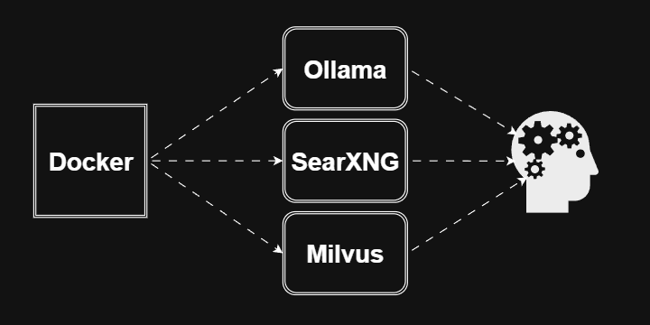

<!-- TODO: footnotes appear out of order for some reason (vectorstore numbered as 2 and context note numbered as 1) -->

  <a onclick="toggleAnimations()" title="Toggle Animations" style="cursor: pointer;">
    
<i class="mdi mdi-sine-wave"></i>

  </a>

# :material-server:{ .icon-def-0  } Servers

!!! tl-dr "TL;DR"
    Learn how to build the servers needed to power your agents :material-robot-outline:{ .icon-def-0 }. Dive into the tutorials below to check them out, or keep scrolling to learn more :material-arrow-down-bold-outline:{ .icon-def-0 }.

 

-   :simple-ollama:{ .icon-def-0  } Ollama

    ---

    Power the decision making and response generation processes of your agents with LMs.

    [:material-arrow-right-thin: Get started with Ollama][ollama-tutorial]

-   :simple-searxng:{ .icon-def-0  } SearXNG

    ---

    Enhance the knowledge store of your agents by giving them the ability to search the web.

    [:material-arrow-right-thin: Get started with SearXNG][searxng-tutorial]

-   :simple-milvus:{ .icon-def-0  } Milvus

    ---

    Create vectorstores [^vectorstore] for all of your documents that can be searched by your agents.

    [:material-arrow-right-thin: Get started with Milvus][milvus-tutorial]

-   :simple-docker:{ .icon-def-0  } Multi-Server Setup

    ---

    Combine these servers together to create a one-stop server stack for all of your needs.

    [:material-arrow-right-thin: Get started with multi-server setups][multi-server]

 

## :material-generator-portable:{ .icon-def-0 } Why are we using servers?

An AI agent requires methods to make decisions, generate responses, and in the best builds, use tools. 

!!! faq "FAQ"
    How can we give agents these abilities? How do we create an agent in the first place?

Well, with :simple-langchain:{ .icon-def-0 } [LangChain][langchain]{.blank} and :simple-langgraph:{ .icon-def-0 } [LangGraph][langgraph]{.blank}, agents are already built in. This means the whole process of creating the agent is abstracted away :material-flash:{ .icon-def-0 }. All we need to do is pass the agent whatever tools we want it to use and an LM to act as a stand-in brain :material-robot-excited-outline:{ .icon-def-0 } :material-hammer-wrench:{ .icon-def-0 } .

!!! faq "FAQ"
    Ok, why not just pass it an LM? Why should we give our agents tools?

To get them to work their magic :material-crystal-ball:{ .icon-def-0 }, LMs are given a bunch of data over a period of time and build up rules for generating responses based on this data :material-matrix:{ .icon-def-0 }. So, their knowledge is only as good as the data they were fed :material-newspaper-variant-multiple-outline:{ .icon-def-0 }. For practical purposes, this can only go up to a certain time period. But, in a lot of cases it will be important to keep our agents up to date :material-calendar-month-outline:{ .icon-def-0 }. 

Also, some of the information that we'll want our agents to analyze will be esoteric :material-ghost-outline:{ .icon-def-0 }. It was possibly not available or only in very small doses when the LM was fed its data. This means the LM won't have many connections between our data and its knowledge store :material-head-dots-horizontal-outline:{ .icon-def-0 }, so the rules it built up won't apply well. Its responses will be uninformed and off base or complete gibberish :material-robot-confused-outline:{ .icon-def-0 }. 

As a general rule, the more context our agents have the better their responses will be [^context]. By giving our agents the proper tools :material-hammer-wrench:{ .icon-def-0 }, we can give them the ability to use other stores of information that are relevant to our projects :material-bookshelf:{ .icon-def-0 }. This way our agents will `generate more informed responses` and `make more informed decisions` even when discussing matters unfamiliar to the LM :material-robot-love-outline:{ .icon-def-0 }.

Ok, giving our agents tools does sound pretty useful :material-checkbox-marked-outline:{ .icon-def-0 }.

!!! faq "FAQ"
    But, it sounds like we'll want a handful of tools. How will we create and keep track of them all?

After having a similar conversation with myself, I learned that two common ways of getting tools to agents are using: :material-cloud-outline:{ .icon-def-0 } `cloud` or :material-laptop:{ .icon-def-0 } `local` servers. Using cloud servers is really convenient. You don't need to set anything up (besides some sort of an account) and all the server upkeep is out of your hands :material-flash:{ .icon-def-0 }. This is probably the way to go if you don't care about paying for server use or having your data on a sever managed by someone else. It also seems to be a promising route for production level scalability :material-scale-balance:{ .icon-def-0 }. 

However, I found myself compelled to learn how to setup the servers I would need on my own machine and manage them myself :material-account-hard-hat-outline:{ .icon-def-0 }. I think it was mostly because I wanted all of my data on my :material-laptop:{ .icon-def-0 } `local machine`, and I had recently gotten myself a viable enough :material-expansion-card-variant:{ .icon-def-0 } GPU for hosting some of the medium sized LLMs. Also, if you haven't noticed by now, I really like learning :material-sprout-outline:{.icon-def-0}.

What I found was that hosting all the servers I needed was really easy once I understood how to use platforms like [Docker][docker]{.blank} :material-checkbox-marked-outline:{ .icon-def-0 }.

  

## :simple-docker:{ .icon-def-0 } Why are we using Docker?

{: .demo-img .png style="display:block;"}

{: .demo-img .gif style="display:none;"} 

What we'll see in these tutorials is that each of our local servers can be setup and built in a [Docker][docker]{.blank} container :material-cube-outline:{ .icon-def-0 } using just a litte bit of code. Then, it's just a simple command to start and stop the containers that house the servers whenever you need them :material-power:{ .icon-def-0 }. 

We'll also see that the containers can be combined into one stack :simple-docker:{ .icon-def-0 } so that all our servers can be started and stopped simultaneously. With this setup, you'll be able to easily start the LM and tool servers to pass over to your agents when you need them and simply stop all the servers when your done, all on your :material-laptop:{ .icon-def-0 } `local machine`.

---

A viable alternative that I hear great things about, but that I haven't tried to get working for myself is the completely open source project :simple-podman:{ .icon-def-0 } [Podman][podman]{.blank}. It's more lightweight :material-flash:{ .icon-def-0 } and secure :material-lock-outline:{ .icon-def-0 } compared to Docker as it doesn't rely on a [daemon][daemon]{.blank} and necessitating root priveleges to run containers, or `pods`. I plan to include this platform in my tutorials as an alternative to using Docker, at some point, because I want to learn how to use both :material-wizard-hat:{ .icon-def-0 }.

---

For the agent brain, we're going to use LMs served with :simple-ollama:{ .icon-def-0 } [Ollama][ollama]{.blank} and to enhance these LMs, we're going to get a :simple-searxng:{ .icon-def-0 } [SearXNG][searxng]{.blank} metasearch engine and a :simple-milvus:{ .icon-def-0 } [Milvus][milvus]{.blank} vectorstore up and running. All of these servers can be containerized in Docker and passed over to our agents with ease :material-checkbox-marked-outline:{ .icon-def-0 }.

 

Check out any of tutorials above to get started :material-arrow-up-bold-outline:{ .icon-def-0 }! To see how to pass all these servers over to our agents in order to create assistants that can grab us up to date information or information relevant to our own personal documents, check out the :material-robot-outline:{ .icon-def-0 } [agents tutorials][agents].

<!-- FOOTNOTES -->
[^vectorstore]: A [vectorstore][vectorstore]{.blank} is a special type of database that can be used to store :material-bookshelf:{ .icon-def-0 } and search :material-magnify:{ .icon-def-0 } your data. It stores your data with additional representations called `embeddings` and searches your data based on special variables called `indices`. The type of indices used for the vectorstore and the way your data is embedded result in different types of searches that can be done :material-shape-plus:{ .icon-def-0 }. For example, think of the difference between searching data for a specific keyword :material-key-chain:{ .icon-def-0 } versus searching data based on an abstract embedding that maps nuanced relationships between data :material-molecule:{ .icon-def-0 }. In the first case, we're only going to get the results we expect, whatever contains the specific keyword. In the second case, we can get results based on relationships between the data that aren't immediately apparent. 

[^context]: I've found that this only works up to a point. Too much context at once can cause confusion :material-robot-confused-outline:{ .icon-def-0 }. To solve this, summarizing the context or breaking the agent task up into smaller tasks to give it less context at a time works pretty well.

<!-- LINKS -->
[agents]: ../agents/index.md
[daemon]: https://en.wikipedia.org/wiki/Daemon_(computing)
[docker]: https://www.docker.com/
[langchain]: https://www.langchain.com/
[langgraph]: https://www.langchain.com/langgraph/
[milvus]: https://milvus.io/
[milvus-tutorial]: milvus.md
[multi-server]: multi-server.md
[ollama]: https://ollama.com/
[ollama-tutorial]: ollama.md
[podman]: https://podman.io/
[searxng]: https://github.com/searxng/searxng/
[searxng-tutorial]: searxng.md
[vectorstore]: https://en.wikipedia.org/wiki/Vector_database