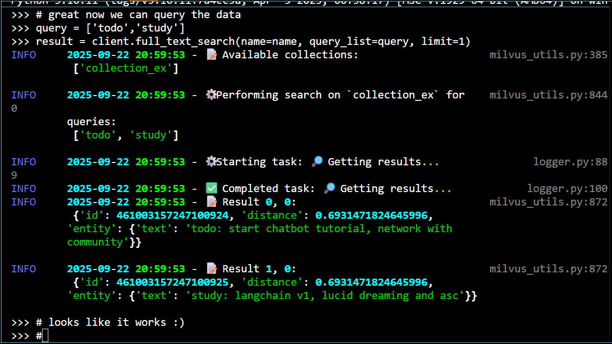
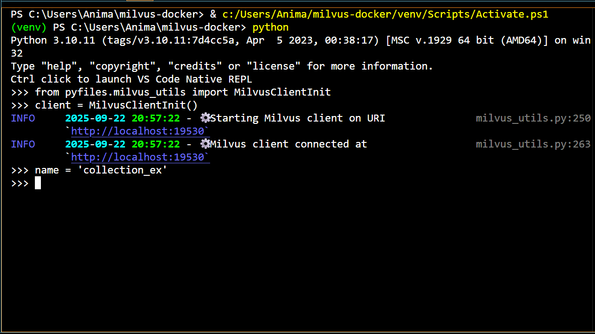

<!-- TODO: update bm25 scoring, sparse vectors, and inverted indices discussions with new knowledge -->

<div class="icon-def-1" style="text-align: center; border: 0.1rem dotted; width: 5%; float: right; padding: 0px; margin: 0px; font-size: 0.9rem; border-radius: 10px;">
  <a onclick="toggleAnimations()" title="Toggle Animations" style="cursor: pointer;">
    <p style="padding: 0px; margin: 0px;"><i class="mdi mdi-sine-wave"></i></p>
  </a>
</div>

# :simple-milvus:{.icon-def-0} Milvus with Docker and Python

<hr class="icon-def-1", style="border-top: 0.2rem dotted; border-bottom: transparent; width: 90%; margin: 0 auto;"> 

{ .img-def }

{.demo-img .png style="display:block;margin:auto;"}

{.demo-img .gif style="display:none;margin:auto;"}

!!! tl-dr "TL;DR"
    Learn how to build and use a [vector database][vectorstore]{.blank} server to store and search your documents on your local machine :material-laptop:{.icon-def-0}. Then, you can use this setup as a tool to give to [locally run AI agents][agents] :material-robot-outline:{.icon-def-0}.

<hr class="icon-def-1", style="border-top: 0.2rem dotted; border-bottom: transparent; width: 90%; margin: 0 auto;"> 

## :material-map-marker-star-outline:{.icon-def-0} About This Project

<div class="grid cards" markdown style="text-align: center; font-size: 2rem; width: 10rem; margin: 0 auto;">

-   
    :simple-milvus:{.icon-def-1} :simple-docker:{.icon-def-1} :simple-python:{.icon-def-1}

</div>

Here, we're going to setup a :simple-milvus:{.icon-def-0} [Milvus][milvus]{.blank} server in :simple-docker:{.icon-def-0} [Docker][docker]{.blank} for using the [vectorstore][vectorstore]{.blank} on our local machines :material-laptop:{.icon-def-0}. We'll see how to add some example data to the vectorstore :material-file-document-plus-outline:{.icon-def-0} and then how to search the database for a given query :material-archive-search-outline:{.icon-def-0}. Once our Milvus server is setup properly, we can also check out some useful information about our client sessions by navigating to [http://localhost:9091/webui][milvus-webui]{.blank}.

The code we learn and use here will serve as the foundation for an indispensable tool to give to our agents, allowing them to obtain information about our personal data :material-calendar-account-outline:{.icon-def-0}. To see what sorts of agents we'll build to use this tool and others, check out the :material-robot-outline:{.icon-def-0} [agents tutorials][agents].

---

[As previously mentioned][servers-why], the way we're going to build agents is by first building local servers for all the gadgets that our agents will need :material-hammer-wrench:{.icon-def-0}. Then, we can learn how to pass these gadgets over to our agents with :simple-langchain:{.icon-def-0} [LangChain][langchain]{.blank} and :simple-langgraph:{.icon-def-0} [LangGraph][langgraph]{.blank}.  

We've gone over how to create an :simple-ollama:{.icon-def-0} [Ollama server][ollama-tutorial] to chat with LMs and a :simple-searxng:{.icon-def-0} [SearXNG server][searxng-tutorial] to search the web. Now, we're going to follow the same sort of process to create the :simple-milvus:{.icon-def-0} [Milvus][milvus]{.blank} server. We'll learn how to setup and use the provided :simple-python:{.icon-def-0} Python code, built on the [PyMilvus][pymilvus]{.blank} library, to interact with the server then dive into the code to see how it all works :material-diving-scuba:{.icon-def-0}. This time, we'll also dive into the math behind the search process to better understand our results :material-calculator-variant-outline:{.icon-def-0}.

---

A [vector database][vectorstore]{.blank}, or a vectorstore, is just a special type of database that can be used to store :material-bookshelf:{.icon-def-0} and query :material-magnify:{.icon-def-0} your data. When data is added to the vectorstore, it's stored with additional representations called `embeddings` which map the data in ways that allow relevant information to be obtained in searches :material-map-search-outline:{.icon-def-0}. There are various types of embeddings to represent data differently :material-shape-plus:{.icon-def-0}, and we'll get a look at how to use one of them in this tutorial, the `sparse embedding` or [sparse vector][sparse-vectors]{.blank} [^sparse-vectors]. 

Vectorstores also utilize special variables called `indices` which describe how the data should be represented for quick searches :material-map-marker-question-outline:{.icon-def-0}. By defining different embeddings and indices, we can represent and search our data in different ways. We can have very different types of data (e.g. images :material-image-outline:{.icon-def-0} or code documents :material-file-code-outline:{.icon-def-0}) and still be able to find relevant information from our queries if we choose proper embeddings and indices :material-checkbox-marked-outline:{.icon-def-0}. 

One way to search data is to do an `exact keyword filtering` :material-key-chain:{.icon-def-0}. For example, if the search query has the word `Milvus` in it, the most relevant data entries found will be those that contain the word `Milvus`. The search that we'll do in this tutorial, a [full-text search][full-text-search]{.blank}, is similar in that it searches for entire keywords of the query while utilizing sparse vectors for the search :material-tag-search-outline:{.icon-def-0}.

However, this type of search also ranks documents for a given query :material-podium-silver:{.icon-def-0}, and so it's probably better defined as a [ranking algorithm][ranking-algorithm]{.blank}. There's quite a lot of nuance here that can be worked through and we'll get to do just that when we dive into the code :material-file-code-outline:{.icon-def-0} and the math :material-calculator-variant-outline:{.icon-def-0}.

Besides full-text searches, another type of search is the `semantic search`. These searches find data based on relations that are, much of the time, not readily apparent :material-head-question-outline:{.icon-def-0}. Instead of simply finding the data that has a particular keyword in it, these searches find data that have complex relations to the query :material-molecule:{.icon-def-0} due to the use of describing the data with `dense embeddings`, or [dense vectors][dense-vector]{.blank} [^dense-vectors].

---

Using :simple-milvus:{.icon-def-0} [Milvus][milvus]{.blank} as a vectorstore to perform these types of searches is an obvious choice :material-checkbox-marked-outline:{.icon-def-0}. As we'll see here and in the [document agent tutorial][doc-agent], it's a powerhouse for storing and searching data :material-home-lightning-bolt-outline:{.icon-def-0}. As for all the various types of searches that we discussed above, [Milvus already has a lot of these][milvus-docs]{.blank} primed and ready for us to use :material-flash:{.icon-def-0}. 

With Milvus, we could choose to do either a full-text or a semantic search, depending on our preferences :material-palette-outline:{.icon-def-0}. We could also perform a [hybrid search][hybrid-search]{.blank}, meaning we can query the data on both sparse and dense vectors at the same time, performing a :material-key-chain:{.icon-def-0} full-text search (exact keyword) and a :material-molecule:{.icon-def-0} semantic search (complex relationships) simultaneously while utilizing ranking algorithms to further increase the relevancy of our results :material-head-check-outline:{.icon-def-0}.

The Milvus server will also utilize a :simple-minio:{.icon-def-0} [MinIO][minio]{.blank} server for data storage and an :simple-etcd:{.icon-def-0} [etcd][etcd]{.blank} server for storage and coordination. I won't go into the details of this part of the setup, though I tried to add extensive [documentation to the code][docker-compose-ak] as a result of me trying to understand a bit better what it was doing :material-puzzle-check-outline:{.icon-def-0}.
  
---

There are a couple of alternatives that I tried for storing and searching data, both of which bridge nicely with :simple-langchain:{.icon-def-0} [LangChain][langchain]{.blank}. If Milvus doesn't fit your needs, you can also check out [FAISS][faiss]{.blank} or [Chroma][chroma]{.blank}.

For a refresher on how to use :simple-docker:{.icon-def-0} [Docker][docker]{.blank} to build an LM server that can power the decision making and response generating aspects of our agents, check out the :simple-ollama:{.icon-def-0} [Ollama server][ollama-tutorial] tutorial. To see how to build a [metasearch engine][metasearch-engine]{.blank} tool to search the web, check out the :simple-searxng:{.icon-def-0} [SearXNG server][searxng-tutorial] tutorial. For an idea of what types of agents we'll build with our servers, check out the :material-robot-excited-outline:{.icon-def-0} [agents tutorials][agents].

---

Finally, before you start building, you can also check out the [Docker compose file][milvus-docker-compose]{.blank} on which ours is based :simple-milvus:{.icon-def-0} :simple-docker:{.icon-def-0}.

Now, let's get building :material-account-hard-hat-outline:{.icon-def-0}!

<hr class="icon-def-1", style="border-top: 0.2rem dotted; border-bottom: transparent; width: 90%; margin: 0 auto;"> 

## :material-flag-checkered:{.icon-def-0} Getting Started

First, we're going to setup and build the repo to make sure that it works :material-wrench:{.icon-def-0}. Then, we can play around with the code and learn more about it :material-test-tube:{.icon-def-0}.

Check out [all the source code here][milvus-docker-ak] :material-arrow-left-bold-outline:{.icon-def-0}.

To setup and build the repo follow these steps:

??? vis-inst "Toggle for visual instructions"

    :material-progress-wrench:{.icon-def-0} This is currently under construction.

1.  Make sure [Docker][docker]{.blank} is installed and running.
1.  Clone the repo, head there, then create a Python environment:

    ```bash
    git clone https://github.com/anima-kit/milvus-docker.git
    cd milvus-docker
    python -m venv venv
    ```

    <a id="gs-activate"></a>

1.  Activate the Python environment:

    ```bash
    venv/Scripts/activate
    ```

    <a id="gs-reqs"></a>

1.  Install the necessary Python libraries:
    ```bash
    pip install -r requirements.txt
    ```

    <a id="gs-start"></a>

1.  Build and start all the Docker containers:

    ```bash
    docker compose up -d
    ```

    > All server data will be located in :material-database-outline:{.icon-def-0} Docker volumes (milvus-data, minio-data, and etcd-data).

1.  Head to [http://127.0.0.1:9091/webui/][milvus-webui]{.blank} to check out some useful Milvus client information.

1.  Run the test script to ensure the Milvus server can be reached through the [PyMilvus][pymilvus]{.blank} library:

    ```bash
    python -m scripts.milvus_test
    ```

    > All logs from the test script are output in the console and stored in the :material-note-edit-outline:{.icon-def-0} `./milvus-docker.log` file.

    <a id="gs-stop"></a>

1.  When you're done, stop the Docker containers and cleanup with:
    ```bash
    docker compose down
    ```

<hr class="icon-def-1", style="border-top: 0.2rem dotted; border-bottom: transparent; width: 90%; margin: 0 auto;"> 

## :material-note-edit-outline:{.icon-def-0} Example Use Cases

Now that the repo is built and working, let's play around with the code a bit :material-test-tube:{.icon-def-0}. 

---

When we built our :simple-ollama:{.icon-def-0} [Ollama][ollama-tutorial] and :simple-searxng:{.icon-def-0} [SearXNG][searxng-tutorial] servers, we demonstrated that the servers could be reached and properly invoked by using the provided Python methods :material-checkbox-marked-outline:{.icon-def-0}. We did this by first instantiating the classes that held the methods to use, then executed the proper commands in the command line :material-console:{.icon-def-0} and by running scripts :material-script-text-outline:{.icon-def-0}.

---

In this case, the main class to interact with the Milvus server is the `MilvusClientInit` class. Once this class is initialized, there are many external methods that we can use to manage our vectorstore collections :material-cards-outline:{.icon-def-0} and perform full-text searches :material-archive-search-outline:{.icon-def-0}.

We can create collections to hold our data using the :material-archive-outline:{.icon-def-0} `create_collection` method and delete these collections with the :material-archive-off-outline:{.icon-def-0} `drop_collection` method. We can list all available collections with the :material-list-box-outline:{.icon-def-0} `list_collections` method, and we can add data to or remove data from a collection using the :material-file-document-plus-outline:{.icon-def-0} `insert` and  :material-file-document-remove-outline:{.icon-def-0} `delete` methods. Finally, we can search a collection for a given query using the :material-archive-search-outline:{.icon-def-0} `full_text_search` method.

For this tutorial, we'll represent our data with `sparse vectors` which can then be used to search for particular keywords :material-key-chain:{.icon-def-0}. [When we build our document agent][doc-agent], we'll see how to add in additional `dense vectors` to represent our data. In this case, we'll be able to use both `sparse` and `dense` embeddings to perform [hybrid searches][hybrid-search]{.blank} for both particular keywords and data based on complex, semantic connections to the query :material-molecule:{.icon-def-0}.

To start off learning how to use the code, let's manage and search a vectorstore through the command line :material-arrow-down-bold-outline:{.icon-def-0}.

---

<a id="cl"></a>

### :material-console:{.icon-def-0} Data Management and Search through the Command Line

??? vis-inst "Toggle for visual instructions"

    :material-progress-wrench:{.icon-def-0} This is currently under construction.

To manage and search data in the command line, follow these steps:

1.  Do [step 3][step-activate] then [step 5][step-start] of the :material-flag-checkered:{.icon-def-0} `Getting Started` section to activate the Python environment and run all the Docker containers to start the Milvus server.

1.  Call the Python environment to the command line:

    ```bash
    python
    ```

1.  Now that you're in the Python environment, import the MilvusClientInit class:

    ```bash
    from pyfiles.milvus_utils import MilvusClientInit
    ```

1.  Initialize the MilvusClientInit class:

    ```bash
    client = MilvusClientInit()
    ```

    <a id="cl-create-collection"></a>

1.  Create a collection with the default parameters:

    ```bash
    client.create_collection()
    ```

    <a id="cl-insert-data"></a>

1.  Insert the default data into the collection:

    ```bash
    client.insert()
    ```

    <a id="cl-search"></a>

1.  Perform the default full-text search on the data:

    ```bash
    client.full_text_search()
    ```

1.  Drop the default collection at the end to clean up:

    ```bash
    client.drop_collection()
    ```

1.  Do [step 8][step-stop] of the :material-flag-checkered:{.icon-def-0}`Getting Started` section to stop the containers when you're done.

Just like with the test script, all logs will be printed in the console and stored in :material-note-edit-outline:{.icon-def-0} `./milvus-docker.log`.

---

There are lots of variables we can customize here: the collection we use, the data we insert, and the queries for which we search the database [^milvus-customization]. 

In the next example, I show how to make these customizations by creating and running a custom script :material-arrow-down-bold-outline:{.icon-def-0}.

<hr class="icon-def-1", style="border-top: 0.2rem dotted; border-bottom: transparent; width: 60%; margin: 0 auto;"> 

<a id="rs"></a>

### :material-script-text-outline:{.icon-def-0} Data Management and Search through Running Scripts

??? vis-inst "Toggle for visual instructions"

    :material-progress-wrench:{.icon-def-0} This is currently under construction.

To manage and search your data through a custom script, follow these steps:

1.  Do [step 3][step-activate] then [step 5][step-start] of the :material-flag-checkered:{.icon-def-0} `Getting Started` section to activate the Python environment and run the Milvus server in Docker.

    <a id="rs-create"></a>

1.  Create a script in the `./scripts` folder named `my-data-search-ex.py` with the following:

    ```python
    # Import MilvusClientInit class
    from pyfiles.milvus_utils import MilvusClientInit

    # Initialize client
    client = MilvusClientInit()

    # Create collection
    collection_name = 'my_collection'
    client.create_collection(collection_name)

    # Create data and insert into collection
    my_data = [
        {'text': 'grocery list: bananas, bread, choco'},
        {'text': 'grocery: green beans'},
        {'text': 'todo list: start chatbot tutorial, network with community'},
        {'text': 'study list: langchain v1, lucid dreaming and asc'},
        {'text': 'study latest gradio implements'},
        {'text': 'My dream last night involved'},
        {'text': 'then I woke up, confused as to if I was still dreaming.'}
    ]
    client.insert(name=collection_name, data=my_data)

    # Define the maximum number of results and the search query
    num_results = 2
    query_list = ['grocery', 'study', 'dream']

    # Get results
    client.full_text_search(
        name=collection_name, 
        query_list=query_list, 
        limit=num_results
    )

    # (Optional) Delete collection when done to clean up
    client.drop_collection(name=collection_name)
    ```

    <a id="rs-run"></a>

1.  Run the script

    ```bash
    python -m scripts.my-data-search-ex
    ```

1.  Do [step 8][step-stop] of the :material-flag-checkered:{.icon-def-0}`Getting Started` section to stop the containers when you're done.

Again, all logs will be printed in the console and stored in :material-note-edit-outline:{.icon-def-0} `./milvus-docker.log`. The name of the Python script doesn't matter as long as you use the same name in [step 2][step-create] and [step 3][step-run]. 

<hr class="icon-def-1", style="border-top: 0.2rem dotted; border-bottom: transparent; width: 30%; margin: 0 auto;"> 

Notice these searches are *full-text*, meaning the data is searched for exact keywords :material-key-chain:{.icon-def-0}. We can improve this search by performing a semantic search simultaneously, picking up on more subtle relationships between the data :material-molecule:{.icon-def-0}. This is exactly what we'll do in the [document agent tutorial][doc-agent] :material-bookshelf:{.icon-def-0} :material-magnify:{.icon-def-0} :material-robot-excited-outline:{.icon-def-0}.

Now that we understand how to use the code, let's open it up to check out the gears :material-cog-outline:{.icon-def-0} :material-arrow-down-bold-outline:{.icon-def-0}.

<hr class="icon-def-1", style="border-top: 0.2rem dotted; border-bottom: transparent; width: 90%; margin: 0 auto;"> 

## :material-view-quilt-outline:{.icon-def-0} Project Structure

Before we take a deep dive into the source code :material-diving-scuba:{.icon-def-0}, let's look at the repo structure to see what code we'll want to learn :material-magnify:{.icon-def-0}.

```
├── docker-compose.yml      # Docker configurations
├── pyfiles/                # Python source code
│   └── logger.py           # Python logger for tracking progress
│   └── milvus_utils.py     # Python methods to use Milvus server
├── requirements.txt        # Required Python libraries for main app
├── requirements-dev.txt    # Required Python libraries for development
├── scripts/                # Example scripts to use Python methods
│   └── milvus_test.py      # Python test of methods
│   └── latency_test.py     # Timing tests for methods
├── tests/                  # Testing suite
├── third-party/            # Milvus/PyMilvus licensing
├── validators/             # Validators for Python methods
└── └── milvus_types_.py    # Type validation for Python methods
```

<h4 style="text-align: left;">milvus_utils.py</h4>

> The `milvus_utils.py` file defines the class and methods needed in order to manage and search custom data using our Milvus server. This is the file on which we're going to spend our deep dive :material-map-marker-star-outline:{.icon-def-0}.

<h4 style="text-align: left;">milvus_types.py</h4>

> This file performs type validation for the methods in the `milvus_utils.py` file :material-shape-plus:{.icon-def-0}. What this means is that the arguments and results of the methods are checked to make sure they have the correct Python type using [Pydantic][pydantic]{.blank} (see [lines 211-213 & 223-225][milvus-utils-skeleton] of the full version of the `milvus_utils.py` file for an example of how this file is used). This trick is quite helpful for ridding your code of potential bugs related to recieving the wrong types of objects :material-shield-bug-outline:{.icon-def-0}. I won't go into this file in detail, but you can [check it out][milvus-types-ak] if you're interested in learning :material-wizard-hat:{.icon-def-0}.

??? bonus-code "How do all the files work?"

    For a refresher on the `logger.py`, `requirements*.txt`, `latency_test.py`, and `milvus_test.py` files as well as the `tests/` folder, check out the :simple-ollama:{.icon-def-0} [Ollama][ollama-project-structure] and :simple-searxng:{.icon-def-0} [SearXNG][searxng-bonus-all-files] tutorials.

    ---

    We've also seen the :simple-docker:{.icon-def-0} Docker compose file for the [Ollama][ollama-docker-compose] and [SearXNG][searxng-docker-compose] tutorials. Here, this file doesn't contain much we haven't seen yet. Similarly to the [SearXNG server][searxng-docker-compose], we define multiple services for :simple-milvus:{.icon-def-0} Milvus as well as the supporting servers, :simple-minio:{.icon-def-0} MinIO and :simple-etcd:{.icon-def-0} etcd. We also perform some new tricks for healthchecks and ensure that the Milvus server can't be started without its supporting servers :material-thermometer-check:{.icon-def-0}. I won't go into details for these, but you can [check out the file][docker-compose-ak] to see what I mean. 

---

Ok, that's all the files :material-checkbox-marked-outline:{.icon-def-0}. Let's go diving :material-diving-scuba:{.icon-def-0}!

<hr class="icon-def-1", style="border-top: 0.2rem dotted; border-bottom: transparent; width: 90%; margin: 0 auto;"> 

## :material-file-code-outline:{.icon-def-0} Code Deep Dive

Here, we're going to look at the relevant files in more detail :material-magnify:{.icon-def-0}. We're going to start with looking at the full files to see which parts of the code we'll want to learn, then we can further probe each of the important pieces to see how they work :material-map-marker-question-outline:{.icon-def-0}.

<hr class="icon-def-1", style="border-top: 0.2rem dotted; border-bottom: transparent; width: 60%; margin: 0 auto;"> 

<a id="milvus-utils"></a>

### :simple-milvus:{.icon-def-0} File 1 | `milvus_utils.py`

??? vis-inst "Toggle file visibility"

    <a id="milvus-utils-skeleton"></a>

    === "Skeleton"

        ```python title="milvus_utils.py skeleton" linenums="1" hl_lines="221-248"
        --8<--
        docs/tutorials/servers/assets/milvus/milvus-utils-skeleton.py
        --8<--
        ``` 

    === "Full"
        
        ```python title="milvus_utils.py full" linenums="1" hl_lines="770-875"
        --8<--
        docs/tutorials/servers/assets/milvus/milvus-utils-full.py
        --8<--
        ```

Above, I show the `milvus_utils.py` file in all its full glory as well as in a skeleton version :material-bone:{.icon-def-0} which is all the code needed to work :material-power:{.icon-def-0} and almost none of the code for some crucial [best practices][ollama-code-best-practices].

Compared to the `ollama_utils.py` file in the [Ollama server tutorial][ollama-utils] and the `searxng_utils.py` in the [SearXNG server tutorial][searxng-utils], many more of the methods in the `MilvusClientInit` class are external methods to be used outside the class. However, the main methods that we're going to use are the `create_collection`, `insert`, and `full_text_search` methods. These are what we used when [working in the command line][command-line] and [running scripts][running-scripts] in the :material-note-edit-outline:{.icon-def-0} `Example Use Cases` section. 

Before we start, you can also :simple-milvus:{.icon-def-0} [checkout the guide][full-text-search]{.blank} that much of this code is based on. 

Now, let's check these methods out :material-arrow-down-bold-outline:{.icon-def-0}.

<hr class="icon-def-1", style="border-top: 0.2rem dotted; border-bottom: transparent; width: 30%; margin: 0 auto;"> 

---

#### :material-map-marker-question-outline:{.icon-def-0} Method 1.1 | `create_collection`

: See [lines 141-175][milvus-utils-skeleton] of `milvus_utils.py`

We've already seen that the `create_collection` method can take in a collection name, then create a Milvus collection that can be used to store and search data. Now, we can open up the method to see how this is all done :material-book-open-variant-outline:{.icon-def-0}.

<a id="code-create-collection"></a>

```python title="create_collection method of milvus_utils.py" linenums="1" hl_lines="0" 
--8<--
docs/tutorials/servers/assets/milvus/milvus-utils-stripped.py:60:62,117:152
--8<--
```

Before discussing how the method works, let's discuss the default values that go into it. These include the:

-  `collection_name` ([lines 2 and 7][code-create-collection]) which is just a string defining the name of the collection,
-  `field_params_list` ([line 8][code-create-collection]) defining the fields with which to represent our data,
-  `func_bm25` ([line 9][code-create-collection]) defining the embedding function to use for an additional representation of the data,
-  `index_params_list` ([line 10][code-create-collection]) defining the fields to use for searching and the index type for quick retrieval. 

Let's look at the last three of these together :material-arrow-down-bold-outline:{.icon-def-0}. 

---

=== "field_params_list"

    ```python title="default field_params_list of create_collection method" linenums="1" hl_lines="0"
    --8<--
    docs/tutorials/servers/assets/milvus/milvus-utils-stripped.py:7:8,37:58
    --8<--
    ```

=== "func_bm25"

    ```python title="default embedding function of create_collection method" linenums="1" hl_lines="0" 
    --8<--
    docs/tutorials/servers/assets/milvus/milvus-utils-stripped.py:5:6,28:35
    --8<--
    ```

=== "index_params_list"

    ```python title="default index_params_list of create_collection method" linenums="1" hl_lines="0" 
    --8<--
    docs/tutorials/servers/assets/milvus/milvus-utils-stripped.py:12:26
    --8<--
    ```

We can see from the `field_params_list` that each data entry will have three fields associated with it, an `ID` for management, a `text` field which will be the content of the data entry, and a `sparse` field :material-checkbox-marked-outline:{.icon-def-0}. This last field will be populated by our embedding function, :material-function-variant:{.icon-def-0} `func_bm25`, which will have a `text` field input and will output a `sparse` field. We can also see from the `index_params_list` that this field will be the one used to search the data :material-archive-search-outline:{.icon-def-0}. 

---

In other words, we start with a list of `text` entries :material-text-box-multiple-outline:{.icon-def-0} and our embedding function, `func_bm25`, turns this text into `sparse` vectors :material-focus-field-horizontal:{.icon-def-0}. As defined by our `index_params_list`, these vectors are then used when scoring results to output the most relevant ones :material-podium-silver:{.icon-def-0}.

??? bonus-code "I want more info about the default values!"

    There's a lot more that can be said about the `field_params_list`, the `func_bm25`, and the `index_params_list`. 

    <a id="bonus-default-values"></a>

    === "field_params_list"
    
        This is how we tell Milvus what fields we want our data to be represented by :material-tag-outline:{.icon-def-0}. 
        
        We let Milvus handle giving IDs to our data entries by setting the `auto_id` argument to `True`. We put a limit on the size of `text` entries and we set the `enable_analyzer` argument to `True` in order to use our embedding function to turn the `text` field into a `sparse` field :material-checkbox-marked-outline:{.icon-def-0}. Finally, each of these fields needs to have a datatype associated with it that Milvus can work with :material-shape-plus:{.icon-def-0}. 

    === "func_bm25"

        This is how we turn text fields into sparse vectors and how we score documents to obtain results with the `full_text_search` method :material-function-variant:{.icon-def-0}. 
        
        This uses the [BM25 method][bm25]{.blank} that's [built into Milvus][milvus-metrics]{.blank}. For more details about how this function works see the :material-calculator-variant-outline:{.icon-def-0} [math deep dive][math-dive] section.

    === "index_params_list"

        This is how we tell Milvus the fields on which we want our documents to be evaluated when searching and how to index our data for quick retrieval :material-archive-search-outline:{.icon-def-0}.

        We use the [SPARSE_INVERTED_INDEX][sparse-inverted-index]{.blank} value for the `index_type`. What does this mean :material-head-question-outline:{.icon-def-0}? 
        
        The [INVERTED][inverted-index]{.blank} index type optimizes document retrieval by mapping each term to each document that contains the term :material-relation-one-to-one-or-many:{.icon-def-0}. Here, we're just making sure we use the inverted index for *sparse vectors* specifically :material-checkbox-marked-outline:{.icon-def-0}. 
        
        :simple-milvus:{.icon-def-0} Milvus stores data in `growing segements` which, after reaching some size, are indexed according to the user's choice of indices :material-palette:{.icon-def-0}. So, the text fields are turned into sparse vectors with BM25 and this information is stored in a `growing segment`. Then, when the segment gets large enough the sparse vectors are indexed in an inverted format that allows for quicker fetching of relevant documents :material-flash:{.icon-def-0}. However, we don't want to index every segment before they reach a particular size, because we would then use up too much memory for too small a gain in speed :material-scale-unbalanced:{.icon-def-0}.   
        
        We let Milvus know that we want to use the BM25 metric for evaluation and we tack on some extra parameters for further customization. We can see that we're setting the \(k_1\) and \(b\) constants from the :material-function-variant:{.icon-def-0} [BM25 scoring function][math-bm25]. 
        
        We're also using the [DAAT_MAXSCORE][full-text-search]{.blank} algorithm to allow for faster evaluation time by filtering out documents that can't possibly score higher than the current highest score evaluated :material-checkbox-marked-outline:{.icon-def-0}. I believe it also does some sorting of the query terms by how much they can possibly contribute to the document scores (i.e. terms that will give very high scores are scored first and terms that will give very low scores are deemed non-essential and thrown out) :material-tag-remove-outline:{.icon-def-0}.

After initializing the schema to use for the collection ([lines 14-16][code-create-collection] of the `create_collection` method), we add each of the fields in the `field_params_list` to the schema using the :material-tag-plus-outline:{.icon-def-0} `_create_field` method ([lines 20-21][code-create-collection]). We then add the `func_bm25` to the schema functions using the :material-function-variant:{.icon-def-0} `schema.add_function` method ([lines 25-26][code-create-collection]). 

We also initialize the index parameters list to use for searching the collection ([line 30][code-create-collection]) and we add each of the indices in the `index_params_list` using the :material-archive-search-outline:{.icon-def-0} `_create_index` method ([lines 31-32][code-create-collection]). Finally, we create the collection with the `client.create_collection` method ([lines 35-39][code-create-collection]) :material-checkbox-marked-outline:{.icon-def-0}.

Let's discuss how the schema and index parameters are initialized and the collection is created through the `client` attribute of the `MilvusClientInit` class. :material-arrow-down-bold-outline:{.icon-def-0}.

<hr class="icon-def-1", style="border-top: 0.2rem dotted; border-bottom: transparent; width: 30%; margin: 0 auto;"> 

---

#### :material-map-marker-question-outline:{.icon-def-0} Method 1.2 | `_init_client`

: See [lines 101-108][milvus-utils-skeleton] of `milvus_utils.py`

Everytime we use the `client` attribute of the class, we're using the :simple-milvus:{.icon-def-0} `MilvusClient` that we initiated with the `_init_client` method.

<a id="code-client"></a>

```python title="Defining the client attribute of the MilvusClientInit class" linenums="1" hl_lines="0"
--8<--
docs/tutorials/servers/assets/milvus/milvus-utils-stripped.py:3:4,9:11,223:241
--8<--
```

So, we can see that we've initialized a `MilvusClient` on the URI that was defined in our :simple-docker:{.icon-def-0} Docker setup. For collection creation, we then use the built in `MilvusClient` methods to initialize the schema and index parameters, as well as create the collection :material-checkbox-marked-outline:{.icon-def-0}. 

??? bonus-code "How do the other methods work?"

    The `_create_field` and `_create_index` methods are also just simple wrappers of built in [PyMilvus][pymilvus]{.blank} methods :material-candy:{.icon-def-0}:

    === "_create_field"
        
        ```python title="_create_field method of the MilvusClientInit class" linenums="1" hl_lines="0"
        --8<--
        docs/tutorials/servers/assets/milvus/milvus-utils-stripped.py:91:98
        --8<--
        ```

    === "_create_index"
        
        ```python title="_create_index method of the MilvusClientInit class" linenums="1" hl_lines="0"
        --8<--
        docs/tutorials/servers/assets/milvus/milvus-utils-stripped.py:100:107
        --8<--
        ```

    For the `_create_field` method, we use the `schema.add_field` method which takes in all the necessary inputs that are needed for a given field :material-tag-outline:{.icon-def-0}. So, we define these with the `field_params_list`, then we pass these params to the `add_field` method (see [lines 20-21][code-create-collection] of the `create_collection` method) :material-checkbox-marked-outline:{.icon-def-0}. 

    The `_create_index` method works exactly the same way, except it uses the `index_params.add_index` method :material-archive-search-outline:{.icon-def-0}. Just like before, we define all the inputs we need for each of the indices in the `index_params_list`, then pass these params to the `add_index` method (see [lines 31-32][code-create-collection] of the `create_collection` method) :material-checkbox-marked-outline:{.icon-def-0}. 

Now that we understand how collections are defined and created with the `create_collection` method :material-checkbox-marked-outline:{.icon-def-0}. Let's check out how data is inserted with the `insert` method :material-arrow-down-bold-outline:{.icon-def-0}.

<hr class="icon-def-1", style="border-top: 0.2rem dotted; border-bottom: transparent; width: 30%; margin: 0 auto;"> 

---

#### :material-map-marker-question-outline:{.icon-def-0} Method 1.3 | `insert`

: See [lines 188-202][milvus-utils-skeleton] of `milvus_utils.py` 

We've already seen that the `insert` method can take in a collection name and some data then add this data to the appropriate collection. Now, we can open up the method to see how this is all done :material-book-open-variant-outline:{.icon-def-0}.

<a id="code-insert"></a>

```python title="insert method of milvus_utils.py" linenums="1" hl_lines="0" 
--8<--
docs/tutorials/servers/assets/milvus/milvus-utils-stripped.py:162:177
--8<--
```

When we recall [how the `client` attribute of the class is defined][code-client], we can see that this method is just a wrapper of the `MilvusClient` method with the same name :material-candy:{.icon-def-0}. We want to insert some given data into the given collection, and we want to wait for a bit before moving on to ensure the data is inserted before trying any searches :material-checkbox-marked-outline:{.icon-def-0}. 

Ok, that one was simple :material-flash:{.icon-def-0}. Now, that we know how to create a collection and insert data into the collection, let's see how to do the full-text search :material-arrow-down-bold-outline:{.icon-def-0}. 

<hr class="icon-def-1", style="border-top: 0.2rem dotted; border-bottom: transparent; width: 30%; margin: 0 auto;"> 

--- 

#### :material-map-marker-question-outline:{.icon-def-0} Method 1.4 | `full_text_search`

: See [lines 221-248][milvus-utils-skeleton] of `milvus_utils.py`

We've already seen that the `full_text_search` method can take in a collection name, a list of queries, and a maximum number of results, then output a list of dictionaries showing the most relevant results. Now, we can open up the method to see how this is all done :material-book-open-variant-outline:{.icon-def-0}.

<a id="code-full-text-search"></a>

```python title="full_text_search method of milvus_utils.py" linenums="1" hl_lines="32-39" 
--8<--
docs/tutorials/servers/assets/milvus/milvus-utils-stripped.py:60:62,73:76,77:80,193:221
--8<--
```

Here, we define the `full_text_search` method with some default values for the collection name, the list of queries we want to search for, and the maximum number of results to retrieve. We tell Milvus we want to do a search on the `sparse` vector fields ([lines 21 & 35][code-full-text-search]) and we want the results to be returned with the `text` fields ([lines 22 & 36][code-full-text-search]) :material-checkbox-marked-outline:{.icon-def-0}. 

We also define an extra search parameter, the `drop_ratio_search` which is some number between zero and one defining the fraction of documents to drop before searching :material-file-document-remove-outline:{.icon-def-0}. In our case, we tell Milvus to drop \(20\%\) of the candidates. Higher values means our search will be faster but less accurate :material-flash:{.icon-def-0}.

---

That's it :material-checkbox-marked-outline:{.icon-def-0}! We've gone through all the code in this repo that's needed to understand how to setup a :simple-milvus:{.icon-def-0} Miluvs server in :simple-docker:{.icon-def-0} Docker and use it to manage and search custom data :material-creation-outline:{.icon-def-0}.

To get an idea of how documents are scored and retrieved using this method, let's check out the `func_bm25` function in more detail :material-arrow-down-bold-outline:{.icon-def-0}.

<hr class="icon-def-1", style="border-top: 0.2rem dotted; border-bottom: transparent; width: 90%; margin: 0 auto;"> 

<a id="math-dive"></a>

## :material-calculator-variant-outline:{.icon-def-0} Math Deep Dive

Here, we're going to look at the relevant math in more detail :material-magnify:{.icon-def-0}. 

<hr class="icon-def-1", style="border-top: 0.2rem dotted; border-bottom: transparent; width: 60%; margin: 0 auto;"> 

<a id="math-bm25"></a>

### :material-function-variant:{.icon-def-0} BM25

This [scoring function][bm25]{.blank} was the 25th (and best performing) version of the algorithms tested for the Okapi Information System at London's City University back in the late 1900s and has been widely used since for exact keyword searches :material-key-chain:{.icon-def-0}.
        
Let's say we want to :material-archive-search-outline:{.icon-def-0} search our documents for a query, \(q\). The scoring function will take into account three terms in order to determine the relevancy of a given document, \(d\): the Term Frequency (TF), the Inverse Document Frequency (IDF), and the Document Length Normalization (DLN). 

- \(\text{TF}(q,d)\): the frequency at which the term, \(q\), appears in the document, \(d\)
- \(\text{IDF}(q)\): a measure of how many documents contain the term, \(q\) 
- \(\text{DLN}(d)\): ensures that longer documents don't get higher scores based mostly on their length rather than their relevancy.

The TF is just some number, however many times the term appears in the document :material-numeric-3-box-multiple-outline:{.icon-def-0}. The other two terms have more complicated mathematical forms :material-function-variant:{.icon-def-0}. Let's look at these two, then we can see how all the terms go together to get the BM25 score :material-arrow-down-bold-outline:{.icon-def-0}.

<hr class="icon-def-1", style="border-top: 0.2rem dotted; border-bottom: transparent; width: 30%; margin: 0 auto;"> 

---

#### :material-exponent:{.icon-def-0} Function 1.1 | Inverse Document Frequency

The IDF is given by:

\[ 
    \text{IDF}(q) = \ln \left( \frac{N - n(q) + 0.5}{n(q) + 0.5} + 1 \right) 
\]

where \(q\) is the term being searched for, \(N\) is the total number of documents, and \(n(q)\) is the number of documents that contain the term \(q\).

:material-numeric-0-box-outline:{.icon-def-0} What happens if none of the documents contain the term (i.e. \(n(q)=0\))?

\[ 
    \text{IDF}(q) = \ln \left( \frac{N + 0.5}{0.5} + 1 \right) = \ln(2) \ln(N+1)
\]

So, if none of the documents contain the term, we get some positive number that grows with the total number of documents. 

:material-numeric-9-plus-box-multiple-outline:{.icon-def-0} What happens if all the documents contain the term (i.e. \(n(q)=N\))?

\[ 
    \text{IDF}(q) = \ln \left( \frac{0.5}{N + 0.5} + 1 \right) = \ln \left( \frac{N + 1}{N + 0.5} \right) = \ln \left( \frac{1 + \left(1/N\right)}{1 + \left(0.5/N\right)} \right)
\]

\[ 
    \left.\text{IDF}(q)\right\vert_{N\gg1} = \left.\ln \left( \frac{1 + \left(1/N\right)}{1 + \left(0.5/N\right)} \right)\right\vert_{N\gg1} \approx \ln(1) 
\]

So, if all the documents contain the term, the IDF for that term gets close to zero (especially when \(N\gg1\), which will usually be the case). 

---

To wrap it all up:

<a id="table-idf"></a>

<div class="center-table" markdown>

|  \(n(q)\)                    |  \(\text{IDF}(q)\)                   |
|:----------------------------:|:------------------------------------:|
| Few documents contain \(q\)  | Increases as \(N\) increases         |
| Most documents contain \(q\) | Decreases to zero as \(N\) increases |

</div>

Now, let's look at the DLN term :material-arrow-down-bold-outline:{.icon-def-0}.

<hr class="icon-def-1", style="border-top: 0.2rem dotted; border-bottom: transparent; width: 30%; margin: 0 auto;"> 

---

#### :material-exponent:{.icon-def-0} Function 1.2 | Document Length Normalization

The DLN depends on some constant, \(0 \leq b \leq 1\), chosen by the user :material-cog-outline:{.icon-def-0},

\[
    \text{DLN}(d) = \left(1 - b + b \frac{d_l}{D_l}\right)
\]

where \(d_l\) is the length of document \(d\) and \(D_l\) is the average length of all documents.

:material-text-long:{.icon-def-0} What happens if the length of the document is much longer than the average length (i.e. \( d_l \gg D_l \))?

\[
    \text{DLN}(d) = \left(1 - b + b \frac{d_l}{D_l}\right)
    = \frac{d_l}{D_l}\left(\frac{D_l}{d_l} - b \frac{D_l}{d_l} + b\right)
\]

\[
    \left. \text{DLN}(d) \right\vert_{d_l \gg D_l} = \left. \frac{d_l}{D_l}\left(\frac{D_l}{d_l} - b \frac{D_l}{d_l} + b\right) \right\vert_{d_l \gg D_l}
    \approx b \frac{d_l}{D_l}
\]

So if the length of the document is much longer than the average length, the DLN will be some large number multiplied by a constant chosen by the user. If the constant is zero, then the DLN is also zero and if the constant is one, the DLN is the ratio of the document length to the average length, which is some very large positive number. 

:material-text-short:{.icon-def-0} What happens if the length of the document is much shorter than the average length (i.e. \( d_l \ll D_l \))?

\[
    \left. \text{DLN}(d) \right\vert_{d_l \ll D_l} = \left. \left(1 - b + b \frac{d_l}{D_l}\right) \right\vert_{d_l \ll D_l} \approx (1-b)
\]

So, if the length of the document is much shorter, the DLN is some number between zero (if \(b=1\)) and one (if \(b=0\)); a very mild number compared to the ratio above.

---

To wrap it all up:

<a id="table-dln"></a>

<div class="center-table" markdown>

| \(d_l / D_l\)                      | \(\text{DLN}(d)\) for \(b=0\) | \(\text{DLN}(d)\) for \(b=1\) |
|:----------------------------------:|:-----------------------------:|:-----------------------------:|
| Document much longer than average  | 0                             | Some large number             |
| Document much shorter than average | 1                             | 0                             |

</div>

Now that we understand these terms :material-checkbox-marked-outline:{.icon-def-0}, let's check out the BM25 function :material-arrow-down-bold-outline:{.icon-def-0}.

<hr class="icon-def-1", style="border-top: 0.2rem dotted; border-bottom: transparent; width: 30%; margin: 0 auto;"> 

---

#### :material-exponent:{.icon-def-0} Function 1.3 | Final Form of BM25

The BM25 scoring function is given by:

<a id="score-bm25"></a>

\[
    \text{score}(d, Q) = \sum^{m}_{i=1} \text{IDF}(q_i) \frac{\text{TF}(q_i, d) \left(k_1 + 1\right)}{\text{TF}(q_i, d) + k_1 \text{DLN}(d)}
\]

where \(d\) is the document being scored, \(Q\) is the user's entire search query which is split into \(m\) terms, and \(q_i\) is the \(i\)-th term of the search query. Here, \(0 \leq k_1 \leq 3\) is a constant chosen by the user which determines the contribution of TF to the score by *capping off* the score as TF gets really large :material-chart-line:{.icon-def-0}. 

If a document contains a term over and over again, the TF is going to be huge and the score for this term is going to blow up compared to the other scores. However, if we limit how large the score can be for a given term, we won't end up with this problem. Check out the equation below to see what I mean as TF becomes very large :material-arrow-down-bold-outline:{.icon-def-0}.

\[
    \left.\frac{\text{TF}(q_i, d) \left(k_1 + 1\right)}{\text{TF}(q_i, d) + k_1 \text{DLN}(d)}\right\vert_{\text{TF}\rightarrow\inf} = \left.\frac{\text{TF}(q_i, d)}{\text{TF}(q_i, d)}\frac{\left(k_1 + 1\right)}{1 + k_1 \frac{\text{DLN}(d)}{\text{TF}(q_i, d)}} \right\vert_{\text{TF}\rightarrow\inf}
    \approx k_1 + 1 
\]

So, for terms that have really large TF, the contribution to the score from TF is capped off to \(k_1 + 1\). This prevents the score from being dominated by overly frequent terms and allows for more subtle results to be found :material-checkbox-marked-outline:{.icon-def-0}. As \(k_1\) gets larger, the maximum allowed contribution from the TF also gets larger and when \(k_1 = 0\), there's no contribution from the TF at all. 

---

To wrap it all up, for very large TF:

<div class="center-table" markdown>

| \(k\) | \(\text{score}(d, Q)\)                | 
|:-----:|:-------------------------------------:|
| 0     | \(\sum^{m}_{i=1} \text{IDF}(q_i)\)    |
| 3     | \(4 \sum^{m}_{i=1} \text{IDF}(q_i)\)  |

</div>

---

Now, recall the [limits we examined for the IDF][table-idf]. The [scoring function][score-bm25] depends on the IDF linearly for a given term. So, ignoring the TF contribution (which is capped off to \(k_1+1\)), if most of the documents contain the term :material-numeric-9-plus-box-multiple-outline:{.icon-def-0}, the score is very small, and if none of the documents contain the term :material-numeric-0-box-outline:{.icon-def-0}, the score becomes some positive number that grows with the total number of documents. 

This means if the document being scored contains terms in our query that don't appear in the other documents very often, it's bound to be relevant. But, if the document contains terms in the our query that almost all documents have, it may not be that relevant :material-checkbox-marked-outline:{.icon-def-0}. 

Now, recall the [limits we examined for the DLN][table-dln]. As the length of the document being scored becomes much longer than the average length :material-text-long:{.icon-def-0}, the [DLN term in the denominator][score-bm25] becomes larger and larger, causing the score to be smaller. While, as the length becomes much shorter than the average :material-text-short:{.icon-def-0}, the DLN term is just some number between zero and one and won't affect the score very much. 

It seems then, that this term is mostly used to *penalize* documents that are much longer than the average length. We don't want the scores for these terms to blow up just because they're much longer and contain many more words (i.e. TF is potentially larger compared to shorter documents) :material-checkbox-marked-outline:{.icon-def-0}.

<hr class="icon-def-1", style="border-top: 0.2rem dotted; border-bottom: transparent; width: 30%; margin: 0 auto;"> 

---

What does this all mean :material-head-question-outline:{.icon-def-0}? Well, we see that a document will get a high score for a given term if the term appears in the document frequently and it's one of the few documents that contain the term :material-file-document-check-outline:{.icon-def-0}. As the frequency of the term in the document goes down or as the number of documents that also contain the term goes up, the score will go down :material-file-document-remove-outline:{.icon-def-0}. Furthermore, if the document is very long its score will be penalized, and if the term frequency is very large its score will be capped off.

With all this being said, it seems that a *high* score means a *more relevant* document, and as the score goes down the document becomes less relevant to the search terms. This is helpful to understand, because documents are ranked using this score through a [*cosine-similarity*][cosine-similarity] test :material-sine-wave:{.icon-def-0}. 

This test checks the similarity between two vectors through a simple dot product (comparing the angle between the two) :material-angle-acute:{.icon-def-0}. If the two vectors are the same, the angle between them is equal to zero, and their similarity score is equal to one. As the angle between the two grows, the similarity score gets closer to zero (for strictly positive vector elements) :material-angle-right:{.icon-def-0}. Let's check out the cosine-similarity score for two vectors \(\textbf{A}\) and \(\textbf{B}\) to see what I mean :material-arrow-down-bold-outline:{.icon-def-0}:

<a id="cosine-similarity-score"></a>

\[
    S_C\left( \textbf{A}, \textbf{B} \right) = \cos\left(\theta_{AB}\right) = \frac{\textbf{A}\cdot\textbf{B}}{\left|\textbf{A}\right|\left|\textbf{B}\right|} = \frac{\sum_{i}^{N}A_i B_i}{\sqrt{\sum_i^N A_i^2} \sqrt{\sum_i^N B_i^2}}
\]

where \(A_i\) and \(B_i\) are the \(i\)-th components of the vectors \(\textbf{A}\) and \(\textbf{B}\). So, all we need to do is add up all the components for the vectors to get the score :material-checkbox-marked-outline:{.icon-def-0}. 

In our case, the vectors that we want to compare are just the sparse vectors that we've been discussing. But how does the `func_bm25` turn the text fields into sparse vectors :material-arrow-down-bold-outline:{.icon-def-0}? 

---

When we add a document to Milvus, it first does a lot of preprocessing behind the scenes, including [tokenization][tokenization]{.blank} and [stop word removal][stop-word]{.blank}. From this preprocessing, it obtains the set of all [tokens][tokens]{.blank} within the document and the TF value for each token is obtained :material-clipboard-list-outline:{.icon-def-0}. The sparse vector for the document is then created from these TF values and stored.

When a user then invokes the full-text search with a query :material-archive-search-outline:{.icon-def-0}, the query goes through similar preprocessing to obtain the search tokens and a sparse vector representation from the TF values of a given document is obtained. This *query vector* is then combined with the IDF values according to the [BM25 score][score-bm25] and compared to the *stored vector* of the document using the [cosine-similarity score][cosine-similarity-score] :material-angle-acute:{.icon-def-0}. 

Notice that when Milvus gives us results from the full-text search, it includes a `distance` parameter :material-vector-line:{.icon-def-0}. This is just the [cosine-similarity score][cosine-similarity-score] between the *query vector* combined with the IDF and the *stored vector* of the document. As expected, higher distances pertain to more relevant documents (both cosine-similarity and IDF increase with increasing relevance) :material-podium-silver:{.icon-def-0}.

---

And that's it :material-checkbox-marked-outline:{.icon-def-0}! We've gone through all the code and math that's needed to understand how to use :simple-milvus:{.icon-def-0} Miluvs to search our custom data for relevant information :material-creation-outline:{.icon-def-0}.

<hr class="icon-def-1", style="border-top: 0.2rem dotted; border-bottom: transparent; width: 90%; margin: 0 auto;"> 

## :material-bookshelf:{.icon-def-0} Next Steps & Learning Resources

If you've followed along with the :material-server:{.icon-def-0} [servers][servers] tutorials up to this point, we've finished building all the individual servers that we'll need in order to start our agent builds :material-robot-excited-outline:{.icon-def-0}. However, there is one final (and very simple tutorial) to show :simple-docker:{.icon-def-0} [how to combine all the servers][multi-server-tutorial] covered in the series. This last tutorial will show how to build the complete server stack that we'll use for our specialized agent builds :material-checkbox-marked-outline:{.icon-def-0}. 

Continue learning how to build the final server stack by choosing the :material-server:{.icon-def-0} [last tutorial in the servers series][multi-server-tutorial], learn how pass this :simple-milvus:{.icon-def-0} Milvus server to an agent and interact with it through a :simple-gradio:{.icon-def-0} [Gradio][gradio]{.blank} web UI in the :material-bookshelf:{.icon-def-0} [document agent][doc-agent] tutorial, or checkout other agent builds in the rest of the :material-robot-excited-outline:{.icon-def-0} [agents][agents] tutorials. 

Just like all the other tutorials, :simple-github:{.icon-def-0} [all the source code is available][animakit] so you can plug and play any of tutorial code right away :material-controller-classic:{.icon-def-0}.

<hr class="icon-def-1", style="border-top: 0.2rem dotted; border-bottom: transparent; width: 60%; margin: 0 auto;"> 

## :material-link-variant:{.icon-def-0} Contributing 

This tutorial is a work in progress. If you'd like to suggest or add improvements :material-notebook-edit-outline:{.icon-def-0}, fix bugs or typos :material-shield-bug-outline:{.icon-def-0}, ask questions to clarify :material-chat-question-outline:{.icon-def-0}, or discuss your understanding :material-wizard-hat:{.icon-def-0}, feel free to contribute through participating in the site :material-forum-outline:{.icon-def-0} [discussions][discussions]! Check out the :material-link-variant:{.icon-def-0} [contributing guidelines][contributing] to get started.

<hr class="icon-def-1", style="border-top: 0.2rem dotted; border-bottom: transparent; width: 30%; margin: 0 auto;"> 


<!-- FOOTNOTES -->
[^sparse-vectors]: These vectors are called *sparse* because most of the indices are zero. They're highly focused in a small number of dimensions :material-image-filter-center-focus:{.icon-def-0}. Or, in other words, almost all of their magnitude is in a handful of select directions. These seem like good vectors to describe an exact keyword :material-key-chain:{.icon-def-0}.

[^dense-vectors]: Where most available dimensions are naught for *sparse* vectors, *dense* vectors are more spread across the dimensions in complex ways :material-vector-polygon:{.icon-def-0}. This is good for modeling complex relationships between data and for finding relevant data that may not necessarily contain the exact keywords in the query :material-molecule:{.icon-def-0}.

[^milvus-customization]: We can also customize the fields that describe our data :material-tag-outline:{.icon-def-0}, the index parameters that describe how we search our data :material-magnify:{.icon-def-0}, and the functions with which we embed our data :material-function-variant:{.icon-def-0}. I leave these examples for a future tutorial where we learn how to give a LangChain agent the ability to do [hybrid searches on our documents][doc-agent] :material-bookshelf:{.icon-def-0}.


<!-- LINKS -->
[agents]: ../agents/index.md
[animakit]: https://github.com/anima-kit
[bm25]: https://en.wikipedia.org/wiki/Okapi_BM25
[chatbot]: ../agents/chatbot.md
[chroma]: https://github.com/chroma-core/chroma
[code-agent]: ../agents/code-agent.md
[code-best-practices]: ollama.md#code-best-practices
[code-client]: milvus.md#code-client
[code-create-collection]: milvus.md#code-create-collection
[code-docker-compose]: milvus.md#code-docker-compose
[code-full-text-search]: milvus.md#code-full-text-search
[code-insert]: milvus.md#code-insert
[command-line]: milvus.md#cl
[contributing]: ../../CONTRIBUTING.md
[cosine-similarity]: https://en.wikipedia.org/wiki/Cosine_similarity
[cosine-similarity-score]: milvus.md#cosine-similarity-score
[dense-vector]: https://milvus.io/docs/dense-vector.md
[discussions]: https://github.com/anima-kit/anima-kit.github.io/discussions
[doc-agent]: ../agents/doc-agent.md
[docker]: https://www.docker.com/
[docker-compose-ak]: https://github.com/anima-kit/milvus-docker/blob/main/docker-compose.yml
[docker-compose-full]: milvus.md#docker-compose-file
[docker-compose-piece]: milvus.md#docker-compose-piece
[etcd]: https://etcd.io/
[faiss]: https://github.com/facebookresearch/faiss
[full-text-search]: https://milvus.io/docs/full-text-search.md
[gradio]: https://www.gradio.app/
[healthz-why]: https://stackoverflow.com/questions/43380939/where-does-the-convention-of-using-healthz-for-application-health-checks-come-f
[hybrid-search]: https://milvus.io/docs/multi-vector-search.md
[inverted-index]: https://milvus.io/docs/inverted.md
[langchain]: https://www.langchain.com/
[langgraph]: https://www.langchain.com/langgraph/
[localhost]: https://en.wikipedia.org/wiki/Localhost
[logging]: https://docs.python.org/3/library/logging.html
[math-bm25]: milvus.md#math-bm25
[math-dive]: milvus.md#math-dive
[metasearch-engine]: https://en.wikipedia.org/wiki/Metasearch_engine
[milvus]: https://milvus.io/
[milvus-docker-ak]: https://github.com/anima-kit/milvus-docker
[milvus-docker-compose]: https://github.com/milvus-io/milvus/releases/tag/v2.6.2
[milvus-docs]: https://milvus.io/docs
[milvus-license]: https://github.com/anima-kit/anima-kit.github.io/blob/main/third-party/milvus-LICENSE
[milvus-metrics]: https://milvus.io/docs/metric.md
[milvus-types-ak]: https://github.com/anima-kit/milvus-docker/blob/main/validators/milvus_types.py
[milvus-url]: http://localhost:19530
[milvus-utils-skeleton]: milvus.md#milvus-utils-skeleton
[milvus-webui]: http://127.0.0.1:9091/webui/
[minio]: https://www.min.io/
[mock-testing]: https://en.wikipedia.org/wiki/Mock_object
[multi-server-tutorial]: multi-server.md
[mypy]: https://mypy-lang.org/
[ollama]: https://ollama.com/
[ollama-code-best-practices]: ollama.md#code-best-practices
[ollama-docker-compose]: ollama.md#docker-compose
[ollama-examples]: ollama.md#examples
[ollama-project-structure]: ollama.md#proj-struct
[ollama-python]: https://github.com/ollama/ollama-python/
[ollama-running-scripts-ex]: ollama.md#running-scripts-ex
[ollama-test]: ollama.md#ollama-test
[ollama-tutorial]: ollama.md
[ollama-utils]: ollama.md#ollama-utils
[ollama-utils-skeleton]: ollama.md#ollama-utils-skeleton
[python]: https://www.python.org/
[pymilvus]: https://github.com/milvus-io/pymilvus
[pytest]: https://docs.pytest.org/en/stable/#
[pytest-order]: https://pypi.org/project/pytest-order/
[rich]: https://github.com/Textualize/rich
[running-scripts]: milvus.md#rs
[pydantic]: https://docs.pydantic.dev/latest/
[pymilvus-license]: https://github.com/anima-kit/anima-kit.github.io/blob/main/third-party/pymilvus-LICENSE
[ranking-algorithm]: https://en.wikipedia.org/wiki/Ranking_(information_retrieval)
[score-bm25]: milvus.md#score-bm25
[searxng]: https://docs.searxng.org/
[searxng-bonus-all-files]: searxng.md#bonus-all-files
[searxng-docker-compose]: searxng.md#docker-compose
[searxng-project-structure]: searxng.md#proj-struct
[searxng-test]: searxng.md#searxng-test
[searxng-tutorial]: http://anima-kit.github.io/tutorials/servers/searxng/
[searxng-utils]: searxng.md#searxng-utils
[servers]: index.md
[servers-why]: index.md#servers-why
[sparse-inverted-index]: https://milvus.io/docs/sparse-inverted-index.md
[sparse-vectors]: https://milvus.io/docs/sparse_vector.md
[step-activate]: milvus.md#gs-activate
[step-create]: milvus.md#rs-create
[step-message]: milvus.md#cl-message
[step-requirements]: milvus.md#gs-reqs
[step-response]: milvus.md#cl-response
[step-run]: milvus.md#rs-run
[step-start]: milvus.md#gs-start
[step-stop]: milvus.md#gs-stop
[stop-word]: https://en.wikipedia.org/wiki/Stop_word
[table-dln]: milvus.md#table-dln
[table-idf]: milvus.md#table-idf
[tokenization]: https://www.datacamp.com/blog/what-is-tokenization
[tokens]: https://nlp.stanford.edu/IR-book/html/htmledition/tokenization-1.html
[tutorials]: https://anima-kit.github.io/tutorials/
[unittest]: https://docs.python.org/3/library/unittest.html
[vectorstore]: https://en.wikipedia.org/wiki/Vector_database